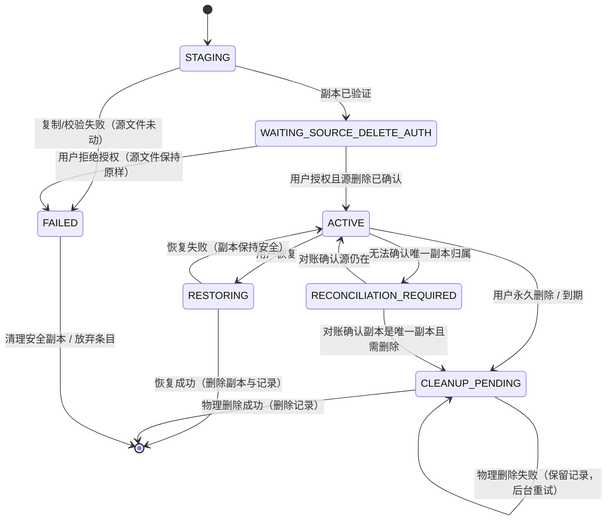

# 影里 Player：整理页功能设计

> **版本**：1.0（合并稿）
> **状态**：方案（未实施）。§17 的待决项未闭合前不得进入实现。
> **适用工程**：`D:\100_Projects\110_Daily\YingLi-Player`
> **范围**：整理页的四个功能——视频压缩、视频转码/格式转换、视频去重、回收站——以及它们与无损切片、AB 循环区间导出、任务中心的接口。
> **合并来源**：本文由 `docs/architecture/compression-and-format-conversion-plan.md`（压缩与格式转换，579 行）与 `docs/architecture/dedup-and-recycle-bin-design.md`（去重与回收站，1268 行）合并而成，两者的 F/G/D/U 编号已统一到同一套序列（见 §0.3）。
> **资料依据**：`refer/Video-deduplication-and-recycle-bin-design-resources/`（清单见 §1）
> **代码依据**：本仓库 `app/src/main/java/seeyuer/yingli/player/` 与 `docs/`（引用均标注 `文件:行`）

---

## 0. 阅读说明与全局约定

### 0.1 对「整理页包含四个功能 + 共用任务中心」的更正（**先读这一节**）

任务描述中的理解是：「整理页」规划包含视频压缩、视频转码、视频去重、回收站四个功能，配一个统一展示进度的「任务中心」。**这个理解与本项目现状有两处不一致，且不一致的部分会影响设计，因此在这里先更正。**

| # | 描述中的理解 | 代码中的实际现状 | 影响 |
|---|---|---|---|
| 1 | 底部导航是「首页 / 视频 / 整理 / 设置」四个 Tab | `RootDestination` 实际有 **5** 个取值：`HOME`、`LIBRARY`、`ORGANIZE`、`PROCESSING`、`SHORTS`（`app/src/main/java/seeyuer/yingli/player/feature/shell/YingLiApp.kt`，`RouteContent` 在 `:944` 分派）。`SETTINGS` **不是**根目的地，它是独立路由 `AppRoute.Settings` | 「设置」不是底部 Tab；「短视频」和「处理中心」是底部 Tab |
| 2 | 任务中心是整理页的二级页面 | 任务中心是**独立根目的地** `RootDestination.PROCESSING`，与「整理」平级，路由到 `ProcessingRoute`（`YingLiApp.kt:945-947`） | 去重与回收站的任务进度要接到 `ProcessingRoute`，不是接进 `OrganizeRoute` |

此外，**「整理页」当前的实际内容与四个功能基本无关**：`app/src/main/java/seeyuer/yingli/player/feature/organize/OrganizeScreen.kt`（376 行）只渲染「收藏数 / 标签数 / 播放列表数 / 智能集合数」四个入口 + 标签列表 + 最近整理 + **重复视频扫描与处置**。`app/src/main/res/values/strings.xml` 中**不存在** `organize_compression` / `organize_transcode` / `organize_recyclebin` 之类的字符串，证实整理页**还没有**压缩/转码/回收站入口。

**结论**：四个功能当前的落点是——去重**已经**落在整理页（Phase 12 已交付一部分）、压缩/转码落在处理中心（Phase 11 已交付）、回收站的 UI 落在**视频页**（`LibraryScreen.kt:595` 的 `TrashPanel`）、无损切片落在处理页（Phase 10 已交付）。因此本设计**不重新规划信息架构**，只做三件事：① 把四个功能的数据模型、一致性规则和任务集成补成可实现的完整契约；② 指出并修掉现状中与项目已声明模型冲突的地方；③ 给出统一的落地顺序与测试要求。**信息架构的归置另开一个决策，见 §17 待决项 D0。**

### 0.2 标记约定

- **[资料]**：结论来自 `refer/` 下的资料，标注文件名。
- **[代码]**：结论来自本仓库源码，标注 `文件:行`。
- **[调整]**：我基于本项目现状对资料做法或既有实现提出的调整。
- **[P0 验证]**：必须真机/最小验证工程确认，不能靠文档推定。
- **[待决]**：需要用户决策，见 §17。
- **[待确认]**：尚未核实、明确标注为不确定的项，见 §17。

### 0.3 编号约定

本文档使用四套**全局唯一**的编号，合并前两份文档的同名编号已重新编排：

| 前缀 | 含义 | 本文档范围 | 说明 |
|---|---|---|---|
| **F** | 不可再还原的基本事实 | **F1–F36** | F1–F25 来自压缩/格式转换方案；F26–F36 来自去重/回收站设计（原 F1–F11） |
| **G** | 现状偏差（代码与事实的矛盾） | **G1–G27** | G1–G11 属转码/切片链路；G12–G26 属去重/回收站链路（原 G1–G15）；G27 是阶段 2 步骤 8 真机新发现（VP9 无 CodecPrivate 无法封进 MP4） |
| **D** | 需用户裁决的决策点 | **D0–D13** | D0–D7 来自去重/回收站设计；D8–D13 来自压缩/格式转换方案的「未决」 |
| **U** | 尚未核实、待确认项 | **U1–U10** | U1–U7 来自去重/回收站设计；U8–U10 来自压缩/格式转换方案的取证遗留 |

**合并前的编号对照**（供追溯旧文档）：

| 旧编号 | 旧出处 | 本文档编号 |
|---|---|---|
| F1–F25 | `compression-and-format-conversion-plan.md` | F1–F25（不变） |
| F1–F11 | `dedup-and-recycle-bin-design.md` | **F26–F36** |
| G1–G11 | `compression-and-format-conversion-plan.md` | G1–G11（不变） |
| G1–G15 | `dedup-and-recycle-bin-design.md` | **G12–G26** |
| D0–D7 | `dedup-and-recycle-bin-design.md` | D0–D7（不变） |
| 未决 1–6 | `compression-and-format-conversion-plan.md` | **D8–D13** |
| U1–U7 | `dedup-and-recycle-bin-design.md` | U1–U7（不变） |

### 0.4 十八条最重要的结论

**关于四个功能的共同基础**

1. **「压缩」与「格式转换」不是两个功能**，而是同一个「目标（容器 × codec × 分辨率 × 码率）」在**编码层**与**封装层**两种可达性上的投影。把两者实现成两套引擎，等于把 F7 的判定逻辑写两遍。三个产品入口（无损切片 / 压缩 / 格式转换）收敛为一个引擎，**实体数从 3 降到 1**（§4.1–§4.3）。
2. **改变文件内容的动作只有两个**：重封装（Remux，零损失，成本 ∝ 字节数）与重编码（Re-encode，必然损失一代，成本 ∝ 像素数 × 帧数）。没有第三种（§3.1）。
3. **平台 + Media3 已经覆盖「把手机上的任意常见视频转成通用 MP4，或转成 WebM/Ogg/AAC，并按预设压缩」的全部需求。** 不可达的目标（MKV/AVI/FLV/TS/MOV/MP3/FLAC/GIF 输出）在项目现有产品决策中**没有一条被要求**（§4.4–§4.6）。
4. **「两个引擎」的全部理由是 F18**：Transformer 只能**编码** H.263/H.264/H.265/MPEG-4 SP + AAC/AMR，而 Media3 `Mp4Muxer` 的 mime 白名单更宽（含 VP9/Opus/Vorbis/AV1/DV/APV）。**muxer 超集只能通过手写 `MediaExtractor` + `Muxer` 管线触达**——这正是 `PlatformClipEngine.fastCut` 已经在做的事。

**关于去重**

5. **去重的目标模型项目已经声明过了，只是没实现。** `docs/06-feature-roadmap.md:199` 原文：「`MediaItem` 表示内容实体，`MediaLocation` 表示物理文件位置；标签、收藏和播放状态挂在内容实体，**去重和文件删除针对位置实体**」。而当前代码是「一个文件一个 item」——`app/src/main/java/seeyuer/yingli/player/domain/catalog/MediaIdentityResolver.kt:32-35` 的注释逐字写着「only stable platform identity is reliable for **this temporary one-file-per-item experiment**」。
6. **Phase 12 已经交付了去重的核心，但它建立在一个即将被推翻的模型上。** 现存 3 张表 `duplicate_fingerprints` / `duplicate_groups` / `duplicate_group_members`（`app/src/main/java/seeyuer/yingli/player/data/room/YingLiDatabase.kt:162-172`）把「重复组」做成了独立实体；而按结论 5，EXACT 重复组**就是**一个带多个 `MediaLocation` 的 `MediaItem`。
7. **`media_locations` 表里已经有 `fastFingerprint` 和 `contentHash` 两列，且全是死列。** 定义在 `app/src/main/java/seeyuer/yingli/player/data/room/MediaEntities.kt:67-68` 与 `app/src/main/java/seeyuer/yingli/player/core/model/media/MediaModels.kt:98-99`；全仓库搜索显示**没有任何数据源写入它们**（`MediaDiscoveryDataSources.kt` 无匹配）。`DefaultMediaScanner.kt:195-207` 有一段「用 contentHash 归并身份」的逻辑，但它**永远不会执行**——它在 `resolveIdentity` 里等 `IdentityResolution.NeedsReview`，而 `DefaultMediaIdentityResolver` 从不返回 `NeedsReview`（`MediaIdentityResolver.kt:25-35`）。
8. **因此去重不需要新表。** 需要的只是：把 `contentHash` / `fastFingerprint` 填上、给它们加算法版本、按哈希做一次 `GROUP BY`。**三张重复表可以整体删除**，替换为 0 张新表 + 1 个索引 + 1 个版本列 + 1 张「忽略组」小表（§7.1、§7.6）。
9. **字节完全相同 ⟹ 大小/时长/分辨率/编码全同（F32）**，因此资料里「更高分辨率、更大体积」这类保留建议对 EXACT 组**没有任何区分力**；只有修改时间、路径、来源、文件名有（§7.3）。
10. **相似视频（SIMILAR）当前是硬关闭的，且关闭理由充分。** `DefaultDuplicateScanner.kt` 直接 `return DuplicateScanResult.Rejected("SIMILAR_EXPERIMENT_DISABLED")`；`docs/architecture/phase-12-duplicate-algorithm-card.md:13` 说明理由是「没有经过隐私审核的代表性标注集，也没有 precision/recall、10k 库复杂度和人工复核成本基线」。**本设计维持关闭，并写出重开的前置条件**（§7.5）。

**关于回收站**

11. **回收站当前实现是坏的，而且是第三种方案——既不是系统回收站，也不是应用副本。** `app/src/main/java/seeyuer/yingli/player/data/filesystem/AndroidFileOperationGateway.kt:60-74` 的 `trash()` **只接受 `file://`**，遇到 `content://` 直接返回 `RecoverableFailure(PERMISSION_REQUIRED)`；实现是 `renameTo(".Trash/YingLi/<name>")`。本项目主媒体源是 MediaStore（`content://`），所以**回收站对绝大多数媒体根本不工作**。
12. **全仓库没有用过任何系统回收站 API。** 搜索 `IS_TRASHED` / `createTrashRequest` / `createDeleteRequest` / `RecoverableSecurityException` 在 `app/src/main/java/` 下 **0 命中**。唯一用到 MediaStore 写入语义的地方是 `AndroidProcessingArtifactStore.kt:39,47`（`IS_PENDING`）。
13. **`trash_entries` 以 `mediaItemId` 为主键**（`YingLiDatabase.kt:110`：`PRIMARY KEY(mediaItemId)`），而结论 5 要求「文件删除针对位置实体」。所有媒体查询都用 `LEFT JOIN trash_entries ON trash_entries.mediaItemId = media_items.id` 排除（`LibraryAndOrganizeDaos.kt:63,90,128,167`；`RoomLibraryRepositories.kt:126,194,263,291,386`）。**这是 item 级排除，不是 location 级排除** —— 一旦一个条目有多个位置，移入回收站会错误地把整个条目藏起来。
14. **去重与回收站的连接已经存在，但是「假的连接」**：`DefaultDuplicateDeletionExecutor` 调 `LibraryMutationRepository.trash(...)`，而后者落到结论 11 的坏实现上。
15. **移入回收站没有任何副本校验与空间预检**：`DefaultLibraryMutationRepository.trash()` 只要 `renameTo` 返回 true 就写 `trash_entries`。这违反 `ADR-XXX` 的「不得仅通过修改数据库标签或隐藏列表条目来冒充文件已安全移入回收站」。
16. **资料中「回收站存应用专属副本」的结论与本项目路线图冲突。** `docs/06-feature-roadmap.md:264` 原文：「默认先进入统一的影里回收站页面；**底层优先使用 MediaStore 系统回收站**，能力不足时使用受控降级实现；永久删除为明确的二次确认」。资料 `ADR-XXX：采用应用自主管理的 30 天视频回收站.md` 则主张「应用自主管理副本」。**这是本设计最需要用户裁决的一处**，见 §8.1 与 D2。

**关于任务中心与调度**

17. **没有任何后台持久化调度。** `app/build.gradle.kts` **没有 `androidx.work` 依赖**；`InAppProcessingScheduler`（`app/src/main/java/seeyuer/yingli/player/data/processing/InAppProcessingScheduler.kt`）是**纯进程内**的 `CoroutineScope` 调度器；`YingLiProcessingService`（`app/src/main/java/seeyuer/yingli/player/app/processing/YingLiProcessingService.kt`）是前台服务，**阶段 1 步骤 4 已实现 Android 15 的 `onTimeout` 收尾**（见 14.2.4；`startForeground(..., FOREGROUND_SERVICE_TYPE_MEDIA_PROCESSING)` 在 `:48-52`）。但「30 天到期清理」在本项目**仍没有任何可用的执行载体**——`onTimeout` 只把运行中的处理任务标记为失败，不承担到期清理；同时 Android 15 起 `mediaProcessing` 前台服务有**每 24 小时 6 小时**的硬上限（F24）。
18. **`ProcessingProjectType.DEDUPLICATE` 已存在但没有执行器。** `app/src/main/java/seeyuer/yingli/player/data/processing/RoutingProcessingExecutor.kt` 只路由 `CLIP` 与 `COMPRESS|CONVERT`，其余落到 `ProcessingExecutionResult.Failure("PROCESSING_TYPE_UNSUPPORTED")`。且 `ProcessingTaskState` **缺** `VALIDATING` / `WAITING_FOR_USER_ACTION` / `PARTIAL_SUCCESS` / `CLEANUP_PENDING` / `EXPIRED` 五个状态。

---

## 1. 资料清单与逐份可复用结论

资料目录：`refer/Video-deduplication-and-recycle-bin-design-resources/`（10 个文件）。在线出处：`https://chatgpt.com/share/6ac844c4-16bc-83ec-bd6c-bf8600e0521e`。

| # | 文件 | 规模 | 解决什么问题 | 可复用的结论 | 本项目是否采信 |
|---|---|---|---|---|---|
| 1 | `回收站实现验收条件.md` | 2678 B / 38 行 | 给回收站一个可勾选的验收骨架（6 组） | 六组分别是：基线与工程、移入与文件安全、恢复与永久删除、30 天期限与清理、压缩/转码集成、变更后回归。其中「**目标文件验证成功前不删除源文件**」「**不以删除数据库记录代替删除文件**」「**清理操作具备幂等性**」三条是硬约束 | **采信**，见 §15 |
| 2 | `回收站状态与操作定义.png` | 1352×1086 | 状态机图（6 状态 10 迁移） | 6 状态：正常媒体 / 移入处理中 / 回收站中 / 恢复处理中 / 永久删除处理中 / 已删除。**关键形状：所有「处理中」状态在「取消或失败」时都退回上一个稳定态**，而不是进入错误终态 | **采信状态形状，但不采信其命名**（它把「正常媒体」和「已删除」也放进状态机，这两个不是本应用要持久化的状态；本设计的稳定态只有 `ACTIVE` / `CLEANUP_PENDING` / `RECONCILIATION_REQUIRED`，见 §8.3） |
| 3 | `回收站最小验证模块.md` | 1050 B / 10 行 | P0 最小验证项（10 条） | 其中 4 条对本项目直接可用：③ 用户拒绝源文件删除授权时源视频仍完整存在且临时副本能安全回滚；④ 目标存储空间不足 / 复制中断 / 应用进程被杀后源文件不丢失；⑥ `expiresAt` 严格边界（到期前可恢复、到期后立即禁止恢复）；⑦ 到期清理在应用重启、设备重启及后台调度延迟后仍会重试 | **采信**，但第 ⑧ 条（隐藏 `MediaStore.Files` URI 可读/删/恢复）**不采信** —— 见 §1.1 |
| 4 | `移入回收站的事务流程.png` | 1157×2878 | 移入的事务顺序图 | 顺序：占用检查 → 权限与目标存储检查 → 创建持久化操作记录 → 复制或迁移 → **目标文件完整性验证** → 持久化回收站记录与 30 天期限 → 必要时授权清理源文件。**两个「否」分支都是「阻止操作并解释原因」，不是「降级继续」** | **采信顺序与「阻止而非降级」的取向**，见 §8.4 |
| 5 | `ADR-XXX：采用应用自主管理的 30 天视频回收站.md` | 6967 B / 108 行 | 回收站存储后端决策草案 | 状态「待基线审查」，日期 2026-10-09。核心主张：**系统回收站生命周期由系统控制，无法满足应用严格管理 30 天的要求，因此应用必须自建副本与期限**；并据此要求「不得仅通过隐藏视频列表条目或修改数据库标记来冒充文件已安全移入回收站」 | **部分采信**：「不得伪装已移入」**完全采信**（这正是当前代码的毛病，见 G17）；「必须自建副本」**不采信为唯一方案**，见 §8.1 |
| 6 | `chatgpt_personal_selected_2026-10-09/问候交流_d9eae9c1fe83.md` | 202864 B / 3590 行 | 原始对话记录，含去重策略讨论、性能量级估算、Android 权限 API 调研 | 有复用价值的只有三类：**判定策略与误判风险矩阵**（§3.2）、**规模量级估算**（§7.4）、**权限 API 边界**（§8.1） | **分类采信**，逐条见下文 |
| 7 | `.../android-video-dedup-architecture-final.md` | 45621 B / 762 行 | 去重系统技术方案与架构基线 v1.0 | 见 §1.2 | **部分采信**，见 §1.2 |
| 8 | `.../android-video-organize-design-v1.0.md` | 56243 B / 844 行 | 整理功能设计与实现规范 v1.0，覆盖压缩/转码/去重/回收站 | 见 §1.3 | **部分采信**，见 §1.3 |
| 9 | `.../organize-page-demo.html` | 60100 B | 整理页 HTML 原型 | 纯视觉原型，**未读**。本项目已有 `core/designsystem` 与 `docs/16` 交互规范，不采用外部原型 | **不采信** |
| 10 | `.../attachment-export-report.json` | 1366 B | 附件导出报告 | 元数据（3 个附件下载成功、ownerRole 均为 assistant、conversation_id `6ac832b5-31bc-83ee-8349-d9eae9c1fe83`） | **非设计内容** |

### 1.1 明确不采信的资料结论

| 资料结论 | 出处 | 不采信的理由 |
|---|---|---|
| 底部固定四个 Tab：首页、视频、整理、设置 | 文件 8，§0.1 | 与代码不符（§0.1）。`SETTINGS` 不是 `RootDestination` |
| 压缩、转码、去重、回收站均归属整理 Tab，任务中心为二级页面 | 文件 8，§0.1 / §2 | 与代码不符（§0.1）。任务中心是独立根目的地 |
| 用隐藏 `MediaStore.Files` URI 保留单项平台删除确认 | 文件 3，第 ⑧ 条；文件 6 | 依赖 `.nomedia` / 隐藏目录的 MediaProvider 行为差异，且资料自己承认「隐藏目录不等于文件仍能像普通视频一样通过原 URI 访问」。本项目不引入这条路径 |
| 引入 Rust / JNI 批处理接口 | 文件 6、7 | 与 `docs/00-android-technology-selection.md`（硬解优先、轻量优先、无明确需求不引入原生依赖）冲突。且本项目媒体规模远未到需要它的量级 |
| 引入向量数据库 / LSH 专用索引 | 文件 6、7 | 资料自己结论是「SQLite B-tree 足够作第一版」。本项目规模更小 |
| 音频指纹、深度学习视觉特征、FFmpeg `signature` 滤镜 | 文件 6、7 | `docs/architecture/phase-14-experiment-ledger.md` 已把 FFmpeg 后端判为 No-Go；音频/ML 无本项目需求依据 |
| 相似视频的自动分组与自动删除 | 文件 6、7 | 与 `docs/06-feature-roadmap.md:437`「不做无确认的自动删除」冲突；且当前项目已硬关闭 SIMILAR |
| `deepmedia/Transcoder`、`LightCompressor`、`fishwjy/VideoCompressor`、`Mp4Composer-android` 等第三方压缩/转码库 | 粘贴对话（m00084） | 逐个核实后**无一提供平台之外的能力**，且多数已归档/停更。见 §13.2 |
| 「libmpv 的 Android 构建关闭了 encoders 与 muxers，因此只能播放」 | 粘贴对话（m00084） | 该结论**与本文档的结论无关**：本项目的播放内核是 Media3/ExoPlayer，从未评估 libmpv；且 `docs/00` 已明确「无明确需求不引入 FFmpeg/libVLC/libmpv」 |

### 1.2 文件 7（去重架构 v1.0）的可复用结论

**采信**：

- **把「重复」拆成三个不同问题**：① 完全重复（字节相同）；② 整段近重复（重编码/分辨率变化/轻微画面变化）；③ 局部片段重复（一段内容出现在另一视频中）。三者成本与判据不同，**不得混在同一个函数里**。本项目：① 立即做；② 保持关闭（前置条件见 §7.5）；③ 不做。
- **不做全量两两比较**：N=100,000 时无序对数为 `100000×99999/2 = 4,999,950,000`。本项目用「哈希等价类」彻底消灭两两比较。
- **P0 完全重复的六步漏斗**：取条目/URI/大小/元数据 → 按 `size_bytes` 分桶 → 单条目桶不算完整哈希 → 桶内 ≥2 且无缓存时算流式 SHA-256 → **只有完整 SHA-256 相等才构成候选** → 期间文件不可读/URI 失效/元数据前后变化时**不得标记成功**。头/尾快速哈希只作筛选。
- **缓存必须绑定源文件的「有效版本信息」**：`size + modified time` 是高效失效线索，**不是绝对的内容身份凭证**。
- **`ContentObserver` 不是唯一正确性来源**：离线期间的变化靠下一次同步或低频完整对账发现。
- **检测器版本/采样配置/归一化规则变化时，只让对应派生索引失效**，不整体重算。
- **数据库「分析完成」状态只能在对应结果完整写入后提交，禁止先标记成功再异步补数据**；崩溃后遗留的 `RUNNING` 应恢复为可重试状态而非成功。
- **性能指标必须实测记录**（每阶段 CPU/壁钟/峰值内存、设备温升、SQLite 大小、冷热查询 P50/P95、候选缩减率、precision/recall、Worker 重试次数与恢复时间），**不编造统一的毫秒/温度/内存阈值**。
- **测试语料必须覆盖负样本**：大小相同内容不同；不同内容但首帧/封面相同；相同片头主体不同；相同音乐不同画面；同场景不同录制时刻；可变帧率、旋转元数据、HDR、不常见编码；分析期间文件被修改、进程被杀、Worker 取消、DB 写入失败。

**不采信 / 需调整**：

| 资料做法 | 调整 | 理由 |
|---|---|---|
| 独立 `exact_hashes` 表存 SHA-256 | **[调整]** 直接用 `media_locations.contentHash`（列已存在） | `MediaEntities.kt:68` 已有该列，且它是「位置实体」的属性，语义完全吻合。新建表只会制造第二个真相来源 |
| 独立 `visual_indices` / `visual_hash_buckets` 表 | **[调整]** 本项目**不做** SIMILAR，暂不建这两张表 | `phase-12-duplicate-algorithm-card.md:13` 已冻结关闭 |
| `duplicate_pairs` 表（`media_key_a < media_key_b`） | **[调整]** EXACT 不需要 pair 表（等价类由哈希直接给出）；SIMILAR 重开时再引入 pair 表 | 等价关系不需要 pair；非等价关系才需要 |
| 独立 `media_assets` 表 + `media_key = volume + media_store_id` | **[调整]** 本项目已有 `media_locations`（含 `volumeId` / `documentId` / `uri`），不新建 | `MediaEntities.kt:52-70` |
| 首版即引入 WorkManager 做后台增量 | **[调整]** 见 §11.6 与 D3：本项目当前无 `androidx.work` 依赖，是否引入是显式决策 | 需要用户裁决 |
| 分层扫描 L1「每视频 8–12 采样点」 | **[调整]** 属于 SIMILAR，本项目不做 | 同上 |

### 1.3 文件 8（整理功能规范 v1.0）的可复用结论

**采信**（这些条目与项目路线图一致或更严格，直接吸收）：

- **统一任务状态集合**：`QUEUED` / `PREPARING` / `RUNNING` / `CANCEL_REQUESTED` / `VALIDATING` / `WAITING_FOR_USER_ACTION` / `SUCCEEDED` / `PARTIAL_SUCCESS` / `FAILED` / `CANCELLED` / `EXPIRED` / `CLEANUP_PENDING`。**进度值可空；无法准确提供百分比时显示阶段状态，不伪造平滑进度；数据库持久化应节流。**
- **文件占用规则**：压缩与转码、压缩/转码与移入回收站、去重确认与压缩/转码、恢复与永久删除、到期清理与用户恢复——**两两不能同时作用于同一媒体**；**竞争时以持久化状态与 `MediaOperationGuard` 为最终仲裁，UI 禁用只是提示**。
- **输出文件事务 7 步**（临时目录 → 验证可读 → `IS_PENDING=1` → 复制到目标 URI 并再验证 → `IS_PENDING=0` → 持久化成功 → 最后清临时文件）。**本项目已实现其中大部分**（`AndroidProcessingArtifactStore.kt:39,47`），去重/回收站应复用同一范式。
- **成功定义必须包含「可读取 + 已发布 + 已持久化」三项**；底层回调返回完成但发布失败时**不得显示完整成功**。
- **取消语义**：先持久化 `CANCEL_REQUESTED` 再调底层取消；**只有底层确认停止后才能标记 `CANCELLED`**；取消不删除输入源文件。
- **批量操作允许部分成功，但必须逐项记录并展示成功/失败/跳过/待重试**；**不得把整批的单一布尔值套给所有文件**。
- **永久删除不得通过隐式失败回退触发**；**「清空」不能先清数据库再删文件**。
- **先按时间拒绝恢复，再尝试物理删除**；用户操作与清理任务竞争时通过事务/状态迁移与守卫保证只有一个最终状态。
- **清理前必须确认目标文件仍对应该回收站条目**，避免误删被外部替换或重新关联的文件。
- **文件系统、MediaStore 和数据库无法组成单一原子事务**，必须使用显式状态机、重试与对账。
- **卸载语义必须写入产品说明**：应用专属目录中的回收站副本会随卸载被移除，**不能描述为卸载后仍可恢复的长期归档**。
- **权限不能只保存一个永久布尔值**；每次关键操作前重新检查系统实际授权。
- **部分授权（`READ_MEDIA_VISUAL_USER_SELECTED`）时媒体范围会变化**；**失去授权或 URI 不可读时任务进入需处理/失败状态，不得把它当作空文件或重复文件删除**。
- **不为实现「全部视频」而默认申请 `MANAGE_EXTERNAL_STORAGE`**。
- **目标 SDK 36 的 `MediaStore` 批量授权请求单次 URI 数量上限为 2000**，批量源文件删除必须分块并逐块记录授权结果。**已实测确认（§20.2.4）**：该上限对 `createTrashRequest()` 与 `createDeleteRequest()` 同样适用，2001 条抛 `IllegalArgumentException: URI list restricted to 2000 per request`。
- **首版不自动调用 FFmpeg 作为隐藏回退**（与 `phase-14-experiment-ledger.md` 的 No-Go 一致）。
- **故障注入测试清单**（复制前/中/未写库时杀进程、DB 已提交但源删除未落库时杀进程、`IS_PENDING` 未清除时杀进程、物理删除成功但 DB 更新前杀进程、撤销授权、移除存储卷、空间不足、I/O 异常、同一媒体上压缩与移入并发、到期清理与恢复并发）。

**不采信 / 需调整**：

| 资料做法 | 调整 | 理由 |
|---|---|---|
| 首版去重「候选分桶 → 快速指纹 → 完整哈希 → 持久化 → 最终复核」六阶段独立扫描 | **[调整]** 完整哈希的结果直接写进 `media_locations`，**不建 `DuplicateScan` / `DuplicateGroup` 实体**；「扫描」退化为一次「填充缺失哈希 + 查询等价类」的操作 | 结论 5/7/8；奥卡姆剃刀 |
| 「推荐保留依据：更高分辨率、更新修改时间、用户偏好的目录」 | **[调整]** 该依据**只对 SIMILAR 成立**。EXACT 组的成员**字节完全相同**，分辨率/时长/体积/编码**必然相同**，只有修改时间、路径、来源（MediaStore vs SAF）、文件名有区分力 | §7.3 |
| 「回收站存应用专属副本，`expiresAt = trashedAt + 30 天`」 | **[调整]** 与 `docs/06:264`「优先使用 MediaStore 系统回收站」冲突。改为**按后端区分期限语义**，见 §8.1 | 路线图 vs ADR 冲突 |
| 「首版建议同一时间最多运行一个重量级 Transformer 输出任务」 | **[调整]** 本项目已有 `maximumConcurrent = 1`（`InAppProcessingScheduler`），保持 | 一致 |
| 新增 `MediaOperationGuard`、`JobManager`、`MediaStorageGateway`、`RecycleBinService`、`RecycleBinCleanupWorker` 五个组件 | **[调整]** 见 §8.9：只新增必要的 1–2 个，其余映射到已有组件 | 奥卡姆剃刀 |
| 「输出文件事务 7 步」中把「复制到目标 URI 并再验证」当成独立一步 | **[调整]** 本项目 `AndroidProcessingArtifactStore` 已把「临时文件 → MediaStore 发布」做成一份可复用实现；回收站应复用它，而不是再写一份 | 避免第三份 MediaStore 发布逻辑（§8.9） |

---

## 2. 不可再还原的基本事实（F1–F36）

以下事实不是经验、不是类比、不是既有假设，而是平台与物理约束。后续所有设计只从这些事实推导。

### 2.1 关于「一个视频文件是什么」（F1–F7）

| 编号 | 事实 | 推论 |
| --- | --- | --- |
| **F1** | 视频文件 = 容器（字节布局与索引）+ 一条或多条已编码轨道 + 元数据。容器不承载画质，轨道承载画质。 | 换容器不改变画质；改画质必须改轨道。 |
| **F2** | 文件体积 = Σ(轨道字节数) + 容器开销。容器开销通常 < 1%。 | 降体积只能动轨道，动容器无效。 |
| **F3** | 轨道字节数 ≈ 码率 × 时长。 | 降体积的物理路径只有三条：**降码率、缩时长、减轨道**。没有第四条。 |
| **F4** | 画质由编码参数（码率/分辨率/量化/编码格式）决定。降码率必然降画质。 | 这是信息论约束，不是实现缺陷。任何「无损压缩」承诺都是假的。 |
| **F5** | 重编码 = 解码 → 处理 → 编码。 | 必然引入一代损失（generation loss），且成本 ∝ 像素数 × 帧数。 |
| **F6** | 换容器 = 逐样本搬运 + 重写索引。 | **零损失**，成本 ∝ 文件字节数，与分辨率无关。通常比重编码快 10–100 倍。 |
| **F7** | 换容器成立的条件：目标 muxer 接受源轨道的 codec。 | 不成立时必须重编码；不存在第三条路。 |

### 2.2 关于「Android 设备能做什么」（F8–F15）

事实来源：AOSP `MediaMuxer` / `MediaExtractor` 类文档，以及 `developer.android.com/media/platform/supported-formats`（**必须给 URL 追加 `.md.txt` 才能取到正文**，见 §20）。

| 编号 | 事实 | 推论 |
| --- | --- | --- |
| **F8** | Android 设备自带专用视频编解码硬件（`MediaCodec`）。 | 它是**已经付过钱的算力**，速度与能效远优于通用 CPU。 |
| **F9** | 平台**强制保证**的编码器只有：H.264 Baseline（3.0+）、H.264 Main（6.0+，仅"推荐"）、MPEG-4 SP、H.263（7.0 起可选）、AAC-LC、AMR-NB/WB、VP8（4.3+）、Opus（10+）、AV1（14+）、APV（16+）。**HEVC 与 VP9 的编码器在平台表中为空。** | HEVC/VP9 编码能力**必须逐设备探测**，不能假设。AV1 编码在 minSdk 31 上也不保证。 |
| **F10** | 平台 `MediaMuxer` 只写 5 种输出格式（MP4 / WebM / 3GP / HEIF / OGG），容器与 codec 强绑定（`MediaMuxer` 参考页 codec 表，起始 SDK）：**AAC / AMR-NB / AMR-WB / H.263 / MPEG-4 SP / H.264 = 16**；**Vorbis / VP8 = 21**；**VP9 / HEVC = 24**；**Opus = 29**（仅 WebM/Ogg）；**Dolby Vision = 33**；**AV1 = 34**；**APV = 36**。多视频/音频轨与 Metadata 轨**仅 MP4 且 API 26+**。 | 部分转换在不重编码前提下**平台做不到**；AV1 与 APV 在 minSdk 31 上不可 mux。 |
| **F11** | Media3 1.10.1 的 `androidx.media3.muxer` 提供 `Mp4Muxer`、`FragmentedMp4Muxer`、`WebmMuxer`、`OggMuxer`、`AacMuxer`。`Mp4Muxer` 接受的样本 mime 比平台宽：`video/avc`、`video/hevc`、`video/av01`、`video/apv`、`video/dolby-vision`、`video/mp4v-es`、`video/x-vnd.on2.vp9`、`audio/mp4a-latm`、`audio/opus`、`audio/vorbis`、`audio/raw`、`audio/3gpp`、`audio/amr-wb`。`WebmMuxer` 只接受 `video/x-vnd.on2.vp8`、`video/x-vnd.on2.vp9`、`audio/opus`、`audio/vorbis`。 | **应用内 muxer 的可达集严格大于平台 muxer**：VP9/Opus/Vorbis 可以进 MP4，而这在平台路径上是禁止的。**但该超集只能通过手写 extractor + muxer 管线触达，不能通过 Transformer 触达——见 F18。** |
| **F12** | Media3 的 `Muxer.Factory` 是公开接口（`create(String)`、`getSupportedSampleMimeTypes(int)`、`supportsWritingNegativeTimestampsInEditList()`），`Transformer.Builder.setMuxerFactory(Muxer.Factory)` 已存在。但只有 MP4/fMP4 有现成 Factory（`InAppMp4Muxer.Factory`、`InAppFragmentedMp4Muxer.Factory`、`DefaultMuxer.Factory`、`FrameworkMuxer.Factory`）；WebM/Ogg/AAC 只有 `Builder`。 | 输出 WebM/Ogg/AAC 需要**一个自定义 `Muxer.Factory` 适配器**，不是需要新依赖。 |
| **F13** | Media3 Transformer 默认输出标准 MP4（`InAppMp4Muxer`）。HDR 编辑从 **API 33** 起在具备编码能力的设备上可用，`HDR_MODE_KEEP_HDR` 是**默认值**；HDR→SDR tone mapping 从 **API 29** 起支持（OpenGL 路径），从 **API 31** 起部分设备支持 MediaCodec 路径，Android 13+ 能拍 HDR 的设备全部支持。 | 本项目 minSdk = 31 → **HDR tone mapping 能力存在**。把它当作"不可用"与事实矛盾。 |
| **F14** | Media3 Transformer **不支持** ExoPlayer 的软件解码器扩展模块。 | Transformer 的可达输入 = 设备硬解 + 平台/Media3 extractor 能解的范围。 |
| **F15** | 平台 `MediaExtractor` 支持读取 MP4/M4A、MKV/WebM、TS、PS、FLV、OGG、FLAC、WAV、MP3、AAC(ADTS)、AMR、AC3/AC4 等；Media3 的 `DefaultExtractorsFactory` 额外提供 `AviExtractor`。 | 输入侧很宽，**瓶颈不在解封装，在重封装与编码**。 |

### 2.3 关于「成本」（F16–F17）

| 编号 | 事实 | 推论 |
| --- | --- | --- |
| **F16** | remux 的耗时与文件字节数成正比；re-encode 的耗时与像素数 × 帧数成正比。1080p30 的重编码典型耗时是同时长 remux 的 10–100 倍。 | 只要 remux 可行，就绝不该 re-encode。这是 planner 的第一优先级。 |
| **F17** | re-encode 的耗时与发热直接取决于是否走硬件编码器。 | 与产品决策 Q497（默认追求速度与能效）一致：**硬编优先是决策要求，也是物理最优**。 |

### 2.4 补充事实：编码层与封装层的边界（F18–F25）

| 编号 | 事实 | 推论 |
| --- | --- | --- |
| **F18** | **Media3 Transformer 的输出编码格式白名单远窄于 muxer 的 mime 白名单**：`Transformer.Builder.setVideoMimeType` 只接受 `video/3gpp`(H263)、`video/avc`、`video/hevc`（API 24+）、`video/mp4v-es`；`setAudioMimeType` 只接受 `audio/mp4a-latm`、`audio/amr-nb`、`audio/amr-wb`。**没有 VP9 / VP8 / AV1 输出，也没有 Opus / Vorbis / FLAC 输出。** 传入不支持的 mime 时 Transformer **静默回退**到支持的 mime，并通过 `Transformer.Listener.onFallbackApplied(...)` 回调通知。 | **F11 的 muxer 超集只能通过手写 `MediaExtractor` + `Muxer` 管线触达，不能通过 Transformer 触达。** 这直接决定 §4.6 必须保留两条独立引擎。 |
| **F19** | `Transformer.Builder.build()` 在 **muxer 不支持所请求的 audio/video MIME** 时抛 `IllegalStateException`。 | 输出 codec × 容器的配对**必须在 build 之前校验**——这正是 `Muxer.Factory.getSupportedSampleMimeTypes()`（F12）的用途，也印证了 G3 的修法。 |
| **F20** | `Transformer.Builder.setPortraitEncodingEnabled` **默认 `false`**，此时"竖屏视频会被旋转 90° 后编码，并在输出文件中写入元数据表示播放时应转回"。 | 竖屏源的输出**编码尺寸是横向的**，方向靠元数据表达。凡按 `KEY_WIDTH`/`KEY_HEIGHT` 比对目标尺寸的验证器都可能误判（见 G7）。 |
| **F21** | Transformer 的 transmux **不是独立 API**，而是 `DefaultEncoderFactory` 在"输入格式已满足编码器配置"时的自动行为（`videoNeedsEncoding()` / `audioNeedsEncoding()`）。 | 依赖它来"顺便省掉一次重编码"是隐式控制流。**显式的 remux 决策必须由 planner 做出**（§4.2），不能委托给库的内部判定。 |
| **F22** | 平台 `MediaExtractor` 的容器支持按编码列举：H.263 = 3gp/mp4/mkv；H.264 = 3gp/mp4/ts/mkv；HEVC = mp4/mkv；VP8 = webm/mkv；VP9 = webm/mkv/mp4；AV1 = mp4/mkv；AAC = 3gp/mp4/m4a/adts/ts；FLAC = flac/mp4(10+)/mkv；Opus = ogg/mp4/mkv；MP3 = mp3/mp4(10+)/mkv(10+)；Vorbis = ogg/mkv/mp4(10+)；PCM = wav；AMR = 3gp/amr。**官方表未列 AVI、FLV、MOV。** | **输入侧的瓶颈确实不在解封装**（F15 得到证实）：MKV 能读 H.264/HEVC/VP8/VP9/AV1/Opus/Vorbis/FLAC，已覆盖绝大多数下载来源。 |
| **F23** | CDD 5.2：设备**只需**"至少 VP8 或 H.264 编码器之一"（[C-1-1] MUST）；H.265 编码器条款是条件式（"若支持则 MUST Main Profile L3"、"STRONGLY RECOMMENDED if there is a hardware encoder"）；而开放给第三方 App 的 H.264/VP8/VP9/HEVC 编码器 **[C-2-1] MUST 支持动态可调码率**。 | ① F9 得到法规层面的确认：**HEVC 编码不可假设，必须探测**。② 动态码率是**保证项**，因此"按预设码率编码"在平台层面有强制支撑（对 G1 的修法有利）。 |
| **F24** | Android 15 起，前台服务类型 `mediaProcessing`（用途逐字："performing time-consuming operations on media assets, like **converting media to different formats**"）的运行时长上限为 **每 24 小时 6 小时**（该上限被同一应用的所有 `mediaProcessing` 前台服务共享）。超时前系统调用 `Service.onTimeout(int, int)`，服务必须在几秒内 `stopSelf()`，否则 ANR。 | 长视频重编码不是"可以随便跑多久"的任务：**6 小时/24 小时是硬上限**，且必须实现 `onTimeout` 才能优雅收尾。这为"输出目标必须按体积/时长预检"（§4.2 第 4 条）补上了一条与存储无关的独立理由。 |
| **F25** | Media3 的 `Mp4Muxer` **是多轨 muxer**：`addTrack(Format)` / `addTrack(int sortKey, Format)` 返回 track id，轨道数量不限（含 `C.TRACK_TYPE_METADATA` 与未知类型，写成文本轨或 T35 轨），并提供 `addTrackReference(trackId, TRACK_REFERENCE_TYPE_CDSC, referencedTrackIds)` 建立轨间引用；支持 `FILE_FORMAT_MP4_WITH_AUXILIARY_TRACKS_EXTENSION`（MP4-AT）。它是**纯 Java 应用内 muxer**，因此 **F10 的"多轨仅 MP4 且 API 26+"约束不适用于它**——那是平台 `MediaMuxer`（native）的限制。它同时暴露 `SUPPORTED_VIDEO_SAMPLE_MIME_TYPES` / `SUPPORTED_AUDIO_SAMPLE_MIME_TYPES` 静态表，正是 `Muxer.Factory.getSupportedSampleMimeTypes()` 的现成来源（F12）。 | **多音轨保留在"手写 `MediaExtractor` + `Mp4Muxer`"这条路上是可达的，且不受 API 26 限制。** 这降低了未来实现多轨保留的成本——它不需要自建 muxer，只需要自建"读样本 → 映射时间戳 → 写样本"的搬运循环（正是 `PlatformClipEngine.fastCut` 已经在做的事）。**但 Transformer 路径上仍然不可能（G5）。** |

### 2.5 关于「文件、权限与事务」（F26–F31）

| 编号 | 事实 | 推论 |
| --- | --- | --- |
| **F26**（原 F1） | 一个文件的字节要么存在于某个存储卷上，要么不存在。没有第三种状态。 | 任何「可恢复」的承诺，都要求字节在承诺期内存在于应用能访问的地方。 |
| **F27**（原 F2） | 应用对自己创建的媒体拥有写/删权限；对其他应用创建的 MediaStore 媒体，只能通过用户批准的请求（`MediaStore.createTrashRequest()` / `createDeleteRequest()`）或 `RecoverableSecurityException` 流程获得一次性授权。 | 删除能力不是应用属性，是**逐文件的权限属性**。 |
| **F28**（原 F3） | Android 11（API 30）起提供系统媒体回收站（`MediaStore.IS_TRASHED`），其保留期由 `MediaStore.DATE_EXPIRES` 表达，该字段**只读**；系统在设备空闲时执行物理删除。 | 系统回收站**不能**被应用配置为「严格 30 天」。 |
| **F29**（原 F4） | 应用专属持久目录（`context.filesDir` 下）中的文件随应用卸载被移除；`cacheDir` / `externalCacheDir` 中的文件可被系统随时清理。 | 放在应用专属目录里的副本**不是**长期归档；放在 cache 里连短期保证都没有。 |
| **F30**（原 F5） | SAF 树（`DocumentsContract`）中的文件没有系统回收站。 | SAF 来源的「可恢复删除」只能靠应用自己保存字节，或者不做可恢复删除。 |
| **F31**（原 F6） | 文件系统操作、MediaStore 更新、Room 写入是三个独立的事务域，无法组成一个原子事务。 | 任何跨三者的流程必须显式设计**中断恢复**与**幂等重试**，并定义「结果不确定」这个状态。 |

### 2.6 关于「重复与身份」（F32–F36）

| 编号 | 事实 | 推论 |
| --- | --- | --- |
| **F32**（原 F7） | 字节完全相同 ⟹ 大小相同、时长相同、分辨率相同、编码相同、内容哈希相同。反之不成立。 | EXACT 判定中，「分辨率更高」「体积更大」这类保留建议**没有任何区分力**；只有内容哈希（以及作为其廉价筛选的大小）有判定力。 |
| **F33**（原 F8） | 内容哈希相等是等价关系（自反、对称、传递）；感知相似度不是。 | EXACT 重复组可以建模为等价类（一个内容实体 + N 个位置）；SIMILAR 候选只能建模为 pair 边，不能预生成组。 |
| **F34**（原 F9） | 文件的内容不因它在媒体库中的身份而改变；改变内容必须重写字节。 | 压缩/转码/切片产出的**一定是新位置**（新文件），不可能是既有位置的「内容变化」。 |
| **F35**（原 F10） | 用户状态（标签、收藏、播放进度、播放历史、播放列表归属、集合归属）是用户劳动的产物，不能因为文件去重而被丢弃。 | 归并两个内容实体时，用户状态必须**迁移**而不是丢弃；迁移规则必须显式定义冲突消解。 |
| **F36**（原 F11） | 一个物理位置在同一时刻只能属于一个内容实体（`media_item_locations.locationId` 唯一索引已保证）。 | 归并只需更新 link 行，不需要复制位置。 |

---

## 3. 由事实推出的操作空间

### 3.1 改变文件内容的动作只有两个

F1–F7 已经把全部可能性穷尽为**两个、且只有两个**不可再分的动作：

| | 动作 A：重封装（Remux） | 动作 B：重编码（Re-encode） |
| --- | --- | --- |
| 改变什么 | 容器、轨道集合、时长 | 编码参数（码率/分辨率/编码格式/色彩） |
| 画质 | **零损失**（F6） | 必然损失一代（F5） |
| 成本 | ∝ 字节数（F16） | ∝ 像素数 × 帧数（F16） |
| 可行性条件 | 目标 muxer 接受源 codec（F7、F10、F11） | 设备有目标编码器 + 能解源 codec（F9、F14） |
| 能否降体积 | 只能靠"减轨道/缩时长"（F3） | 可以降码率、降分辨率 |

**没有第三种动作。** 播放、抽帧、截图、生成缩略图不属于"改变文件"的操作空间，不在本文范围。

### 3.2 去重判定策略：可行组合与误判风险

**资料做法**（文件 6、7）：文件级哈希 SHA-256 / 分片哈希预筛 / 元数据比对 / 逐帧像素哈希 / 感知哈希 pHash-dHash / 时序视频指纹 / 音频指纹 / 深度学习特征 / FFmpeg `signature`。

**由 F32/F33 推出的必要区分**：

| 策略 | 判定强度 | 能否单独作为「重复」结论 | 能发现的差异 | 发现不了的差异 | 误判风险 | 成本 | 本项目 |
|---|---|---|---|---|---|---|---|
| **元数据比对**（大小、时长、分辨率、编码） | 最弱 | **不能** | 完全无关的文件 | 全部 | **极高**：不同文件常共享大小/时长/分辨率（`MediaIdentityResolver.kt:32-34` 的注释已指出） | 极低（已在索引里） | 仅用作**分桶筛选** |
| **大小 + 头尾快速指纹** | 弱 | **不能**（资料明确「只用于筛选，不作为最终重复证明」） | 大小或头尾不同的文件 | 头尾相同中间不同 | 中：构造性碰撞可行 | 低（`QUICK_HASH_BYTES = 64 KiB` × 2） | 用作**第二层筛选** |
| **完整内容哈希（SHA-256）** | **等价关系** | **能**（在「不宣称密码学零碰撞」的前提下） | 任何字节差异 | 无 | 极低 | 高（需读完整个文件） | **EXACT 的唯一判据** |
| **多帧感知哈希（aHash/pHash）** | 相似度 | **不能单独作为删除依据**（资料：「单帧 pHash 不作为最终判据」） | 重编码、缩放、轻微画面变化 | 帧序列顺序、局部片段、音轨 | 高（相同片头/封面/静态画面、相同配乐） | 高（需解码抽帧） | **不做**（SIMILAR 保持关闭） |
| **时序视频指纹** | 相似度 + 顺序 | 不能单独 | 局部片段匹配 | — | 中 | 很高 | 不做 |
| **音频指纹** | 相似度 | **不能**（资料：「画面不同音频相同＝可能共用配乐，不能判定重复」） | 共用配乐 | 画面 | 高 | 高 | 不做 |

**结论（[调整]）**：本项目只做**完整内容哈希**这一条判定链，前两层（大小、快速指纹）**只作筛选**，后四种**全部不做**。理由是 F32/F33：只有完整内容哈希既是等价关系、又能直接支撑「删除哪一份」这个不可逆动作。

**误判风险矩阵**（资料文件 6 的原始矩阵 + 本项目结论）：

| 变化类型 | 完整内容哈希 | 感知哈希 | 本项目能否发现 |
|---|---|---|---|
| 仅改名 / 仅移动目录 | **可判** | 可判 | **能** |
| 重新封装（remux，流不变） | 通常**不可判**（容器字节不同） | 可判 | **不能**（明确告知用户：这不是重复，是不同文件） |
| 重新编码 / 压缩 / 缩放 | 不可判 | 可判 | 不能 |
| 改速度 / 帧率 | 不可判 | 「视抽帧与匹配算法而定」 | 不能 |
| 剪片头片尾 | 不可判 | 「视抽帧位置而定」 | 不能 |
| 只截取一部分 | 不可判 | 单帧不可靠 | 不能 |
| 损坏 / 无法解码 | 只要字节可读即可判；读取失败则**不产生结论** | — | 能（前提：读取失败时不生成结论，见 §7.1 第 6 条） |

**这一点必须写进 UI 文案**：EXACT 模式的「未发现重复」**不等于**「没有相似视频」。资料文件 8 的 `duplicates_similar_disabled` 文案已经表达了这个意思，应保留并强化。

### 3.3 回收站存储后端：只有四种可能

由 F26–F30 推出，可选的存储后端只有三种可用方案加一种兜底，且**互斥**（详细对比与推荐见 §8.1）：

| 方案 | 机制 | 额外空间 | 能否保证「严格 30 天可恢复」 | 适用来源 |
|---|---|---|---|---|
| **R1 系统回收站** | `MediaStore.createTrashRequest()`（他应用媒体）或直接置 `IS_TRASHED = 1`（本应用媒体）；期限读 `MediaStore.DATE_EXPIRES` | **0** | **否**（F28） | 仅 MediaStore 共享媒体 |
| **R2 应用专属副本** | 复制到 `filesDir/recycle-bin/items/<uuid>`，验证副本后请求删除源 | **≈ 原文件大小**（移入阶段峰值可达 2×） | **是** | 全部（含 SAF 树） |
| **R3 同卷隐藏目录移动** | `renameTo(".Trash/YingLi/<name>")`（**当前实现**） | 0 | **是**（只要 rename 成功） | **仅 `file://`** |
| **R4 阻止并解释** | 不执行，只说明原因 | 0 | — | 全部 |

---

## 4. 功能分解与可达矩阵

### 4.1 推翻「压缩和格式转换是两个功能」

- **压缩** = 目标画质低于源（降码率/降分辨率）→ 必然走 **B**。
- **格式转换** = 目标容器或目标 codec 与源不同 → 走 **A** 或 **B**，由 F7 判定。

两者不是并列的功能，而是**同一操作空间里的两个目标函数**。用户表达的是目标（"变小"或"能在别的设备上播"），引擎回答的是动作（A 还是 B）。把"压缩"和"转换"实现成两套引擎，等于把 F7 的判定逻辑写两遍。

`docs/02-product-and-ui-research.md:125` 说"MP4 remux 与视频压缩属于不同任务，界面需要明确区分"——这个区分正确，但它约束的是**入口层**（用户表达意图），不是**引擎层**。产品决策 Q226 同理。

### 4.2 统一任务模型：`OutputTarget`

一个任务 = 一个**目标描述**：

```
OutputTarget(
    containerMimeType: String,   // "video/mp4" | "video/webm" | "audio/mp4" | "audio/ogg" | "audio/aac"
    videoCodecMimeType: String?, // null = 无视频轨
    audioCodecMimeType: String?, // null = 无音频轨
    maximumLongEdge: Int?,       // null = 保持源
    videoBitrate: Int?,          // null = 保持源码率
    audioBitrate: Int?,
)
```

Planner 的输入是 `(SourceMediaInfo, DeviceMediaCapabilities, OutputTarget, 保留策略, availableBytes)`，输出是 `ProcessingPlan { operation: REMUX | TRANSCODE, ... }`。判定顺序由 F7、F16 直接给出：

1. 目标三元组与源一致，且无质量参数 → **REMUX**（切片场景）。
2. 目标 muxer 接受源视频 codec 与源音频 codec → **REMUX**。
3. 否则，设备有目标编码器且能解源 → **TRANSCODE**。
4. 否则 → **拒绝**，返回明确错误码，不静默降级（产品决策 Q500）。

### 4.3 四个产品入口收敛到同一套管线

| 产品入口 | `OutputTarget` | Planner 输出 | 现状落点 |
| --- | --- | --- | --- |
| 无损切片（Phase 10） | 容器/codec 同源，无质量参数，带时间区间 | REMUX | 已交付（`PlatformClipEngine.fastCut` / `accurateCut`） |
| 压缩（Phase 11） | 容器/codec 同源，`videoBitrate`/`maximumLongEdge` 有值 | TRANSCODE | 已交付（`Media3TranscodeEngine`） |
| 格式转换（M9 新增） | 容器或 codec 与源不同 | REMUX 或 TRANSCODE（由 F7 判定） | **未实现**（G3/G4） |
| AB 循环区间导出（§9） | 同无损切片，但带来自播放会话的区间 | REMUX 或 TRANSCODE（用户二选一） | **未实现**（G9/G10/G11） |

**实体数从 4 降到 1。** 这正是奥卡姆剃刀要求的减法：`PlatformClipEngine.fastCut`（A 的实现）与 `Media3TranscodeEngine.transcode`（B 的实现）共用同一套 probe / plan / execute / verify 管线，差别只在 planner 选出的 `operation` 字段。

### 4.4 输出侧可达矩阵（目标容器 × codec 是否可写）

由 F10、F11、F9、F15 直接推出。**这张表是方案的事实边界，不是待办清单。**

| 目标容器 | 可写入的视频 codec | 可写入的音频 codec | 平台 muxer | Media3 muxer |
| --- | --- | --- | --- | --- |
| MP4 / fMP4 | H.263、MPEG-4 SP、**H.264**、**H.265**（设备相关）、AV1（Android 14+）、APV（Android 16+）、VP9※ | AAC-LC、AMR-NB/WB、Opus※、Vorbis※、PCM※ | ✅（VP9/Opus 除外；多轨需 API 26+） | ✅（超集；**多轨与元数据轨无 API 限制**，见 F25） |
| WebM | **VP8**、**VP9** | **Opus**、**Vorbis** | ✅ | ✅ |
| OGG | — | **Opus** | ✅ | ✅ |
| ADTS (.aac) | — | **AAC** | ✅ | ✅ |
| 3GP | H.263、H.264、MPEG-4 SP | AAC、AMR | ✅ | ❌（Media3 无 3GP muxer） |
| **MKV** | — | — | ❌ | ❌ |
| **AVI / FLV / TS / MOV** | — | — | ❌ | ❌ |
| **MP3 / FLAC / WAV** | — | — | ❌ | ❌（WAV 需 Media3 > 1.10.1 的 `WavMuxer`） |

※ = 仅 Media3 应用内 muxer 可达，平台 muxer 拒绝。

**本表描述的是"muxer 能写入什么"。** 要真正产出，还受 F18 约束：Transformer 只能**编码**出 H.263 / H.264 / H.265 / MPEG-4 SP 视频与 AAC / AMR 音频。VP9 / AV1 / Opus / Vorbis **只能以 remux 方式**（源本身已是该 codec）进入输出，且必须走手写的 `MediaExtractor` + `Muxer` 路径。

### 4.5 转换侧可达矩阵（常见源 → 目标是否免重编码）

| 源 | → MP4 | → WebM | 备注 |
| --- | --- | --- | --- |
| MP4 / H.264 + AAC | ✅ remux（平台 `MediaMuxer` 或 `Mp4Muxer`） | ❌ **不可达** | 转 WebM 需编码 VP8/VP9 + Opus/Vorbis，而 Transformer 不能编码它们（F18），平台 VP9 编码器又非强制（F9） |
| MP4 / H.265 + AAC | ✅ remux | ❌ 同上 | |
| MKV / H.264 + AAC | ✅ remux | ❌ 同上 | 最常见的"下载的 MKV 转 MP4"场景，**免重编码** |
| MKV / H.265 + AAC | ✅ remux | ❌ 同上 | |
| MKV 或 WebM / VP9 + Opus | ✅ remux，**仅 Media3 `Mp4Muxer`**（平台 muxer 拒绝 VP9/Opus 进 MP4） | ✅ remux（平台 `MediaMuxer` 或 `WebmMuxer`） | 这条**必须走手写管线**，Transformer 走不通（F18） |
| MKV / AV1 + Opus | ✅ remux（`video/av01`，**API 34+**，F10） | ❌ `WebmMuxer` 只认 VP8/VP9 | |
| 任意 → MKV / AVI / FLV / TS / MOV / MP3 / FLAC / WAV / GIF | ❌ **不可达** | — | 无 muxer 或无编码器（§4.4） |

> 3GP（H.263/H.264/MPEG-4 + AAC/AMR，平台 `MUXER_OUTPUT_3GPP`，API 26+）技术上可达，但无产品需求，不纳入可达集。
> **重编码可达的输出集合**由 F18 唯一确定：`{H.263, H.264, H.265, MPEG-4 SP} × {AAC, AMR-NB, AMR-WB} × {MP4}`。这是 Transformer 的能力上界，也是本项目重编码路径的能力上界。

### 4.6 可达性的两层：编码层与封装层

**平台 + Media3 已经覆盖"把手机上的任意常见视频转成通用 MP4，或转成 WebM/Ogg/AAC，并按预设压缩"的全部需求。** 不可达的目标（MKV/AVI/FLV/TS/MOV/MP3/FLAC/GIF 输出）在项目现有产品决策中**没有一条被要求**。

但可达性有**两层**，不能混为一谈：

| 层 | 能力 | 实现路径 | 覆盖 |
| --- | --- | --- | --- |
| **编码层** | 输出 H.263 / H.264 / H.265 / MPEG-4 SP + AAC / AMR（F18） | Media3 `Transformer`（含全部设备一致性 workaround、Surface 生命周期、进度/取消、回退回调） | 产品需求 100% 覆盖：**MP4 + H.264 + AAC 是唯一必需的目标** |
| **封装层** | 额外可写入 VP9 / Opus / Vorbis / AV1 / Dolby Vision / APV（F11） | **手写 `MediaExtractor` + `Muxer`**，Transformer 走不通 | 仅"源已经是该 codec、只需换容器"的场景 |

**这就是"两个引擎"而不是"一个引擎"的全部理由**：编码必须用 Transformer（否则要自己承担 §13.5 列出的十项强制约束），而封装在少数场景下 Transformer 够不着。两个引擎不是架构冗余，是 F18 的直接后果。

**已知的、被产品决策接受的边界**（不是缺陷）：多音轨保留与字幕嵌入在 Transformer 路径上不可能（G5）；HDR 源的处理能力依赖设备（G2、D9）。

### 4.7 去重：从「一个文件一个 item」到「内容等价类」

这是去重侧的**核心重构**（修 G12）。

**目标模型**（`docs/06:199` 已声明）：`MediaItem` = 内容等价类；`MediaLocation` = 物理文件位置；用户状态挂 `MediaItem`；文件操作针对 `MediaLocation`。

**达成方式**：**归并在「去重处置」时发生**，而不是在编目扫描时发生。理由：
- 编目扫描期算哈希代价不可控（F32 不要求；用户没要求扫描时就哈希全部文件）。
- 归并会迁移用户状态（F35），这是一次**用户可见的数据变更**，应当由用户确认。
- 归并后媒体库会「少一个条目」，用户需要看到这是自己的操作结果。

**归并的不变量（必须用测试锁住）**：
1. 每个 `media_locations` 行恰好属于一个 `media_items` 行（`media_item_locations.locationId` 唯一索引）。
2. 不存在没有 location 的 `media_items` 行（归并后必须删除 loser）。
3. 同一 `contentHash` 且 `hashAlgorithmVersion` 相同的所有 location，若都已哈希，则**必须**属于同一个 `media_items` 行——**这是「归并已完成」的判据**。
4. 不变量 3 在扫描后可能被打破（新加入的重复文件），此时 UI 显示为「有 N 组待处理重复」。**「不变量被打破」= 「有重复待处理」**，这是同一个事实的两种说法。

**为什么「重复组」不是实体**：F33 说明内容哈希相等是**等价关系**。等价关系可以直接由 `GROUP BY contentHash` 给出，不需要 group 实体、不需要 member 实体、不需要 group id。只有**非等价关系**（感知相似度）才需要 pair 边。

---

## 5. 项目现状基线（全部来自代码）

### 5.1 技术栈与运行形态

| 项 | 值 | 出处 |
|---|---|---|
| 语言 / 构建 | Kotlin 2.4.0 / AGP 9.3.1 / Gradle 9.5.0 / JDK 21 | `build.gradle.kts:10-24`（**硬校验** JDK 必须 21、Gradle 必须 9.5.0，否则抛 `GradleException`） |
| SDK | `compileSdk = 36`、`targetSdk = 36`、`minSdk = 31` | `app/build.gradle.kts` |
| 版本 | `versionCode = 1`、`versionName = "0.1.0"` | `app/build.gradle.kts` |
| UI | Jetpack Compose | `core/designsystem/` |
| 持久化 | Room（`exportSchema = true`，schema 目录 `$projectDir/schemas`）+ DataStore Preferences | `app/build.gradle.kts`；`data/room/YingLiDatabase.kt` |
| 播放 | Media3 1.10.1（exoplayer / session / ui / transformer / **inspector.frame** / effect） | `app/build.gradle.kts` |
| 图片 / 序列化 / 分页 / 文件树 | coil.compose + coil.video / kotlinx.serialization.json / androidx.paging / androidx.documentfile | `app/build.gradle.kts` |
| **无** | **androidx.work（WorkManager）** | `app/build.gradle.kts` 依赖清单中不存在 |
| 严格度 | `allWarningsAsErrors = true`；lint `abortOnError / warningsAsErrors / checkReleaseBuilds = true`；ABI splits 四种 | `app/build.gradle.kts` |
| 包结构 | `seeyuer.yingli.player.{app,core,data,domain,engine,feature}`；**`domain` 不得导入 `android.*` / Compose / Room / Media3 / FFmpeg** | `AGENTS.md`；`app/src/test/.../architecture/ArchitectureRulesTest.kt` 强制 |
| 架构门禁 | 处理执行器、去重算法不得被 UI 直接调用；必须通过领域接口返回可持久化状态 | `docs/06-feature-roadmap.md:588` |
| 构建命令 | `.\gradlew.bat testDebugUnitTest lintDebug assembleDebug assembleDebugAndroidTest` | `AGENTS.md` |

### 5.2 媒体索引与元数据存储

Room 数据库 `yingli-media.db`，`@Database(version = 9, exportSchema = true)`，**25 个实体**（`app/src/main/java/seeyuer/yingli/player/data/room/YingLiDatabase.kt:9-39`）。迁移 `MIGRATION_1_2` … `MIGRATION_8_9`（`:53-107`）；8→9 为 `ALTER TABLE media_sources ADD COLUMN includeNomedia`，7→8 为 `media_locations.relativePath`。

与四个功能直接相关的表：

| 表 | 主键 | 关键列 | 出处 |
|---|---|---|---|
| `media_sources` | `id` | `rootUri`(unique)、`mode`、`volumeId`、`accessState`、`includeHidden`、`includeNomedia` | `MediaEntities.kt:7-19` |
| `media_items` | `id` | `title`、`playbackPositionMillis`、`completed` | `MediaEntities.kt:21-31` |
| `media_locations` | `id` | `sourceId`、`uri`(**unique**)、`volumeId`、`documentId`、`fileName`、`mimeType`、`sizeBytes`、`modifiedEpochMillis`、`durationMillis`、`width`、`height`、`missingScanCount`、`lastSeenEpochMillis`、**`fastFingerprint`**、**`contentHash`**、`relativePath` | `MediaEntities.kt:33-70` |
| `media_item_locations` | `(mediaItemId, locationId)` | `locationId` **唯一索引** ⇒ 一个位置只属于一个 item；一个 item 可有多个位置 | `MediaEntities.kt:72-91` |
| `trash_entries` | **`mediaItemId`** | `locationId`、`originalUri`、`trashedUri`、`deletedAtEpochMillis`、`purgeAtEpochMillis`、`state`；索引 `locationId`、`purgeAtEpochMillis` | `YingLiDatabase.kt:110-112`；`LibraryEntities.kt:7` |
| `duplicate_fingerprints` | `mediaItemId` | `sizeBytes`、`quickHash`、`fullHash`、`durationMillis`、`width`、`height`、`perceptualHashes`(TEXT)、`algorithmVersion`、`sourceModifiedEpochMillis`、`generatedAtEpochMillis`；索引 `sizeBytes`、`fullHash` | `YingLiDatabase.kt:163-165` |
| `duplicate_groups` | `id` | `mode`、`sizeBytes`、`fullHash`、`visualScore`、`durationScore`、`dimensionScore`、`overallScore`、`algorithmVersion`、`generatedAtEpochMillis`；索引 `mode` | `YingLiDatabase.kt:166-168` |
| `duplicate_group_members` | `(groupId, mediaItemId)` | `position`；外键 → `duplicate_groups` ON DELETE CASCADE | `YingLiDatabase.kt:169-171` |
| `media_tag_refs` | `(mediaItemId, tagId)` | 外键 → `tag_definitions` ON DELETE CASCADE | `YingLiDatabase.kt:115` |
| `favorites` | `mediaItemId` | `createdAtEpochMillis` | `YingLiDatabase.kt:118` |
| `playlist_items` | `(playlistId, mediaItemId)` | `position`、`addedAtEpochMillis` | `YingLiDatabase.kt:122` |
| `collection_items` | `(collectionId, mediaItemId)` | `addedAtEpochMillis` | `YingLiDatabase.kt:127` |
| `playback_history` | `mediaItemId` | `playCount`、`lastPlayedAtEpochMillis`、`lastPositionMillis` | `YingLiDatabase.kt:130` |
| `recently_organized` | `mediaItemId` | `organizedAtEpochMillis`、`action` | `YingLiDatabase.kt:132` |
| `processing_project_inputs` | `(projectId, mediaItemId)` | `position` | `YingLiDatabase.kt:139` |
| `clip_projects` | `id` | **`sourceMediaId`**、`sourceLocationId`、`sourceDurationMillis`、`exportMode`、`preset` | `YingLiDatabase.kt:154` |

**注意：用户状态（标签、收藏、播放进度、播放历史、播放列表、集合）全部挂在 `mediaItemId` 上，`media_locations` 上没有任何用户状态。** 这正是结论 5 要求的形状——内容实体的状态与物理位置解耦。**去重归并时唯一需要迁移的就是这批 `mediaItemId` 外键。**

### 5.3 媒体身份的现状（**去重侧最关键的一节**）

**领域模型**（`app/src/main/java/seeyuer/yingli/player/core/model/media/MediaModels.kt`）：

- `MediaItemId` / `MediaLocationId` / `MediaSourceId` / `VolumeId`：都是 `@JvmInline value class`，值必须匹配 `[A-Za-z0-9_-]{1,128}`（`:244`）。
- `MediaUri`：必须 `content://` 或 `file://`（`:32-38`）。
- `MediaItem(id, title, playbackPositionMillis = 0, completed = false, tags: Set<String> = emptySet())`（`:70-81`）。
- `MediaLocation(id, sourceId, uri, volumeId, documentId, fileName, mimeType, sizeBytes, modifiedEpochMillis, durationMillis, width, height, missingScanCount, lastSeenEpochMillis, **fastFingerprint**, **contentHash**, relativePath)`，`require(mimeType.startsWith("video/"))`（`:83-114`）。
- `MediaIdentityEvidence(uri, volumeId, documentId, fileName, sizeBytes, modifiedEpochMillis, durationMillis, width, height, **fastFingerprint**, **contentHash**, relativePath)`（`:116-129`）。
- `ThumbnailKey.diskName()` = `mediaItemId_locationId_modifiedEpochMillis_sizeBytes_width_height_variant`（**缩略图缓存 key 含 locationId**）。

**身份解析器**（`app/src/main/java/seeyuer/yingli/player/domain/catalog/MediaIdentityResolver.kt`，41 行）：

```
resolve():
  1) locations.firstOrNull { it.uri == evidence.uri }  → Match / NewIdentity
  2) volumeId != null && documentId != null 时按 (volumeId, documentId) 唯一匹配 → Match / NewIdentity
  3) 否则 → NewIdentity
```

第 3 步上方有一段**逐字注释**（`:32-35`）：

> `// Do not infer identity from metadata. Different files commonly share`
> `// size, duration, and resolution; only stable platform identity is`
> `// reliable for this temporary one-file-per-item experiment.`

**结论：解析器从不返回 `NeedsReview`。** 因此 `DefaultMediaScanner.resolveIdentity`（`DefaultMediaScanner.kt:186-208`）里那段「用 contentHash 归并身份」的代码（`:195-207`）是**死代码**，永远不会执行。

**扫描器**（`app/src/main/java/seeyuer/yingli/player/domain/catalog/DefaultMediaScanner.kt`，233 行）：

- 构造函数已注入 `contentHasher: MediaContentHasher = MediaContentHasher.None`（`:23`），`MediaContainer.kt:187` 实际传入 `AndroidMediaContentHasher(context, foundation.dispatchers)`。
- 扫描时按 `uri`、`sizeBytes`、`(volumeId, documentId)`、`contentHash` 建立四个索引（`:47-56`）。
- **`locationsByHash` 只在已有 `contentHash` 时才可能有内容，而没有任何代码写入 `contentHash`** ⇒ 该索引恒为空。
- 批量提交 `BATCH_SIZE = 400`（`:230`），进度每 `PROGRESS_BATCH = 64` 条更新一次（`:229`）。
- `TERMINAL_FAILURES = { PERMISSION, SOURCE_OFFLINE, IO }`（`:231`）；`scanComplete` 为 false 时不标记缺失（`:164`）；`applyMutation(..., markMissing = scanComplete)`。

**`AndroidMediaContentHasher`**（`app/src/main/java/seeyuer/yingli/player/data/filesystem/AndroidMediaContentHasher.kt`，63 行）：`sha256(uri): String?`，`BUFFER_SIZE = 64 * 1024`，支持 `content://`（`resolver.openInputStream`）与 `file://`（`FileInputStream`），失败返回 `null`。**它是当前唯一的「流式 SHA-256」实现，但被死代码路径挡住。**

**领域侧接口**（`app/src/main/java/seeyuer/yingli/player/domain/catalog/CatalogContracts.kt:74-78`）：`fun interface MediaContentHasher { suspend fun sha256(uri: MediaUri): String?; companion object { val None = MediaContentHasher { null } } }`。

**另一个重复实现**：`app/src/main/java/seeyuer/yingli/player/data/duplicates/AndroidDuplicateFingerprintGenerator.kt` 的 `fullHash(uri)` 也是流式 SHA-256（`STREAM_BUFFER_BYTES = 256 * 1024`），与 `AndroidMediaContentHasher.sha256` 是**两份功能重叠的实现**（G22）。

### 5.4 已交付的视频处理管线

`ProcessingProjectType`（`app/src/main/java/seeyuer/yingli/player/domain/processing/ProcessingContracts.kt`）：

```
enum class ProcessingProjectType { CLIP, COMPRESS, CONVERT, DEDUPLICATE }
```

**`DEDUPLICATE` 已声明，但没有执行器**（见 §5.6、G21）。

| 能力 | 实现 | 关键事实 |
|---|---|---|
| 无损/精确切片 | `app/src/main/java/seeyuer/yingli/player/data/processing/clips/PlatformClipEngine.kt`（215 行） | `fastCut` = `MediaExtractor` + `MediaMuxer`，`seekTo(start*1000, SEEK_TO_PREVIOUS_SYNC)`，`baseTimeMicros = extractor.sampleTime`，纯 remux 不重编码；白名单 `FAST_MP4_MIME_TYPES = {video/avc, video/hevc, video/mp4v-es, audio/mp4a-latm, audio/mpeg}`（`:207-213`）；`accurateCut` = Media3 `Transformer` + `ClippingConfiguration.Builder().setStartsAtKeyFrame(false)`；错误码 `SEEK_FAILED` / `FAST_CUT_FAILED` / `ENCRYPTED_SAMPLE_UNSUPPORTED` |
| 压缩 / 转码 | `app/src/main/java/seeyuer/yingli/player/data/processing/transcode/Media3TranscodeEngine.kt` | Media3 `Transformer`；三档固定预设 `compatible_mp4`(1920/8Mbps/192k)、`balanced_mp4`(1920/5Mbps/160k)、`space_saver_mp4`(1280/2.5Mbps/128k)；**`Transformer.Builder` 没有 `setEncoderFactory`，预设码率未接进编码器**（G1）；`HDR_TO_SDR` 直接返回 `Failed("HDR_TONE_MAPPING_UNAVAILABLE")`（G2） |
| 输出发布 | `app/src/main/java/seeyuer/yingli/player/data/processing/AndroidProcessingArtifactStore.kt`（106 行） | 临时目录 `cacheDir/processing-artifacts/<taskId>/<uuid>.partial` → `MediaStore.Video.Media`，`RELATIVE_PATH = "Movies/YingLi-Output"`，`IS_PENDING = 1` → 复制 → `IS_PENDING = 0`（`:39,47`）；失败时 `resolver.delete(output)`；`cleanupExpired` 清理 `RETENTION_MILLIS = 24h` 的 `.partial`；`ownedFile` 做 canonical path 前缀校验防目录穿越 |
| 输出验证 | `Media3TranscodeEngine.kt` 内的 `MediaExtractorOutputVerifier` | 检查文件存在/视频轨/视频 mime/音轨/音频 mime/尺寸/时长（`DURATION_TOLERANCE_MILLIS = 1500`）/读 1MB 样本/`MediaMetadataRetriever.getFrameAtTime(0, OPTION_CLOSEST_SYNC)` 实际解码首帧；错误码 `OUTPUT_MISSING` / `VIDEO_TRACK_MISSING` / `VIDEO_CODEC_MISMATCH` / `AUDIO_TRACK_MISSING` / `AUDIO_CODEC_MISMATCH` / `DIMENSION_MISMATCH` / `DURATION_MISMATCH` / `VIDEO_SAMPLE_UNREADABLE` / `VIDEO_FRAME_UNDECODABLE` / `OUTPUT_PROBE_FAILED` |
| 处理编排 | `app/src/main/java/seeyuer/yingli/player/data/processing/transcode/TranscodeProcessing.kt` | `TranscodeCoordinator`（`POLICY_PREFIX = "TRANSCODE"`、`SEPARATOR = "\|"`、Base64 URL 编码，`PROGRESS_TOTAL = 1_000L`）；`TranscodeProcessingExecutor.execute()` = 重新 probe → plan → 分配 artifact → `engine.transcode` → `verifier.verify` → 提交 |
| 切片编排 | `app/src/main/java/seeyuer/yingli/player/data/processing/clips/ClipProcessing.kt` | `ClipExportCoordinator`（`CLIP_POLICY_PREFIX`）、`ClipProcessingExecutor.execute/recover` |
| 调度装配 | `app/src/main/java/seeyuer/yingli/player/data/processing/` | `InAppProcessingScheduler.kt`、`RoomProcessingRepository.kt`、`RoutingProcessingExecutor.kt` |
| 时间轴抽帧 | `data/processing/clips/AndroidTimelineFrameProvider.kt` | 供处理页时间轴取帧 |

**注意：`feature/` 目录下没有任何 transcode 专属 UI**（只有 home、library、organize、player、processing、security、settings、shell、shorts）——即 Phase 11 任务 11.6 的「处理配置和结果对比 UI」未落地为独立界面。

### 5.5 页面与状态管理

- **根导航**：`RootDestination { HOME, LIBRARY, ORGANIZE, PROCESSING, SHORTS }`；`AppRoute { Root(...), Processing, Settings, HomeStats, Vault, Detail, Player, VaultPlayer, AppLock }`；分派在 `feature/shell/YingLiApp.kt:944`，`ORGANIZE -> organizeViewModel?.let { OrganizeRoute(it, modifier) } ?: Unit`（`:1015`）。
- **整理页**：`feature/organize/OrganizeViewModel.kt`（245 行）+ `OrganizeScreen.kt`（376 行）。`OrganizeUiState` 已含 `duplicateMode = EXACT`、`duplicateGroups: List<DuplicateGroup>`、`duplicateSelections: Map<DuplicateGroupId, Set<MediaItemId>>`、`duplicateScanning: Boolean`、`duplicateStatusCode: String?`、`pendingDeletion: DuplicateGroupId?`。
  - `scanDuplicates()` 直接在 `viewModelScope.launch` 里跑 `scanner.scan(...)`，**进度只有一个布尔量**，无阶段、无百分比、无跨进程恢复。
  - 状态码是**字符串拼接**：`"SCAN_COMPLETED_${groups.size}"`、`"SCAN_CANCELED"`、`"TRASH_COMPLETED_${n}"`、`"TRASH_PARTIAL_${n}_${m}"`。
  - `toggleDuplicateTrash` 里有 `if (updated.size >= group.candidates.size) return`，保证每组至少留一份。
- **回收站 UI 在视频页**：`feature/library/LibraryViewModel.kt` 注入 `trashRepository: TrashRepository`，用 `combine(trashRepository.observe(), trashOpen)` 合成 `LibraryUiState.trashEntries` / `trashOpen`；方法 `toggleTrash()` / `trashSelected()` / `restore(entry)` / `purge(entry)`。视图是 `LibraryScreen.kt:919` 的 `TrashPanel(entries, onToggleTrash, onRestore, onPurge, modifier)`，入口是 `LibraryScreen.kt:405` 的下拉菜单项 `library_trash`。
- **短视频页也有移入回收站**：`feature/shorts/ShortsScreen.kt:313,340-341`（**硬编码中文字符串，未走 `stringResource`**，G23）。
- **首页有维护项**：`feature/home/HomeViewModel.kt:100-110` 用 `combine(duplicateRepository.groups, trashRepository.observe())` 产出 `MaintenanceKind.TRASH` 与 `MaintenanceKind.DUPLICATES`；`HomeScreen.kt:395,399` 显示 `home_trash_pending` / `home_trash_summary` / `home_duplicates_found`。
- **播放页（AB 循环）**：`feature/player/AbLoopControls.kt`（`AbLoopToolCapsule`）、`AbLoopMath.kt`（几何：区间条 3dp / 徽标 18dp / 标记层 64dp / 压暗 `AbRangeOutsideAlpha=0.55` / 未激活 `AbRangeInactiveAlpha=0.28`）、`PlayerTransportControls.kt`、`PlayerControlId.AB_LOOP`（可配置快捷槽）、`PlayerUiState.abLoop`（`PlayerViewModel.kt:131`）。
- **字符串资源**：`app/src/main/res/values/strings.xml` 有 `library_trash` / `library_trash_empty` / `library_restore` / `library_move_to_trash` / `library_delete_confirm_title` / `library_delete_confirm_message` / `home_trash_pending` / `home_trash_summary` / `settings_trash_retention`；有 `duplicates_*` 全套；有 `processing_*` 全套（含 `processing_transcode`）；**没有 `organize_compression` / `organize_transcode` / `organize_recyclebin`**。

### 5.6 已有任务/进度机制

**领域契约**（`app/src/main/java/seeyuer/yingli/player/domain/processing/ProcessingContracts.kt`，343 行）：

- `ProcessingProject(id, type, inputMediaIds, outputPolicy, createdAtEpochMillis)`。
- `ProcessingTaskState { QUEUED, PREPARING, RUNNING, PAUSED, CANCELING, SUCCEEDED, FAILED, CANCELED }` + `val terminal`。**缺** `VALIDATING`、`WAITING_FOR_USER_ACTION`、`PARTIAL_SUCCESS`、`CLEANUP_PENDING`、`EXPIRED`（结论 18）。
- `ProcessingTask(id, projectId, operationKey = "default", state, progress?, priority = 0, attempt = 0, errorCode?, outputDisplayName?, outputToken?, createdAtEpochMillis, updatedAtEpochMillis)`；约束 `priority in -10..10`、`errorCode` 匹配 `[A-Z][A-Z0-9_]+`、仅 `FAILED` 可带 `errorCode`、仅 `SUCCEEDED` 可带 output。
- `ProcessingProgress(stage, processedUnits, totalUnits?, unitsPerSecond?, estimatedRemainingMillis?)` + `val fraction`。**进度值本身已支持可空**，符合资料要求。
- `ProcessingTaskReducer.reduce(...)` 返回 `Applied / Ignored / Rejected`；`ProcessingTaskEvent` 有 12 种（Prepare/Start/Progressed/Pause/Resume/RequestCancel/FinishCancel/Succeed/Fail/Recover/Retry）；`Recover` 把 `PREPARING|RUNNING → QUEUED`、`CANCELING → CANCELED`。
- `interface ProcessingExecutor { execute(task, onProgress): ProcessingExecutionResult; cancel(taskId); recover(task) }`。
- `ProcessingSchedulerPolicy.next(tasks, runningCount, maximumConcurrent, conditions)`：按 `priority` 降序 + `createdAt` 升序。
- `interface ProcessingRepository { tasks; projects(); create(project, tasks); apply(taskId, event): ProcessingReduction; recoverInterrupted(); clearTerminal() }`。

**实现**：

- `app/src/main/java/seeyuer/yingli/player/data/processing/RoutingProcessingExecutor.kt`（36 行）：`CLIP → clipExecutor`；`COMPRESS|CONVERT → transcodeExecutor`；**其余（含 `DEDUPLICATE`）→ `Failure("PROCESSING_TYPE_UNSUPPORTED")`**。
- `app/src/main/java/seeyuer/yingli/player/data/processing/InAppProcessingScheduler.kt`（139 行）：`class InAppProcessingScheduler(scope, repository, executor, clock, logger, conditions, onActiveChanged, maximumConcurrent = 1)`；`start()` 先 `repository.recoverInterrupted()` 再 `repository.tasks.collectLatest(::schedule)`。**纯进程内调度，无 WorkManager，无跨进程/跨重启续跑**（除 `recoverInterrupted` 把残留 `RUNNING` 复位为 `QUEUED`）。
- `app/src/main/java/seeyuer/yingli/player/data/processing/RoomProcessingRepository.kt`（159 行）：**事件溯源 + 节流写库**——`apply(taskId, event)` 在事务内读当前 → `reduce` → 仅当 `Applied && shouldCheckpoint(...)` 才 upsert task 并插入 event。`shouldCheckpoint` 条件：状态变化 / 进度差 ≥ `total/100` / 时间差 ≥ `CHECKPOINT_INTERVAL_MILLIS = 2_000L` / `fraction == 1`。
- `app/src/main/java/seeyuer/yingli/player/app/processing/YingLiProcessingService.kt`（134 行）：前台服务，`CHANNEL_ID = "processing"`，`NOTIFICATION_ID = 2002`；`onStartCommand` 中 `if (Build.VERSION.SDK_INT >= 35) startForeground(NOTIFICATION_ID, notification(), ServiceInfo.FOREGROUND_SERVICE_TYPE_MEDIA_PROCESSING)`，否则普通 `startForeground`。**已实现 `onTimeout`（阶段 1 步骤 4，见 14.2.4）**；G18 所指的「到期清理执行载体」仍未确定。
- 调度条件（`app/src/main/java/seeyuer/yingli/player/app/MediaContainer.kt`）：`schedulerConditions()` 用 `BatteryManager.BATTERY_PROPERTY_CAPACITY`，`batteryLow = capacity in 0..LOW_BATTERY_PERCENT`（`LOW_BATTERY_PERCENT = 15`）；`storageAvailable = availableBytes >= MINIMUM_FREE_BYTES`（`MINIMUM_FREE_BYTES = 256 MiB`）。

**DI 装配**（`MediaContainer.kt`，403 行）：`data class MediaContainer(...)` 有 45 个字段，含 `trashRepository`、`libraryMutationRepository`、`duplicateRepository`、`duplicateScanner`、`duplicateDeletionExecutor`、`processingRepository`、`processingArtifactStore`、`processingController`、`processingLifecycle`。注释明确：**容器内组件是跨宿主单例（Activity 与 Service 共享），页面销毁时不能收**。`shutdown()` 只关 `frameCalibrationControl` 与 `processingLifecycle`（G25）。

**回收站没有任何独立的 Worker / Service / Guard 组件**：`trashRepository` 只是 Room 表读写，没有到期清理调度器。

### 5.7 已存在的去重实现（Phase 12）

| 文件 | 关键事实 |
|---|---|
| `domain/duplicates/DuplicateContracts.kt`（243 行） | `DuplicateMode { EXACT, SIMILAR }`；`MediaFingerprint(mediaId, sizeBytes, quickHash, fullHash, durationMillis, width, height, perceptualHashes: List<Long>, algorithmVersion, sourceModifiedEpochMillis, generatedAtEpochMillis)`，`require(quickHash == null \|\| matches("[a-f0-9]{64}"))`；`DuplicateEvidence.Exact(sizeBytes, fullHash, algorithmVersion, generatedAtEpochMillis)` / `.Similar(visualScore, durationScore, dimensionScore, overallScore, ...)`；`DuplicateGroup(id, mode, candidates, evidence)`，`require(candidates.size >= 2)`、`require((mode == EXACT) == (evidence is Exact))`；`DuplicateEvidenceFactory.exact(...)` 用 `groupBy { sizeBytes to fullHash }` 取 `size >= 2`；`DuplicateDeletionPlan(groupId, keepMediaIds, trashMediaIds, evidenceAlgorithmVersion, createdAtEpochMillis)`，`require(keep.isNotEmpty())`、`require(trash.isNotEmpty())`、`require(keep ∩ trash == ∅)`；`DuplicateDeletionValidator.validate(group, plan, currentFingerprints)` 校验 `GROUP_MISMATCH` / `INCOMPLETE_SELECTION` / `EVIDENCE_VERSION_CHANGED` / `FINGERPRINT_MISSING` / `FILE_CHANGED`；`interface DuplicateRepository { groups: Flow<List<DuplicateGroup>>; fingerprint(mediaId); saveFingerprints(...); replaceGroups(mode, groups); ignore(groupId) }`；`interface DuplicateScanner { scan(mode): DuplicateScanResult; cancel() }`；`interface DuplicateFingerprintGenerator { size(uri); quickHash(uri, sizeBytes); fullHash(uri); perceptualHashes(uri, durationMillis) }` |
| `data/duplicates/DefaultDuplicateScanner.kt`（112 行） | `scan(mode)` 开头 **`if (mode == DuplicateMode.SIMILAR) return Rejected("SIMILAR_EXPERIMENT_DISABLED")`**；`loadAllMedia()` 用 `libraryRepository.query(LibraryQuery(cursor, pageSize = LibraryQuery.MAX_PAGE_SIZE))` **把整库累加进内存列表**（G20）；缓存命中条件 `cached.algorithmVersion == ALGORITHM_VERSION && cached.sourceModifiedEpochMillis == item.modifiedEpochMillis && cached.exactReady`；三级漏斗 size → quickHash → fullHash；组 id = `"exact-${fullHash.take(24)}-${sizeBytes}"`；`ALGORITHM_VERSION = 1` |
| `data/duplicates/AndroidDuplicateFingerprintGenerator.kt`（128 行） | `size(uri)` 用 `openAssetFileDescriptor`；`quickHash(uri, sizeBytes)` = SHA-256 over（8 字节 sizeBytes + 头 `QUICK_HASH_BYTES = 64 * 1024` + 尾 64 KiB，尾部用 `channel.position(sizeBytes - QUICK_HASH_BYTES)`）；`fullHash(uri)` 流式 SHA-256，`STREAM_BUFFER_BYTES = 256 * 1024`；`perceptualHashes(uri, durationMillis)` 用 **`MediaMetadataRetriever.getFrameAtTime(timeMicros, OPTION_CLOSEST_SYNC)`**（不是 Media3 `FrameExtractor`），`FRAME_POSITIONS = listOf(0.2, 0.5, 0.8)`，`HASH_SIDE = 8`，算法是 **averageHash（aHash）**；异常统一吞成 `null` / `emptyList()` |
| `data/duplicates/DefaultDuplicateDeletionExecutor.kt`（69 行） | `execute(plan)` 取组 → 拒 `SIMILAR_DELETION_DISABLED` → 加载整库 → **对每个候选重新 `generator.size` + `generator.fullHash` 构造 current 指纹并调 `DuplicateDeletionValidator.validate`（最终复核，符合资料要求）** → `mutationRepository.trash(targets)` → `if (result.succeeded > 0) duplicateRepository.ignore(group.id)`；结果映射 `Completed` / `Rejected("TRASH_FAILED")` / `Partial` |
| `data/duplicates/RoomDuplicateRepository.kt`（122 行） | `groups: Flow<List<DuplicateGroup>>` 由 `dao.observeGroups().map{...}` 实现，**每个组内再查 members + fingerprints（N+1 查询）**（G20）；`replaceGroups(mode, groups)` 在 `withTransaction` 内先 `deleteGroups(mode)` 再插入；`ignore(groupId) = dao.deleteGroup(groupId)`（G26）；`perceptualHashes` ↔ 逗号拼接字符串互转 |
| `docs/architecture/phase-12-duplicate-algorithm-card.md`（20 行） | Exact v1 分层 `size → quickHash → full SHA-256`；**只有大小与完整 SHA-256 都相同才形成 Exact 组**；**扫描只生成证据，不自动选择删除项**；执行前重新读取并比较算法版本、修改时间、感知特征，任一变化以 `FILE_CHANGED` 拒绝；**执行统一调用媒体库回收站，不直接永久删除**；Similar v1 **生产扫描固定返回 `SIMILAR_EXPERIMENT_DISABLED`**；已知限制：不宣称密码学绝对无碰撞、ContentProvider 无法报告稳定大小时不生成 Exact 结论、当前并发由串行扫描约束、GB 级/10k 库仍需真机性能矩阵、删除是回收站语义不代表闪存物理擦除 |

**Phase 12 的路线图契约**（`docs/09-tdd-phased-development-checklist.md:902-974`）要求：12.1 契约（**禁止 `autoDelete`**、模式不可隐式切换）；12.2 分层哈希扫描（**覆盖同尺寸非重复、quick hash 碰撞、大文件取消和文件变化**；不把整文件载入内存；GB 级流式测试与取消测试通过）；12.3 相似特征 Spike（**未达基线则 Similar 保持关闭**）；12.4 相似候选生成（**10k 复杂度/内存基线**）；12.5 去重复核与保留建议 UI（**默认不勾选删除**；文件变化后要求重新验证；颜色不是唯一模式线索；**无自动批量删除入口**）；12.6 删除计划验证与回收站联动（**每组至少保留一项**；某项失败时不继续误删；结果逐项可追踪；**永不直接永久删除**）；12.7 交付清理。

### 5.8 已存在的回收站实现

| 文件 | 关键事实 |
|---|---|
| `domain/library/FileOperationContracts.kt`（96 行） | `enum FileOperationFailure { NAME_CONFLICT, PERMISSION_REQUIRED, READ_ONLY, SOURCE_MISSING, TARGET_MISSING, VOLUME_OFFLINE, PARTIAL, UNKNOWN }`；`sealed FileOperationResult { Success(uri); RecoverableFailure(reason); PartialSuccess(succeeded, failed) }`；`FileOperationTarget(mediaId, locationId, sourceUri)`；`interface FileOperationGateway { rename(target, newName); move(target, destination); trash(target); restore(entry); purge(entry) }`；**`enum TrashState { TRASHED, RESTORING, PURGING, FAILED }`**（G19）；`TrashEntry(mediaId, locationId, originalUri, trashedUri: MediaUri?, deletedAtEpochMillis, purgeAtEpochMillis, state = TRASHED)`；`TrashRetentionPolicy(retentionDays = 30)`，`purgeAt(deletedAt) = deletedAt + retentionDays * 86_400_000L`，`isExpired(entry, now) = now >= entry.purgeAtEpochMillis`；`interface TrashRepository { observe(); put(entry); updateState(mediaId, state); remove(mediaId); expired(nowEpochMillis) }`；`BatchOperationSummary(succeeded: Int, failures: Map<MediaItemId, FileOperationFailure>)`；`interface LibraryMutationRepository { trash(items); trashByIds(ids); restore(entry); purge(entry) }` |
| `data/filesystem/AndroidFileOperationGateway.kt`（176 行） | **`trash(target)`（`:60-74`）只接受 `SCHEME_FILE`，`content://` 直接返回 `RecoverableFailure(PERMISSION_REQUIRED)`；实现是 `file.renameTo(File(file.parentFile, ".Trash/YingLi/<uniqueTarget>"))`**（G14）—— 同卷隐藏目录，**不是应用专属目录，也不是复制**。`restore(entry)`（`:76-91`）同样只支持 file↔file 的 `renameTo`，原文件已存在则 `NAME_CONFLICT`。`purge(entry)`（`:93-103`）对 `content://` 直接 `resolver.delete(uri)`（**Android 11+ 删除他应用媒体需要 `MediaStore.createDeleteRequest()`，此处未处理 `RecoverableSecurityException`**，G15）。`rename` 用 `DocumentFile.fromSingleUri`；`move` 支持 file→file `renameTo` 与 content→content `copyContentThenDelete`（先复制再删源，失败时回滚目标）；`uniqueTarget` 冲突时追加 ` (N)` |
| `data/library/RoomTrashRepository.kt`（33 行） | `observe()/put(entry)/updateState(mediaId, state)/remove(mediaId)/expired(nowEpochMillis)` 全部直接映射 `libraryDao()` 的 trash 方法；`TrashEntry ↔ TrashEntryEntity` 直接字段对应 |
| `data/library/DefaultLibraryMutationRepository.kt`（56 行） | `trash(items)` 逐项 `gateway.trash(...)`，**成功才** `trashRepository.put(TrashEntry(id, locationId, uri, result.uri, now, TrashRetentionPolicy(retentionDays()).purgeAt(now)))`，返回 `BatchOperationSummary(succeeded, failures)`；`restore/purge` 成功才 `trashRepository.remove(entry.mediaId)`。**没有空间预检、没有副本完整性验证、没有授权等待态**（G17） |
| `app/src/main/java/seeyuer/yingli/player/app/MediaContainer.kt` | `DefaultLibraryMutationRepository(AndroidFileOperationGateway, trashRepository, clock, retentionDays = { foundation.themeRepository.settings.first().trashRetentionDays })` —— 保留天数来自设置，**默认 30**（定义 `data/preferences/ThemeRepository.kt:55`，约束 `:79` `require(trashRetentionDays in MIN_TRASH_RETENTION_DAYS..MAX_TRASH_RETENTION_DAYS)`，读写 `:103,131,193,221`；UI `feature/settings/SettingsScreen.kt:191`；写入 `feature/shell/YingLiAppViewModel.kt:67`（`coerceIn(...)`）；备份/恢复 `data/settings/RoomBackupGateway.kt:184,206`） |
| `app/src/test/java/seeyuer/yingli/player/domain/library/TrashRetentionPolicyTest.kt` | 保留期策略已有单测 |

**`trash_entries` 的 11 处排除条件**（G16 的影响面，全部按 `mediaItemId` 而不是 `locationId`）：

- `data/room/LibraryAndOrganizeDaos.kt:29,32,38,41`（trash 方法）；`:63-64, 90-91, 128-129, 167-168`（`HomeDao` 的 4 个查询）
- `data/library/RoomLibraryRepositories.kt:126-127, 194-195, 263-264, 291`（**`:291` 是拼接进 RawQuery 的字符串 `"trash_entries.mediaItemId IS NULL"`**）`, 386, 426`
- `data/room/YingLiDatabase.kt`（`:110-112` 定义 + 索引）、`LibraryEntities.kt:7`

**`FileOperationGateway` 的消费者只有一处**：`DefaultLibraryMutationRepository`（`FileOperationGateway` 出现在 `FileOperationContracts.kt:31`(接口)、`AndroidFileOperationGateway.kt:15,20,23`、`DefaultLibraryMutationRepository.kt:6,16`、`MediaContainer.kt:29,213`）⇒ **压缩/转码/切片链路不经过它**，删除 R3 的影响面仅限回收站。`LibraryMutationRepository` 的消费者：`LibraryViewModel.kt:76,395`、`ShortsViewModel.kt:51,393`、`DefaultDuplicateDeletionExecutor.kt:15,23`、`MediaContainer.kt:109`。

### 5.9 现状偏差清单（G1–G26）

以下每条都是**当前代码与 §2 事实的矛盾**，不是"可以做得更好"。

**转码 / 切片 / 格式转换链路（G1–G11）**

| # | 严重度 | 现象 | 后果 | 修法 |
|---|---|---|---|---|
| **G1** | **严重** | `Media3TranscodeEngine.kt:79-84` 构造 `Transformer` 时只调用 `setLooper` / `setVideoMimeType` / `setAudioMimeType` / `addListener`，**没有 `setEncoderFactory`**。实际码率由 Media3 `DefaultEncoderFactory.getSuggestedBitrate()` 按设备能力推导 | `compatible_mp4`（8 Mbps）与 `balanced_mp4`（5 Mbps）在 `TranscodeContracts.kt:96-103` 里唯一差别是 `targetVideoBitrate` 与输出文件名；两者 `maximumLongEdge` 都是 1920、编码格式都是 AVC/AAC，因此**产出文件的体积完全相同**。`targetVideoBitrate` 只在 `TranscodeContracts.kt:204` 参与空间估算。**三档预设目前只有两档真实存在**。**已成真机实测（2026-10-09，§20.1.2）**：`compatible_mp4` 与 `balanced_mp4` 输出**字节完全相同（473 598）**，请求 2.5 Mbps 的 `space_saver_mp4` 反而输出 **505 710 字节**（比 8 Mbps 的更大） | `DefaultEncoderFactory.Builder().setRequestedVideoEncoderSettings(VideoEncoderSettings.Builder().setBitrate(...).build())`，配合 `Transformer.Builder.setEncoderFactory(...)`；音频同理用 `AudioEncoderSettings`。**注意 §20.1.5：本设备全分辨率硬件编码器只报 VBR/CBR，`BITRATE_MODE_CQ` 不可用** |
| **G2** | **严重** | `Media3TranscodeEngine.kt:51-53` 只要 `plan.changes` 含 `HDR_TO_SDR` 就直接返回 `Failed("HDR_TONE_MAPPING_UNAVAILABLE")`；而 `AndroidMediaCapabilityProbe.kt:114` 把 `supportsHdr` 硬编码为 `false`，导致 `TranscodeContracts.kt:195-197` 对**每一个 HDR 源**都生成 `HDR_TO_SDR` | **HDR 视频在当前实现下完全无法转码**——必然进入 `HDR_TO_SDR`，然后必然失败。这与 F13（tone mapping 自 API 29 可用、minSdk 31）矛盾，也与 `docs/06-feature-roadmap.md:428` "提交前分析 HDR" 的要求矛盾 | `Composition.Builder.setHdrMode(HDR_MODE_TONE_MAP_HDR_TO_SDR_USING_MEDIACODEC)`（API 31+ 设备支持时）或 `..._USING_OPEN_GL`（兜底）；`supportsHdr` 改为实测（`MediaCodecInfo.CodecCapabilities.profileLevels` 查 HEVC Main10 + `ColorInfo`） |
| **G3** | 高 | `PlatformClipEngine.kt:207-213` 的白名单是 `setOf("video/avc", "video/hevc", "video/mp4v-es", "audio/mp4a-latm", "audio/mpeg")`，输出固定 `MUXER_OUTPUT_MPEG_4`，且必须带时间区间 | VP9/Opus/AV1 源走不了快速通道；无法输出 WebM/Ogg；无法做"整文件换容器"。**没有「格式转换」入口** | 白名单改为**由目标 muxer 的 `getSupportedSampleMimeTypes()` 反查**（F12 已经提供了这个能力），而不是写死一张表；`fastCut` 的时间区间参数改为可选，支持整文件 remux |
| **G4** | 中 | `media3-muxer` 是 `media3-transformer` 的传递依赖，未在 `gradle/libs.versions.toml:35-40` 显式声明；`Transformer.Builder.setMuxerFactory` 未被调用 | F11 给出的"应用内 muxer 超集"完全没用上 | 显式声明 `androidx.media3:media3-muxer`；实现一个 `Muxer.Factory` 适配器把 `WebmMuxer.Builder` / `OggMuxer.Builder` / `AacMuxer` 接进 `setMuxerFactory`（F12） |
| **G5** | **文档级（已证伪的旧表述）** | `TranscodeContracts.kt:189-194` 已为 `EXTRA_AUDIO_TRACKS_REMOVED` 与 `SUBTITLES_NOT_EMBEDDED` 置 `requiresConfirmation = true`，满足 Q498"不静默丢轨"。**这部分是正确的。** 但 `docs/architecture/phase-11-transcode-contract.md` 与本设计初稿都写过"保留多音轨需要 `Composition.Builder.setSequences(...)` 构造多条 `EditedMediaItemSequence`" | **这条是错的。** `Composition.sequences` 的官方原文是："`MediaItem` instances from different sequences that are overlapping in time will be **mixed** in the output."——多条序列是**混音**，不是保留为多条独立轨道。再叠加 Transformer 的硬边界原文"**The output can contain at most one video track and one audio track. Other track types are ignored.**"，结论是 **Transformer 路径上多音轨保留在结构上不可能** | 当前"丢多音轨 + 要求确认"的行为**是正确的产品边界**，不是待修缺陷。**契约文档里那句错误的技术说明必须删掉**，否则会误导后续实现者去做一件 Transformer 做不到的事。**同时也要把"多轨需要 API 26+"的旧说法一并删掉**（那是平台 `MediaMuxer` 的限制，Media3 `Mp4Muxer` 没有，见 F25） |
| **G6** | **严重（新发现）** | `Media3TranscodeEngine.kt` 注册的 `Transformer.Listener` 只处理成功与失败，**没有覆写 `onFallbackApplied(Composition, TransformationRequest, TransformationRequest)`**。而 F18 说明：请求了不支持的编码 mime 时，Transformer 会**静默回退**到它支持的 mime，并且**只通过这个回调通知** | 如果 planner 或 UI 请求了设备不支持的编码格式（最典型：HEVC——F9/F23 已证明 HEVC 编码器不是平台必需项），Transformer 会**产出 H.264 文件并报告成功**。用户以为得到了 HEVC（更小），实际得到 AVC。这与 Q498"不静默丢轨"、Q500"不静默降质"是**同一类错误**，而且更隐蔽 | 覆写 `onFallbackApplied`，把回退记入 `TranscodeChangeCode`（新增 `VIDEO_CODEC_FALLBACK` / `AUDIO_CODEC_FALLBACK`，`requiresConfirmation = true`）；**或在 build 之前用 `Muxer.Factory.getSupportedSampleMimeTypes()` + 编码器探测把不可能的组合挡掉**（F19）。**两者都要做** |
| **G7** | **已实测裁定**（见 §20.1.1） | ~~`Transformer.Builder.setPortraitEncodingEnabled` **默认 `false`**（F20），此时竖屏视频会被**先旋转 90° 再编码**，方向靠输出文件的旋转元数据表达。一个 1080×1920 的竖屏源，在 `maximumLongEdge = 1920` 的预设下，**输出编码尺寸会是 1920×1080（横向）**~~。**实测推翻了这个前提**：`maximumLongEdge = 1920` 对 1080×1920 的源**不触发缩放**，输出仍是 `1080×1920` + `rotation=0`。**旋转只在真正触发缩放时出现**：`space_saver_mp4`（长边 1280）产出 `1280×720` + `rotation=90`。而 `MediaExtractorOutputVerifier` 比对的是 `KEY_WIDTH`/`KEY_HEIGHT` 与 planner 算出的 `targetWidth`/`targetHeight` | 验证器**只在缩放路径上**误报：`space_saver_mp4` 对竖屏源返回 `DIMENSION_MISMATCH`，而 `compatible_mp4` / `balanced_mp4` 通过。**不是"每个竖屏源都误报"** | **已裁定：planner 对、verifier 错。** planner 的目标尺寸是**显示语义**（`720×1280` 正是用户预期），输出旋转后恰好等于该值 ⇒ **verifier 缺一次按 `KEY_ROTATION ∈ {90,270}` 的转置比较**。修法属阶段 1（不属阶段 0）。**planner 保持显示语义不动。**⚠ 带旋转元数据的**横向源**仍未测，补测前不得据此改 planner |
| **G8** | **文档级** | `Media3TranscodeEngine` 提交成功后只返回成功，不回报编码器**实际使用**的码率与尺寸。而 F23 只保证"支持动态可调码率"，不保证实际值等于请求值；`VideoEncoderSettings` 也可能被编码器按 profile/level 约束调整 | G1 修复之后，"预设码率真的生效了"仍然**只能靠输出体积间接推断**，无法直接断言 | 不做额外抽象，但**原定的读取途径已被实测否掉**（§20.1.3）：本设备输出的 MP4 视频轨**读不到 `KEY_BIT_RATE`**（源与全部输出均为 `null`）。改为「输出**字节数 ÷ 时长**」得到的平均码率或 Transformer 侧回报，**并必须写明该口径受内容复杂度影响、不等于请求码率，断言需设容差**。尺寸的读回仍用 `MediaExtractor`（**但要先按 `KEY_ROTATION` 换算，见 G7 / §20.1.1**）。这属于验证器的职责扩展，不新增实体 |
| **G9** | **严重** | AB 循环与导出切片**零连接**：播放页没有"导出当前 A–B"动作；`ProcessingViewModel.createProject`（`ProcessingViewModel.kt:134-149`）永远只造 `ClipSegment(id, 0, minOf(duration, DEFAULT_SEGMENT_MILLIS), "Clip 1")` | 用户必须在处理页手工重建刚才已经选好的区间；**即使从处理页，用户也无法直接得到一个指定区间** | §9 的 `ClipProject.forRange(...)` 纯工厂 + 播放页入口 |
| **G10** | 中 | 临时状态与持久实体的边界没有守卫 | 把 `AbLoopState` 直接带进 `ClipProject` 是最自然的违反方式（C1） | 在入队前一次性固化，并让固化后的对象**不含任何 AB 类型**（编译期即可保证） |
| **G11** | 中（能力边界） | `PlatformClipEngine.probe` 的白名单 `FAST_MP4_MIME_TYPES` 不含 VP9 / Opus / Vorbis / AV1，因此 WebM(VP9+Opus) 源的快速导出会返回 `FAST_CONTAINER_UNSUPPORTED` | 与 §4.5 / §4.6 的"封装层需走手写管线"是同一件事；**缺口不在引擎，而在播放页入口没有据此路由** | 与 G3 合并修复（白名单改为 muxer 反查） |

**去重 / 回收站链路（G12–G26）**

| # | 严重度 | 现象 | 后果 | 修法 |
|---|---|---|---|---|
| **G12** | **严重** | `MediaItem` 是「一个文件一个 item」，与 `docs/06-feature-roadmap.md:199` 声明的「`MediaItem` 是内容实体、`MediaLocation` 是物理位置、去重与删除针对位置实体」冲突；`MediaIdentityResolver.kt:32-35` 自认是 temporary experiment | 去重没有可归并的目标；`trash_entries` 以 `mediaItemId` 为主键，无法表达「同一内容的多个位置里只回收其中一个」 | §4.7 归并 + §7.3 引用合并；`trash_entries` 主键改为 `locationId`（§8.2） |
| **G13** | **严重** | `media_locations.contentHash` / `fastFingerprint` 是死列，没有任何数据源写入；`DefaultMediaScanner.kt:195-207` 的哈希归并逻辑因 `MediaIdentityResolver` 从不返回 `NeedsReview` 而永不执行 | 「已有哈希缓存」这一整条优化路径是空的；Phase 12 只能另建 `duplicate_fingerprints` 表重复存储同一信息 | 填充这两列 + 加 `hashAlgorithmVersion`（§7.1） |
| **G14** | **严重** | 回收站 `trash()` 只支持 `file://`，对 `content://` 返回 `PERMISSION_REQUIRED`；主媒体源是 MediaStore | **回收站对绝大多数媒体不工作**；去重处置必然失败 | §8.1 后端决策 + §8.4 移入流程 |
| **G15** | **严重** | `purge()` 对 `content://` 直接 `resolver.delete(uri)`，未处理 `RecoverableSecurityException` / 未走 `createDeleteRequest()` | 永久删除会抛异常或静默失败；资料明确「不得静默把授权拒绝变成永久删除」 | §8.6 |
| **G16** | **严重** | `trash_entries` 以 `mediaItemId` 为主键，所有查询用 `LEFT JOIN ... ON mediaItemId = media_items.id` 排除（item 级排除） | 一旦 G12 修复（一个 item 多 location），回收一个位置会把整个 item 从媒体库藏起来 | `trash_entries` 主键改 `locationId`；排除逻辑改到 `media_item_locations` 层（§8.2、§8.8） |
| **G17** | **严重** | 移入回收站**没有任何文件系统动作的完整性验证**，也没有空间预检：`DefaultLibraryMutationRepository.trash()` 只要 `renameTo` 返回 true 就写 `trash_entries` | 违反 `ADR-XXX` 的「不得仅通过修改数据库标记来冒充文件已安全移入回收站」与资料文件 3 第 ②④ 条 | §8.4 十步移入事务 |
| **G18** | 高 | **部分已修（阶段 1 步骤 4，2026-10-09）**：`YingLiProcessingService.onTimeout` 已实现并标记 `FAILED("FOREGROUND_SERVICE_TIMEOUT")`。**仍未解决的部分**：没有任何到期清理执行载体——无 WorkManager 依赖、无 Worker；`TrashRepository.expired()` 没有任何调用者 | 「30 天到期清理」无法兑现 | §8.7；是否引入 WorkManager 见 D3 |
| **G19** | 中 | `TrashState` 只有 4 个值，缺少 `STAGING` / `WAITING_SOURCE_DELETE_AUTH` / `CLEANUP_PENDING` / `RECONCILIATION_REQUIRED` | 无法表达「副本已验证但等待授权」「物理删除失败待重试」「结果不确定」三种必须存在的中间态 | §8.3 状态机 |
| **G20** | 中 | `DefaultDuplicateScanner.loadAllMedia()` 把整库读进内存；`DefaultDuplicateDeletionExecutor` 也加载整库；`RoomDuplicateRepository.groups` 有 N+1 查询 | 10k 库内存与耗时不可控；违反资料「分页查询、不一次性全量加载」与 `docs/09:943` 的 10k 复杂度基线要求 | §7.4 |
| **G21** | 中 | 去重扫描完全脱离任务中心：`OrganizeViewModel.scanDuplicates()` 在 `viewModelScope` 里直接跑，进度只有一个布尔；`ProcessingProjectType.DEDUPLICATE` 没有执行器 | 离开整理页即丢进度；无取消持久化、无重试、无跨重启恢复 | §11.1 |
| **G22** | 中 | `AndroidMediaContentHasher.sha256` 与 `AndroidDuplicateFingerprintGenerator.fullHash` 是两份流式 SHA-256 实现 | 两份实现的分块大小、异常语义不同，无法保证同一文件得到同一结论 | §7.1 收敛为一份 |
| **G23** | 低 | `ShortsScreen.kt:313,340-341` 的「移入回收站」文案是硬编码中文，未走 `stringResource` | 与项目 i18n 规范不符 | 随回收站重构一并修 |
| **G24** | 低 | `duplicate_groups` / `duplicate_group_members` / `duplicate_fingerprints` 三张表与 `MediaItem`/`MediaLocation` 模型重叠 | 两个真相来源，可能不一致 | §7.6 删除三张表 |
| **G25** | 低 | `MediaContainer` 有 45 个字段，去重与回收站相关组件没有生命周期归属；`shutdown()` 只关 `frameCalibrationControl` 与 `processingLifecycle` | 新增调度组件时无处安放生命周期 | §11.6 |
| **G26** | 低 | `DuplicateRepository.ignore(groupId)` = `dao.deleteGroup(groupId)`（`RoomDuplicateRepository.kt`） | 删掉组后下次扫描会重建，**用户会反复看到同一组** | §7.1 的 `duplicate_ignores` 表 |
| **G27** | 中（能力边界） | **阶段 2 步骤 8 真机新发现**：`Mp4Muxer` 的能力表列了 `video/x-vnd.on2.vp9`，但写样本时 `Boxes.vpcCBox` 要求 csd-0。源自带 VP9 CodecPrivate 时可行；**ffmpeg 产出的 VP9 WebM 通常不带 CodecPrivate**（`matroskaenc.c:1219-1224` 的 `default:` 分支只在 `extradata_size > 0` 时写），此时抛 `IllegalArgumentException: csd-0 is not found in the format for vpcC box` | 「容器能力表说收」不等于「写得进去」；**白名单反查（G3/G11 的修法）管不到这一层**——校验通过之后才在写样本时失败。VP9→MP4 的无损搬运对常见源不可达 | 自行合成 csd-0（profile/level/bitDepth/chroma 缺省 0/10/8/0，颜色字段取 `Format.colorInfo`）。**本期未做**，真机用例 5 已把缺口钉住（见 §14.3.4） |

---

## 6. 压缩与格式转换设计

### 6.1 域层（`domain/processing`，不得导入 `android.*`）

```
enum class ProcessingOperation { REMUX, TRANSCODE }

data class OutputTarget(
    val containerMimeType: String,
    val videoCodecMimeType: String?,
    val audioCodecMimeType: String?,
    val maximumLongEdge: Int? = null,
    val videoBitrate: Int? = null,
    val audioBitrate: Int? = null,
)

data class ProcessingPlan(
    val source: SourceMediaInfo,
    val target: OutputTarget,
    val operation: ProcessingOperation,   // 由 planner 依据 F7/F16 判定
    val targetWidth: Int,
    val targetHeight: Int,
    val retainedTrackIds: Set<Int>,
    val estimatedOutputBytes: Long,
    val requiredFreeBytes: Long,
    val outputDisplayName: String,
    val changes: List<ProcessingChange>,
)
```

**`TranscodePreset` 降级为 `OutputTarget` 的命名常量**（`object OutputTargets`），不再携带 `version`——没有持久化契约需要版本号，版本号是凭空增加的实体。现有三档预设折叠为：

| 预设 ID | `containerMimeType` | `videoCodecMimeType` | `maximumLongEdge` | `videoBitrate` | `audioBitrate` |
|---|---|---|---|---|---|
| `compatible_mp4` | `video/mp4` | `video/avc` | 1920 | 8_000_000 | 192_000 |
| `balanced_mp4` | `video/mp4` | `video/avc` | 1920 | 5_000_000 | 160_000 |
| `space_saver_mp4` | `video/mp4` | `video/avc` | 1280 | 2_500_000 | 128_000 |

`DefaultTranscodePlanner.plan(source, capabilities, preset, availableBytes)` 的现有常量保留：`ESTIMATE_FACTOR = 1.15`、`MINIMUM_ESTIMATE_BYTES = 1MB`、`FREE_SPACE_RESERVE_BYTES = 128MiB`；拒绝码 `VIDEO_ENCODER_UNAVAILABLE` / `ENCODER_SIZE_UNSUPPORTED` / `INSUFFICIENT_STORAGE`；宽高强制偶数（`even()` = `and -2`）；输出名 `"${baseName}_${preset.id.value}.mp4"`。**`FREE_SPACE_RESERVE_BYTES = 128MiB` 与调度侧的 `MINIMUM_FREE_BYTES = 256 MiB`（`MediaContainer.kt`）不一致，应统一为后者。**

`TranscodeChangeCode` 保留：`RESOLUTION_REDUCED` / `VIDEO_CODEC_CHANGED` / `AUDIO_CODEC_CHANGED` / `EXTRA_AUDIO_TRACKS_REMOVED` / `SUBTITLES_NOT_EMBEDDED` / `HDR_TO_SDR` / `FRAME_RATE_CAPPED`（后四者 `requiresConfirmation = true`），**新增 `VIDEO_CODEC_FALLBACK` / `AUDIO_CODEC_FALLBACK`（G6，`requiresConfirmation = true`）**。

### 6.2 数据层

- **`ContainerMuxerFactory`**：`containerMimeType → Muxer.Factory`，内部委托 `Mp4Muxer` / `WebmMuxer` / `OggMuxer` / `AacMuxer`。**这张映射表就是 F19 所说的"build 之前必须校验"的依据**——它同时提供 `getSupportedSampleMimeTypes()`，planner 用它而不是用一张写死的白名单（G3）。**【已实现（步骤 8）】** 四个容器一视同仁；MP4 那一行取自 `Mp4Muxer.SUPPORTED_*` 静态表（单一真源）。「MP4 不顶替 `Transformer` 自带封装器」这条取舍写在 `Media3ProcessingEngine` 里，不在本类。
- **`InAppRemuxEngine`（原 `PlatformRemuxEngine`）**：把 `PlatformClipEngine.fastCut` 的时间区间参数改为可选，支持整文件 remux（G3）。**【已实现（步骤 8）】** 改用 Media3 `Muxer` 而非平台 `MediaMuxer`；能力反查走 `ContainerMuxerFactory.supports(...)`。**注意 G27**：能力表通过之后仍可能因缺 codec private 数据写不进去。
- **`Media3TranscodeEngine` 补齐**：
  - `setEncoderFactory(DefaultEncoderFactory.Builder().setRequestedVideoEncoderSettings(...).setRequestedAudioEncoderSettings(...))`（G1）；
  - `setMuxerFactory(...)`（G4）；
  - `Composition.Builder.setHdrMode(...)`（G2）；
  - **覆写 `Transformer.Listener.onFallbackApplied(...)`**，把回退转成 `TranscodeChangeCode` 并要求确认（G6）——这是**唯一**能发现"请求的编码格式被库静默替换"的位置；
  - 竖屏源的尺寸语义按 G7 实测结果处理（**实测之前不动**）。
- **`MediaExtractorOutputVerifier` 扩展**：读输出的 `KEY_WIDTH`/`KEY_HEIGHT` 与**平均码率**（`字节数 × 8 × 1000 / 时长毫秒`），让验证结果里带上可对照的产出参数。**G8 的原定作法（读 `KEY_BIT_RATE` 直接断言）已被实测否掉**：本设备输出的 MP4 视频轨该键恒为 `null`，且编码器可以忽略请求码率，故平均码率只作对照、不参与 `valid`（见 §14.2.1）。
- 两者都实现同一个 `ProcessingEngine` 接口，由 planner 的 `operation` 字段路由。

### 6.3 能力探测

`AndroidMediaCapabilityProbe` 增加：

- 逐编码器记录 `MediaCodecInfo.CodecCapabilities.profileLevels` 与 `ColorInfo`，得出真实 `supportsHdr`（**替换 `:114` 的硬编码 `false`**，修 G2）。
- 记录编码器支持的 `BITRATE_MODE`（`isBitrateModeSupported`，F23 保证动态码率可用，但不保证 VBR/CBR/CQ 三种模式都在）。
- 记录 `getQualityRange()`（API 28+）——若要走恒定质量（CQ）路线，这是唯一的取值依据，**不得猜**。
- 缓存失效条件明确化（当前契约只说"缓存"，未定义失效）。

`AndroidMediaCapabilityProbe` 现有诊断码保留：`CODEC_CAPABILITY_ERROR` / `NO_VIDEO_ENCODER_REPORTED`；`source()` 用 `MediaExtractor` 读 `KEY_WIDTH`/`KEY_HEIGHT`/`KEY_FRAME_RATE`/`KEY_BIT_RATE`/`KEY_COLOR_TRANSFER`（ST2084→HDR10、HLG→HLG、SDR_VIDEO/null→SDR）。

### 6.4 UI

按 Q226 保留三个入口，但都只表达意图，不暴露参数：

- **无损切片**（Phase 10，已有）
- **压缩**（Phase 11，预设三档，已有模型）
- **格式转换**（M9 新增）：选项由 §4.4 的可达矩阵生成，**不可达的目标不出现在列表里**（而不是出现后报错）。

**不做"任意参数"UI**（Q112/Q539 已决策固定预设）；`OutputTarget` 是内部模型，不是用户可编辑表单。

---

## 7. 去重设计

### 7.1 分层扫描：把「扫描」退化为「填哈希 + 查等价类」

由 F32/F33/F36 与结论 5/7/8 推出：**扫描的产物不是「组」，而是「每个位置的内容哈希」。组是查询出来的。**

```
L0  分桶      media_locations GROUP BY sizeBytes HAVING count >= 2
             → 只有一个文件占用的 size 直接跳过（视频很少字节数完全相同）
L1  快速指纹   对 L0 的成员算 quickHash（SHA-256 over: 8 字节 sizeBytes + 头 64 KiB + 尾 64 KiB）
              写入 media_locations.fastFingerprint
              → fastFingerprint 不同 ⇒ 必然不同，直接排除
L2  完整哈希   对 L1 同 (sizeBytes, fastFingerprint) 的成员算流式 SHA-256
              写入 media_locations.contentHash
              → 只有 contentHash 相等才构成 EXACT 候选
L3  分组       SELECT contentHash, sizeBytes FROM media_locations
             WHERE contentHash IS NOT NULL AND hashAlgorithmVersion = :current
             GROUP BY contentHash, sizeBytes HAVING COUNT(*) >= 2
              → 每一行就是一个 EXACT 重复组（等价类）
L4  最终复核   用户提交处置前，对组内每个位置重算 size + contentHash，
              比较 sizeBytes / modifiedEpochMillis / contentHash / hashAlgorithmVersion
              任一变化 ⇒ 拒绝（FILE_CHANGED）
```

**必须遵守的规则**（来自资料，且与项目现状一致）：

1. **读取期间文件不可读、URI 失效、或元数据前后变化时，不得写入哈希、不得标记成功**（资料文件 7；`phase-12-duplicate-algorithm-card.md:18`）。
2. **哈希算法版本变化时，旧哈希必须整体失效**，不能混用。为此 `media_locations` 新增 `hashAlgorithmVersion: Int?`；查询条件加 `AND hashAlgorithmVersion = :current`。
3. **缓存有效性由 `(sizeBytes, modifiedEpochMillis, hashAlgorithmVersion)` 三者共同决定**；`sizeBytes` 是筛选线索，`modifiedEpochMillis` 是失效线索，`hashAlgorithmVersion` 是算法线索。**三者都不构成内容身份凭证**，只有 `contentHash` 是。
4. **不得把整文件载入内存**：流式读取，缓冲区 ≤ 256 KiB。
5. **取消必须可传播**：`MediaExtractor` 在 API 36 上仍无 `setCancellationSignal`（`docs/19-player-implementation-progress.md:258`），因此取消要在读取循环的样本边界上自查取消标记（本项目 `FrameScanLifecycle` 已有此范式）。
6. **读取失败 ⇒ 不产生结论，而不是产生「不重复」的结论。** 这两者在 UI 上必须可区分（`FAILED` vs 「未发现重复」）。

**[调整] 实现收敛（G22）**：只保留**一份**流式哈希实现。保留 `domain/catalog/MediaContentHasher`（`CatalogContracts.kt:74`，`fun interface`，`companion object { val None = MediaContentHasher { null } }`）作为唯一接口，把 `AndroidMediaContentHasher` 作为唯一实现，**删除 `AndroidDuplicateFingerprintGenerator` 的 `size` / `quickHash` / `fullHash` 三个方法**（`perceptualHashes` 随 SIMILAR 一起搁置）。理由：`MediaContentHasher` 已经在 `domain` 层、已被 `DefaultMediaScanner` 注入（`MediaContainer.kt:187`），且 `MediaUri` 已经是受限类型；而 `AndroidDuplicateFingerprintGenerator` 接收裸 `String` uri，类型安全更差。

**快速指纹的落点**：`media_locations.fastFingerprint`（列已存在）。**完整哈希的落点**：`media_locations.contentHash`（列已存在）。**新增唯一一列**：`media_locations.hashAlgorithmVersion INTEGER`。

**「忽略此组」的持久化（唯一需要的新表）**：

```
duplicate_ignores(
    contentHash TEXT NOT NULL,
    sizeBytes INTEGER NOT NULL,
    memberCount INTEGER NOT NULL,
    ignoredAtEpochMillis INTEGER NOT NULL,
    PRIMARY KEY(contentHash, sizeBytes)
)
```

语义：当前组的成员数等于 `memberCount` 时该组被隐藏；**成员数变化（新增了一份重复）时组重新出现**。理由：用户「忽略」的是**当时看到的那一组**，不是「永远不提醒这一类内容」。这个语义比「永久忽略 contentHash」更符合用户意图，且可用一条断言测试。**这修 G26**——当前 `ignore(groupId) = dao.deleteGroup(groupId)` 会在下次扫描时重建，用户反复看到同一组。

### 7.2 重复分组与展示

由 F33 推出：

- **EXACT 组 = 等价类 = 一个 `contentHash` 下的全部 `media_locations`。** 不需要 group 实体、不需要 member 实体、不需要 group id。
- **组的稳定标识**：`contentHash`（64 位十六进制）本身就是稳定标识；UI 与测试可用它作为 key。若需要短标识，取 `contentHash.take(24)`（与现有 `DefaultDuplicateScanner` 的 `"exact-${fullHash.take(24)}-${sizeBytes}"` 一致）。
- **组内展示字段**（每行一个位置）：缩略图（`ThumbnailRequest(mediaItemId, locationId, uri, ...)` 已支持按 location 取帧，`MediaModels.kt:197-220`）、`fileName`、`relativePath`、`sizeBytes`、`modifiedEpochMillis`、来源（`MediaSourceMode`：`ALL_FILES` / `MEDIA_STORE` / `SAF_TREE`）、`lastSeenEpochMillis`、`missingScanCount`、**哈希验证状态**（`contentHash` 是否存在 + `hashAlgorithmVersion` 是否等于当前版本）。
- **必须展示「为什么判定为重复」**：`duplicates_exact_evidence` 文案「完整 SHA-256 一致：%1$s…」已存在，保留。
- **不得让颜色成为唯一模式线索**（`docs/09:950`）：`duplicates_exact` / `duplicates_similar` 两个模式必须有文字标签。
- **默认不勾选删除**（`docs/09:949`）；**无自动批量删除入口**（`docs/09:951`）。

**被回收/缺失的位置必须从组里消失**：
- `media_locations` 中 `missingScanCount > 0` 且已确认缺失的位置，不应出现在候选里。
- 已移入回收站的位置，不应出现在候选里（条件从 `LEFT JOIN trash_entries ON mediaItemId` 改成 `ON locationId`，见 §8.8）。

### 7.3 处置动作：保留哪一份、如何合并引用

**「保留哪一份」的推荐排序（必须可见，且必须由用户可覆盖）**：

由 F32 推出——**EXACT 组内所有成员的 `sizeBytes` / `durationMillis` / `width` / `height` / `mimeType` 必然相同**，因此资料里「更高分辨率、更新修改时间、用户偏好的目录」中的前两项**对 EXACT 无意义**。EXACT 组可用的区分维度只有：

| 优先级 | 依据 | 方向 | 理由 |
|---|---|---|---|
| 1 | `missingScanCount == 0` 且 `lastSeenEpochMillis` 最新 | 保留 | 最近一次扫描仍能访问到的位置更可能有效 |
| 2 | `modifiedEpochMillis` 更新 | 保留 | 用户最近动过的那一份更可能是「在用」的 |
| 3 | 来源优先级 `SAF_TREE > MEDIA_STORE > ALL_FILES` | 保留 | SAF 树是用户显式授权的目录，删除代价更明确；`ALL_FILES` 来源的删除能力最弱 |
| 4 | `relativePath` 不在 `.nomedia` / 隐藏目录内 | 保留 | 隐藏目录中的条目可能无法通过 MediaStore 正常访问 |
| 5 | `fileName` 不含「copy」「副本」「(1)」等副本标记 | 保留 | 启发式，仅作最后排序 |

**必须同时展示「删除这一份会失去什么」**：该位置所属内容实体上挂的标签数、是否收藏、播放进度、播放列表数、集合数。因为归并会把这些状态迁移走，用户需要知道迁移是否完整。

**「如何合并引用」的完整规则**（F35 + F36；这是本设计最需要测试覆盖的部分）：

记 `survivor` = 用户选择保留的位置所属的内容实体，`loser` = 被移入回收站的位置所属的内容实体（若多个位置共享同一 loser，则逐个处理）。

| 表 | 键 | 合并规则 | 冲突时的选择 |
|---|---|---|---|
| `media_item_locations` | `(mediaItemId, locationId)` | 把 loser 的所有 link 行改为指向 survivor；`locationId` 唯一索引保证无重复 | 无冲突 |
| `media_tags` | `(mediaItemId, tag)` | **并集** | 无冲突 |
| `favorites` | `mediaItemId` | **逻辑或**（任一为收藏即保留收藏） | 无冲突 |
| `playback_history` | `mediaItemId` | `playCount` **求和**；`lastPlayedAtEpochMillis` 取**最大值**；`lastPositionMillis` 取 `lastPlayedAtEpochMillis` 较大者的位置 | 两者位置不同且时间戳相同（不可能同时发生，除非时钟回拨）→ 取 survivor 的位置并写一条 `DIAGNOSTIC_LOG` |
| `recently_organized` | `mediaItemId` | 取 `organizedAtEpochMillis` 较大者 | 时间戳相同 → 取 survivor 的 `action` |
| `playlist_items` | `(playlistId, mediaItemId)` | **并集**；同一 playlist 内两者都有时，保留 `addedAtEpochMillis` 较小者，然后**按 `addedAtEpochMillis` 重排该 playlist 的 `position`** | 位置必须重排，否则 `(playlistId, position)` 语义混乱 |
| `collection_items` | `(collectionId, mediaItemId)` | **并集**；`addedAtEpochMillis` 取较小者 | 无冲突 |
| `clip_projects.sourceMediaId` | 普通列 | **重指向 survivor**（`sourceLocationId` 若指向 loser 的 location，也要重指向 survivor 保留的那个 location） | **[待决 D1]** 切片项目是否应被禁止涉及重复内容 |
| `processing_project_inputs.mediaItemId` | `(projectId, mediaItemId)` | **重指向 survivor**；若同一 project 内已存在 survivor 的输入行，则删除重复行并重排 `position` | 见上 |
| `media_items` | `id` | loser 在失去所有 link 行后**删除** | 删除前断言它确实没有 link 行 |
| `media_items.playbackPositionMillis` / `completed` | 普通列 | `playbackPositionMillis` 取 survivor 的值（与 `playback_history.lastPositionMillis` 一致）；`completed` 取**逻辑或** | 无冲突 |

**整个归并必须在一个 Room 事务内完成**（F31）。归并完成后，`media_locations` 中 loser 的那个位置**仍然存在**（只是挂到了 survivor 上），所以「归并」本身**不删除任何字节**。

**归并与删除是两步还是一步？**
- **推荐：一步。** 用户勾选「移入回收站」的成员，确认时在同一事务里完成「① 引用迁移到保留项 → ② 把勾选位置标记为待回收 → ③ 提交回收任务」。理由：归并的**唯一目的**就是让保留项继承全部用户状态；把它拆成两个用户步骤没有任何收益。
- **[调整]** 与资料「执行前重新读取大小与完整 SHA-256」一致：复核失败则**整个事务不执行**，UI 显示 `FILE_CHANGED` 并要求重新扫描。
- **[调整]** 与 `phase-12-duplicate-algorithm-card.md:9` 一致：「删除计划默认为空，必须同时包含至少一个保留项和一个回收站项」。**「覆盖整组」在等价类模型下要重新表述**：允许**部分**移入（例如一组 4 份只回收 2 份），只要至少留 1 份。当前 `DuplicateDeletionValidator` 的 `INCOMPLETE_SELECTION`（要求 `keep ∪ trash == all`）**过严**，应放宽为「`keep ∪ trash ⊆ all` 且 `keep` 非空且 `trash` 非空」。**[待决 D1]**

### 7.4 大规模视频库下的性能与增量扫描

**资料量级**（文件 6）：100,000 视频 × 平均 30 分钟；每 10 秒采样 = 1,080 万帧；无序对数 `100000×99999/2 = 4,999,950,000`；并发上限 `N = min(4, cores - 1)`。

**[调整] 本项目的实际量级与对应结论**：

| 维度 | 本项目做法 | 依据 |
|---|---|---|
| 比较复杂度 | **O(n) 分桶 + O(k log k) 排序**，其中 k 是 size 冲突桶的成员数；**没有两两比较** | F33（等价类）+ L3 的 `GROUP BY` |
| 首扫成本 | 只对「size 与其他文件相同的文件」算快速指纹，只对「快速指纹也相同的文件」算完整哈希。**单例 size 的文件完全不读内容** | L0/L1/L2 |
| 二次扫描 | 若 `(sizeBytes, modifiedEpochMillis, hashAlgorithmVersion)` 都未变，**直接复用已有 `fastFingerprint` / `contentHash`，不重读文件**。这是「第二次扫描明显快于第一次」（`docs/06:461`）的实现方式 | 资料文件 7 的缓存规则 |
| 增量 | 编目扫描（`DefaultMediaScanner`）发现新增/变化的 `media_locations` 后，**只对这批新位置走 L0–L2**；已有哈希不动 | 资料文件 7「增量只更新相关桶」 |
| 失效 | `modifiedEpochMillis` 变化 或 `hashAlgorithmVersion` 变化 ⇒ 该位置的 `fastFingerprint` / `contentHash` 置空，等待重算 | 资料文件 7 |
| 并发 | **串行**（当前 `DefaultDuplicateScanner` 已是串行）；哈希读取是 IO 密集，解码不是（本项目不抽帧），所以并发收益有限 | `phase-12-duplicate-algorithm-card.md:19` |
| 内存 | **流式 + 分页**，禁止把整库读进内存（修 G20） | 资料文件 7、`docs/09:943` |
| 进度 | 必须有阶段（`BUCKETING` / `QUICK_HASH` / `FULL_HASH` / `GROUPING`）、已处理数、总数、可取消 | 资料文件 8 的统一状态集合 |
| 不承诺 | **不承诺「首次扫描几分钟完成」**，必须真机实测后写进文档 | 资料文件 6 |

**验收基线（必须实测记录，不编造）**：1k / 10k 两档媒体库的首次扫描耗时与峰值内存；二次扫描耗时与首次的比值；单文件平均与 P95 哈希耗时；SQLite 增长量（只有 3 列，可忽略）；取消到停止的延迟。

### 7.5 相似视频（SIMILAR）：维持关闭

**当前状态**：`DefaultDuplicateScanner.kt` 直接返回 `Rejected("SIMILAR_EXPERIMENT_DISABLED")`；UI 有 `duplicates_similar` 分段控件与 `duplicates_similar_disabled` 提示。

**[调整] 维持关闭**，理由（与 `phase-12-duplicate-algorithm-card.md:13` 一致）：没有经过隐私审核的代表性标注集，没有 precision/recall 基线，没有 10k 库复杂度与人工复核成本基线。

**重开的前置条件**（逐条可验证，缺一不可）：

1. 建立**标注集**：至少覆盖资料文件 7 列出的负样本（同大小不同内容、相同首帧/封面不同内容、相同片头主体不同、相同配乐不同画面、同场景不同录制时刻、可变帧率、旋转元数据、HDR、不常见编码、损坏文件）。标注集必须记录来源与授权方式。
2. 用标注集画出 **precision/recall 曲线**，而不是凭经验写死阈值（资料文件 6 明确要求）。
3. 冻结**版本化的特征提取器接口**（`algorithmVersion` + 采样配置 `configHash`），并把版本写进 `docs/architecture/` 的算法卡。
4. 冻结**「严格 / 均衡 / 宽松」三档预设**（`docs/06:456` 要求首版不暴露任意阈值）。
5. 记录 10k 库的**内存 / 耗时 / 候选缩减率**基线。
6. **相似候选必须与完全重复分入口、分结果证据、分删除路径**（F33：相似不是等价关系，不能预生成组）。

**数据结构预留（不在本轮实现）**：SIMILAR 需要 pair 边而非组，因此未来引入 `similarity_evidence(locationAId, locationBId, ...)`，**约束 `locationAId < locationBId`**（资料文件 7 的 `media_key_a < media_key_b`，本项目映射到 `locationId`）。**当前不做。**

### 7.6 模型归并的破坏性改动清单

用户已授权「鼓励重构、破坏性改动、不考虑兼容性」，因此迁移可以直接重建表，不做数据保留。

| 动作 | 对象 | 说明 |
|---|---|---|
| 删除表 | `duplicate_fingerprints`、`duplicate_groups`、`duplicate_group_members` | 信息全部落在 `media_locations.fastFingerprint` / `contentHash` / `hashAlgorithmVersion` |
| 新增列 | `media_locations.hashAlgorithmVersion INTEGER` | 算法版本 |
| 新增索引 | `media_locations(contentHash, hashAlgorithmVersion)` | 支撑 L3 的 `GROUP BY` |
| 新增表 | `duplicate_ignores(contentHash, sizeBytes, memberCount, ignoredAtEpochMillis)` | 「忽略此组」需要持久化（§7.1） |
| 改主键 | `trash_entries`：`mediaItemId` → `locationId` | 修 G16；**所有 11 处 `LEFT JOIN` 同步改** |
| 删除代码 | `DefaultDuplicateScanner` / `RoomDuplicateRepository` / `AndroidDuplicateFingerprintGenerator` / `DuplicateGroup*` 契约中与 group 实体相关的部分 | 由新的等价类查询取代 |
| 保留代码 | `DuplicateDeletionValidator` 的**复核语义**（`FILE_CHANGED` / `EVIDENCE_VERSION_CHANGED`） | 语义正确，只是输入从 `MediaFingerprint` 换成 `MediaLocation` |
| 数据库版本 | v9 → v10（或更高） | 破坏性迁移：直接 `DROP TABLE` 三张重复表 + 重建 `trash_entries` |

---

## 8. 回收站设计

### 8.1 存储后端决策（**本设计最需要裁决的一处**）

由 F26–F30 推出，可选的存储后端只有三种，且**互斥**：

| 方案 | 机制 | 额外空间 | 能否保证「严格 30 天可恢复」 | 适用来源 | 卸载后 | 系统授权弹窗 |
|---|---|---|---|---|---|---|
| **R1 系统回收站** | `MediaStore.createTrashRequest()`（他应用媒体）或直接置 `IS_TRASHED = 1`（本应用媒体）；期限读 `MediaStore.DATE_EXPIRES` | **0** | **否**（F28：`DATE_EXPIRES` 只读，系统空闲时物理删除） | 仅 MediaStore 共享媒体 | 文件与系统状态仍在，卸载后**其他应用仍能看到系统回收站内容** | 需要（仅他应用媒体） |
| **R2 应用专属副本** | 复制到 `filesDir/recycle-bin/items/<uuid>`，验证副本后请求删除源 | **≈ 原文件大小**（移入阶段峰值可达 2×） | **是** | 全部（含 SAF 树） | **副本随卸载删除**（F29） | 删除源时需要（若源在共享媒体库） |
| **R3 同卷隐藏目录移动** | `renameTo(".Trash/YingLi/<name>")`（**当前实现**） | 0 | **是**（只要 rename 成功） | **仅 `file://`** | 保留 | 无 |
| **R4 阻止并解释** | 不执行，只说明原因 | 0 | — | 全部 | — | 无 |

**冲突陈述**：

- `docs/06-feature-roadmap.md:264`：「默认先进入统一的影里回收站页面；**底层优先使用 MediaStore 系统回收站**，能力不足时使用受控降级实现；永久删除为明确的二次确认」→ 倾向 **R1 优先**。
- `ADR-XXX：采用应用自主管理的 30 天视频回收站.md`：「Android 系统回收站的到期时间由系统掌控，不能用它直接兑现应用自定义的严格 30 天期限。因此，本文采用应用自主管理的回收站记录与副本」→ 倾向 **R2**。
- 资料文件 8 §1.1：「如果产品要求『回收站内每个私有副本的单项删除必须出现 Android 系统媒体授权弹窗』，则与应用专属副本存储方案不兼容」。
- 当前代码：**R3**，且对 `content://` 直接失败（G14）。

**我的推荐（[调整]）：R1 为主后端，R2 为受控降级，R3 删除，R4 兜底。** 理由：

1. **R1 是唯一零空间代价的可恢复删除**（F26：可恢复要求字节存在，R1 的字节本来就在，只是被系统标记）。在手机存储是最稀缺资源的场景下，「为了能回收一份 2 GB 的视频而先复制一份 2 GB」是产品上难以接受的。
2. **R3 必须删除**，因为 F27：应用对其他应用创建的共享媒体**没有路径访问权**，`renameTo` 根本不成立；而它「成功」时（`file://`）也只是把文件搬进一个既不受系统保护、也不受应用期限管理的隐藏目录，并且会让原 URI 失效、需要重新扫描。**R3 是本项目当前最大的正确性缺陷。**
3. **R2 只在 R1 不可用时启用**，且**必须先通过 §15 的 P0-B 验证**（F30：SAF 树没有系统回收站；F27：部分来源没有删除权）。
4. **R4 是默认的失败处理**：资料明确「不支持或无法可靠操作的文件必须阻止操作并解释原因，不能静默永久删除」。

**代价与必须披露的产品事实（[调整]，来自 F28/F29）**：

| 后端 | 期限语义（必须原样写进 UI） | 必须披露 |
|---|---|---|
| R1 | 「由系统管理，通常约 30 天；到期后系统在设备空闲时删除。**应用不能延长或缩短这个期限**」 | 恢复资格取决于系统是否已删除；`DATE_EXPIRES` **未移入时为 `null`，已移入时可读且实测为 `date_added + 恰好 30 天`**（§20.2.1）；UI 据此显示剩余天数，`null` 时不显示 |
| R2 | 「应用保留 %1$d 天；到期后立即禁止恢复，后台尽快物理删除」 | 副本占用与源文件相近的空间；**卸载应用会删除这些副本，卸载后不可恢复** |

**[待决 D2]** 三种可选的收口方式：
- **D2-a（推荐）**：接受「两类条目、两种期限语义」，UI 按后端分别显示剩余期限与说明；`settings_trash_retention`（回收站保留时间）**只对 R2 条目生效**，UI 需注明。
- **D2-b**：全量 R2，换取统一的严格 30 天。代价：空间 2×，且卸载即丢。
- **D2-c**：全量 R1，放弃严格 30 天与用户可配保留期。代价：删除 `settings_trash_retention` 设置项；SAF 树来源无法回收（只能 R4）。

**[P0 验证] 必须先做的四件事**（资料文件 3 的第 ②③④⑥ 条）：

1. 对一个**本应用创建**的 `Movies/YingLi-Output` 视频与一个**其他应用创建**的视频，分别验证 R1 的移入/恢复/永久删除路径，以及 `DATE_EXPIRES` 是否可读、值是多少。
2. 验证在 API 31 与 API 36 上的行为差异（`minSdk = 31`，需两端都测）。
3. 验证 SAF 树来源的文件在 R1 下会发生什么（预期：不可用 → R4 或 R2）。
4. 验证「用户拒绝授权」后源文件仍完整、且回收站条目**不显示为成功**。

### 8.2 数据模型

**核心改动（修 G16）**：`trash_entries` 的主键从 `mediaItemId` 改为 **`locationId`**。理由：F26（字节属于位置）+ `docs/06:199`（删除针对位置实体）+ G12（一个 item 可以有多个位置）。

```text
@Entity(
  tableName = "trash_entries",
  primaryKeys = ["locationId"],
  indices = [Index("mediaItemId"), Index("purgeAtEpochMillis"), Index("contentHash")],
)
data class TrashEntryEntity(
    val locationId: String,              // 主键：被回收的物理位置
    val mediaItemId: String,             // 冗余：便于按 item 查询与对账
    val sourceId: String,                // 来源（决定后端能力）
    val backend: String,                 // R1_SYSTEM / R2_APP_COPY
    val state: String,                   // 见 §8.3
    // —— 源文件引用快照（源文件删除后不能假设这些仍然有效）——
    val originalUri: String,
    val originalVolumeId: String?,
    val originalDocumentId: String?,
    val originalDisplayName: String,
    val originalRelativePath: String?,
    val originalMimeType: String,
    val originalSizeBytes: Long,
    val originalModifiedEpochMillis: Long,
    val originalDurationMillis: Long?,
    val originalWidth: Int?,
    val originalHeight: Int?,
    // —— 内容校验 ——
    val contentHash: String?,            // 移入时从 media_locations 继承或重算
    val hashAlgorithmVersion: Int?,
    // —— 副本（仅 R2）——
    val copyRelativePath: String?,       // filesDir/recycle-bin/items/<uuid>，UUID 文件名
    val copySizeBytes: Long?,
    val copyVerifiedAtEpochMillis: Long?,
    // —— 生命周期 ——
    val trashedAtEpochMillis: Long?,     // 仅在进入 ACTIVE 时写入（§8.4）
    val expiresAtEpochMillis: Long?,     // trashedAt + retentionDays（仅 R2）；R1 从 DATE_EXPIRES 读
    val systemExpiresAtEpochMillis: Long?, // R1：MediaStore.DATE_EXPIRES 快照
    // —— 恢复 ——
    val restoreUri: String?,             // 恢复后新建的 MediaStore URI
    val restoredAtEpochMillis: Long?,
    // —— 失败诊断 ——
    val lastErrorCode: String?,
    val lastErrorDetail: String?,
    val retryCount: Int,
    val updatedAtEpochMillis: Long,
)
```

**与现状的差异**：

| 现状（`TrashEntry`） | 新模型 | 理由 |
|---|---|---|
| 主键 `mediaItemId` | `locationId` | G16；F26 |
| 无 `backend` | `backend: R1_SYSTEM / R2_APP_COPY` | 期限语义与删除路径按后端分派（§8.1） |
| 无 `state` 中间态（只有 `TRASHED/RESTORING/PURGING/FAILED`） | §8.3 的 7 态 | G19 |
| 无副本字段 | `copyRelativePath` / `copySizeBytes` / `copyVerifiedAtEpochMillis` | 资料文件 8 §8.2；G17 |
| 无 `contentHash` | 有 | 恢复前后校验、与去重联动 |
| 无错误详情与重试计数 | 有 | 资料文件 8 §8.2；G18 |
| `deletedAtEpochMillis` / `purgeAtEpochMillis` 必填 | `trashedAtEpochMillis` / `expiresAtEpochMillis` **可空** | 资料文件 8 §8.3：**只有源文件删除已确认、副本完整、DB 可恢复时才进入 `ACTIVE` 并开始计时**。当前实现只要 rename 成功就写 `purgeAt`，是错的（G17） |

**目录（仅 R2）**（资料文件 8 §8.2）：

```text
filesDir/recycle-bin/
├── staging/     # 尚未成为有效回收站条目的临时副本（写入中）
├── items/       # 已激活的回收站文件，UUID 文件名
└── recovery/    # 对账/清理失败时暂时保留的文件
```

**必须使用内部 UUID 文件名**，不得用原始文件名拼路径（防路径冲突与路径注入）。原始文件名只用于显示与恢复元数据。

### 8.3 状态机

由 F31（无原子事务）与资料文件 2/8 推出。**稳定态与过渡态必须分开**。



| 状态 | 含义 | UI | 允许的操作 |
|---|---|---|---|
| `STAGING` | 正在复制/校验副本，尚未移入 | 进行中 | 无（禁止恢复/删除） |
| `WAITING_SOURCE_DELETE_AUTH` | 副本已验证，等待系统删除授权 | 等待授权 | 取消（→ `FAILED`，回滚副本） |
| `ACTIVE` | 移入成功，处于保留期 | 显示剩余期限 | 恢复、永久删除 |
| `RESTORING` | 正在恢复 | 进行中 | 无 |
| `CLEANUP_PENDING` | 已过期或已请求删除，物理清理失败 | 显示原因，禁止恢复 | 重试、查看诊断 |
| `FAILED` | 移入失败，源文件未动 | 显示原因 | 重试、放弃 |
| `RECONCILIATION_REQUIRED` | 上次操作结果不确定，无法确认唯一副本归属 | 需要用户处理 | 对账、**不得自动删除任何副本** |

**R1 条目没有 `STAGING` / `WAITING_SOURCE_DELETE_AUTH` 两个态**（系统自己完成复制语义），直接 `ACTIVE`；`trashedAt` 由系统状态变化时间决定。

**与现状的差异**：现状 `TrashState { TRASHED, RESTORING, PURGING, FAILED }` 缺少 `STAGING`、`WAITING_SOURCE_DELETE_AUTH`、`CLEANUP_PENDING`、`RECONCILIATION_REQUIRED`（G19），且 `TRASHED` 被用作「已成功」——但当前实现在**没有任何验证**的情况下就写它（G17）。

### 8.4 移入流程

顺序严格按资料文件 4 的流程图，**两个「否」分支都是「阻止并解释原因」，不是降级继续**。

```text
1  用户请求移入（单个 / 批量 / 来自去重处置）
2  占用检查（MediaOperationGuard）
      该位置正在被压缩/转码/切片/恢复/清理？ → 阻止并解释（占用者是谁）
3  能力检查
      该位置所属来源在后端 R1 可用？ → 否 → 后端降级为 R2；R2 也不可用 → 阻止并解释
4  空间检查（仅 R2）
      availableBytes >= originalSizeBytes + FREE_SPACE_RESERVE(256 MiB)？ → 否 → 阻止，不尝试「边复制边删源」
5  创建 STAGING 记录（先持久化，再做文件操作 —— 顺序不可颠倒）
6  执行后端动作
      R1: MediaStore.createTrashRequest(uris) 或对自有媒体直接置 IS_TRASHED = 1
           → 失败/用户取消 → FAILED（源文件保持原样）
      R2: 流式复制到 staging/<uuid>.partial，同时计算 SHA-256
           → 复制/校验失败 → FAILED，删除 .partial，源文件保持原样
7  副本完整性验证（仅 R2）
      长度 == originalSizeBytes 且 SHA-256 == 移入时哈希 且 可重新打开读取？ → 否 → FAILED
8  提交副本
      staging/<uuid>.partial → items/<uuid>（原子 rename）
9  请求删除源
      R1: 不需要（系统已接管）
      R2: 源在共享媒体库且非本应用创建 → createDeleteRequest()；用户拒绝 → FAILED，回滚 items/<uuid> 到 recovery/
10 激活
      仅当「源文件删除结果已确认 + 副本完整 + DB 记录可恢复」时：
      写 trashedAtEpochMillis / expiresAtEpochMillis，state = ACTIVE
      —— 此刻才开始 30 天计时
```

**必须遵守的规则**：

1. **开始前检查目标空间；空间不足时阻止，不尝试「边复制边删除源」来绕过空间检查**（资料文件 8 §8.3）。
2. **复制流中断、进程被杀、副本校验失败，绝不删除源文件**（F26 + 资料文件 8 §8.3）。
3. **只有源文件删除结果已确认、副本完整且 DB 记录可恢复时，项目才进入 `ACTIVE`**（资料文件 8 §8.3）。
4. **系统授权被拒绝时，源文件应保留；默认回滚暂存副本；若无法确认源文件是否仍存在，应保留暂存数据并标记 `RECONCILIATION_REQUIRED`，不能为追求整洁而删除唯一副本**（资料文件 8 §8.3）。
5. **批量移入允许部分成功，每个位置独立记录阶段和结果**，不得把整批的单一布尔值套给所有文件（资料文件 8 §8.3）。
6. **重复点击 / 重复请求 / 重试不生成无法识别的重复记录**（资料文件 1）：`trash_entries` 主键是 `locationId`，插入用 `OnConflictStrategy.IGNORE` + 状态机守卫。

**[调整] 与去重归并的配合**：来自去重处置的移入，第 2 步之前先执行 §7.3 的引用迁移事务；引用迁移与移入**在同一个 Room 事务内提交**（文件操作在事务外，但状态提交在事务内）。

### 8.5 恢复流程

```text
1  检查 now < expiresAt（R2）或系统尚未删除（R1）
      R2 且 now >= expiresAt → 业务层立即拒绝，即使清理尚未执行（资料文件 8 §1.2）
      R1 且 DATE_EXPIRES 已过 或 文件不可访问 → 拒绝并说明「系统已删除」
2  检查 state == ACTIVE（其他状态不可恢复）
3  检查目标位置可用：原卷在线、原目录可写、权限未撤销、无同名冲突
4  创建目标媒体记录（IS_PENDING = 1），设置原始 displayName / MIME / 允许的 relativePath
5  写入目标
      R2: 从 items/<uuid> 流式写入，同时计算 SHA-256 并与记录比对
      R1: 从系统回收站移出（IS_TRASHED = 0 / createTrashRequest 的逆操作）
6  校验：长度、哈希、可重新打开读取
7  仅在校验通过后才 IS_PENDING = 0
8  保存 restoreUri 与 restoredAtEpochMillis
9  最后删除副本（R2）与回收站记录
```

**必须遵守的规则**：

1. **任何步骤失败都要保留回收站副本和必要记录，不能先删副本再尝试恢复**（资料文件 8 §8.4）。
2. **原目录不可用或出现同名文件冲突时，应给出明确选择**（恢复到应用视频目录 / 改名 / 取消），**不得静默覆盖现有文件**（资料文件 8 §8.4）。
3. **恢复通常会创建新的媒体记录，不应假设原 `_ID` 可恢复**（资料文件 8 §8.2）。
4. **恢复成功后必须重新参与媒体索引**：重新 probe、重新参与去重候选（§8.8）。
5. **[调整] 恢复后 `media_locations` 的 `uri` 必须更新为 `restoreUri`**，`contentHash` 若校验一致则保留，否则置空等待重算。**这是一处现状完全没有的逻辑**（现状 `restore` 只做 `renameTo` 并删 `trash_entries` 行）。

### 8.6 永久删除、批量删除与清空

**按文件所有权分派确认方式**（资料文件 8 §1.1 与 ADR-RECYCLE-002）：

| 对象 | 确认方式 | 理由 |
|---|---|---|
| **R1 条目**（仍在共享媒体库中，`IS_TRASHED = 1`） | 应用确认 → 若源非本应用创建，走 `MediaStore.createDeleteRequest()` 等系统授权 | F27：系统媒体删除授权只适用于共享媒体 URI |
| **R2 条目**（应用专属目录中的副本） | **应用自己的确认界面**，然后 `File.delete()` | F29：应用私有目录中的普通文件**不能**套用 `createDeleteRequest()`；**不能虚称已调用系统媒体删除授权** |
| **批量 / 清空** | 先展示条目数量、不可恢复警告与失败可能性，应用确认后逐项执行、逐项记录 | 资料文件 8 §8.5 |

**必须遵守的规则**：

1. **支持部分成功。删除失败的条目保留记录并进入 `CLEANUP_PENDING`**（资料文件 8 §8.5）。
2. **「清空」不能先清数据库再删文件**：每个文件确认删除成功后才删除相应元数据（资料文件 8 §8.5）。
3. **不能静默把授权拒绝或 I/O 失败变成永久删除**（资料文件 8 §8.5）。
4. **永久删除不得通过隐式失败回退触发**（ADR）。
5. **批量授权请求单次 URI 上限 2000**（目标 SDK 36），必须分块并逐块记录用户授权结果（资料文件 8 §4.2）。
6. **删除前必须确认目标文件仍对应该回收站条目**：R2 用 `copyRelativePath` 的 UUID + 记录的 `copySizeBytes`/`contentHash` 校验；R1 用 `locationId` + `originalUri` + MediaStore `_ID` 校验。**避免误删路径被覆盖后出现的新文件**（资料文件 8 §8.6）。
7. **物理删除成功后再删除数据库记录；失败则保留条目（`CLEANUP_PENDING`）、错误详情和重试信息**（资料文件 8 §8.6）。

**[调整] 修 G15**：`AndroidFileOperationGateway.purge()` 当前对 `content://` 直接 `resolver.delete(uri)`。必须改为：捕获 `RecoverableSecurityException` → 返回 `RecoverableFailure(PERMISSION_REQUIRED)` 并携带可发起 `createDeleteRequest()` 的 URI 集合 → 由上层发起系统授权 → 用户确认后重试。

### 8.7 30 天期限与清理

**由 F28/F29 推出的两个独立指标**（资料文件 8 §1.2）：

1. **恢复资格严格**：`now >= expiresAt` ⇒ **立即拒绝恢复**，即使后台清理尚未执行。
2. **物理删除尽快执行**：到期入清理队列，后台重试，应用每次启动/进前台再检查；**不承诺物理删除精确到秒**。

**产品承诺的准确措辞**（资料文件 8 §1.2）：**「保留期限为 30 天，到期后自动清理」**，而不是「第 30 天某一秒必定完成物理删除」。R1 条目的措辞改为**「由系统管理，通常约 30 天」**。

**执行载体（修 G18）**：**当前项目没有任何可用的载体**。三个选项：

| 选项 | 做法 | 优点 | 缺点 |
|---|---|---|---|
| **C1 引入 WorkManager** | 加 `androidx.work` 依赖 + `CoroutineWorker` + `PeriodicWorkRequest`（`BatteryNotLow` / `StorageNotLow` 约束） | 唯一能跨进程重启、跨设备重启存活的机制；资料文件 8 §9.3 推荐；`docs/06` 也提到 WorkManager | 引入新依赖；`docs/06:20` 明确「不能因为未来的需求提前引入重量级依赖」，需评估 |
| **C2 复用应用启动对账** | 在 `YingLiApplication` / `MainActivity` 启动与进前台时跑一次到期扫描 + 清理；配合 `InAppProcessingScheduler` 在前台服务运行期间处理 | 零新依赖；符合资料「每次启动/进入前台检查」 | **应用长期不启动则永不清理**；对 R2 意味着副本可能远超 30 天占用空间 |
| **C3 用现有前台服务** | 把清理挂到 `YingLiProcessingService` 上 | 零新依赖 | 该服务只在有处理任务时运行，且 Android 15 有每日 6 小时限制（F24）；`onTimeout` 已于阶段 1 步骤 4 实现，但它只负责「超时后把运行中的处理任务标记为失败」，**不承担到期清理**，因此把清理挂上去仍会与处理任务同生共死 |

**[待决 D3]** 推荐 **C2 先做 + C1 作为后续评估**：理由是资料文件 8 自己承认「后台周期任务不保证在截止秒数启动」，而 C2 已经能保证「恢复资格严格」这个**唯一必须严格的部分**（因为它是纯 DB 判定，不需要后台执行）。物理删除的延迟对 R1 无影响（系统自己会删），对 R2 只影响空间占用，不是正确性问题。**若采纳 C2，必须在文档与 UI 中明说「物理清理在下次打开应用时执行」**（见 D7）。

**R1 的期限来源**：`MediaStore.DATE_EXPIRES`（只读）。**已实测（§20.2.1）**：未移入时为 `null`，移入后为 `date_added + 恰好 30 天`，恢复后回到 `null` —— 因此「可读时显示剩余天数、`null` 时不显示」是**精确可判**的，不是保守取舍。仍遵循资料文件 6：**「只有数据来源能够可靠提供时才展示，不要假设所有文件都统一保留 30 天」**。

**到期清理的幂等性**（资料文件 8 §8.6）：同一文件被重复清理时不能删除无关文件；「文件已不存在、目标身份已核实」**不应反复报告为未知错误**，应视为清理成功。

### 8.8 与去重结果的交互

**问题**：被回收的文件是否仍参与去重？

**答案（由 F26/F36 与 §8.2 推出）**：

1. **`media_locations` 行不因移入回收站而删除。** 位置实体仍然存在（R1 时字节还在，R2 时字节在副本里），所以行保留，由 `trash_entries` 表达「它已被回收」。
2. **已回收的位置不参与去重候选**：L3 的分组查询加 `LEFT JOIN trash_entries ON trash_entries.locationId = media_locations.id WHERE trash_entries.locationId IS NULL`。
3. **已回收的位置不参与媒体库列表**：把现有的 11 处 `LEFT JOIN trash_entries ON mediaItemId` 全部改为按 `locationId`，并且**判断「item 是否可见」改为「该 item 是否还有未被回收的 location」**。这是 G16 的完整修法：

   ```sql
   -- 旧：WHERE trash_entries.mediaItemId IS NULL
   -- 新：item 至少有一个未回收的位置
   WHERE EXISTS (
       SELECT 1 FROM media_item_locations mil
       LEFT JOIN trash_entries te ON te.locationId = mil.locationId
       WHERE mil.mediaItemId = media_items.id AND te.locationId IS NULL
   )
   ```

   **[调整]** 这个改动影响 `LibraryAndOrganizeDaos.kt:63,90,128,167`、`RoomLibraryRepositories.kt:126,194,263,291,386`、以及 `HomeDao` 的 4 个查询。**必须为「item 至少有一个未回收位置」建立一个可复用的 SQL 片段或视图**，否则 11 处各写一遍必然漂移。另外 `LibraryDao.observePage/observeCount` 的 `@RawQuery` 已带 `observedEntities = [TrashEntryEntity::class]`，改造后必须重新核对（U4）。
4. **恢复后重新参与索引与去重**：更新 `media_locations.uri` = `restoreUri`；`contentHash` 校验一致则保留（于是它立刻重新出现在同一等价类里），不一致则置空等待重算。
5. **永久删除后清理派生数据**：`media_locations` 行删除 → `media_item_locations` 级联删除 → 若 item 无剩余位置则删除 item → 缩略图缓存清理（`ThumbnailKey.diskName()` 含 `locationId`，需按 location 清理）。
6. **[调整] 回收站视图里不展示重复组关系。** 用户在回收站里看到的是「一个被回收的位置」，不是「一组重复」。重复关系在整理页处理。理由：回收站是**恢复**语义的页面，把去重上下文塞进去会让「恢复哪一个」变复杂。

### 8.9 组件边界（奥卡姆剃刀）

资料文件 8 建议 5 个新组件。**由 F26–F36 推出，本项目实际只需要新增 2 个**：

| 资料建议的组件 | 本项目映射 | 理由 |
|---|---|---|
| `RecycleBinRepository` | **保留**，重写 `TrashRepository` 接口 | 现有 `TrashRepository` 就是它，只是接口要按 §8.2/§8.3 扩展 |
| `RecycleBinService` | **新增**（1 个）：`TrashService` | 移入/恢复/删除/清理的编排需要状态机守卫与事务边界，不能塞进 Repository |
| `MediaStorageGateway` | **已有**：`FileOperationGateway` + `AndroidProcessingArtifactStore` 的 MediaStore 发布逻辑 | 不新建第三份。**但要收敛**：MediaStore 的 `IS_PENDING` 发布逻辑应抽成一份可复用实现，供 artifact store 与回收站共用 |
| `RecycleBinCleanupWorker` | **不需要**（若采纳 D3-C2） | 清理挂到应用启动对账 |
| `MediaOperationGuard` | **新增**（1 个）：`MediaOperationGuard` | 但**不是新机制**——它就是 `ProcessingRepository.tasks` 上的一个查询：「该 mediaId/locationId 是否有非终态任务」。做成一个小接口即可 |
| `JobManager` | **已有**：`ProcessingRepository` + `InAppProcessingScheduler` + `RoutingProcessingExecutor` | 不新建 |

**净新增：1 个接口（`TrashService`）+ 1 个小接口（`MediaOperationGuard`）+ 1 个 `ProcessingProjectType.DEDUPLICATE` 执行器 + 1 个 `RECYCLE` 执行器。**

---

## 9. AB 循环区间导出（切片入口）

### 9.1 为什么这一节必须存在

用户提出（m00407，逐字）："对了，忘了说，还有导出切片功能。主要就是应用在 AB循环播放的时候，继续调研"。调研结论是：这不是一项新功能诉求，而是**两个已交付子系统之间缺失的一条接缝**。

| 一半 | 现状 | 位置 |
| --- | --- | --- |
| AB 循环 | **已完整实现**（域 / 应用 / 引擎 / UI 四层齐全） | `domain/playback/PlaybackSessionContracts.kt:159`、`domain/playback/AbLoopSession.kt`、`app/playback/PlaybackSessionRuntime.kt`、`feature/player/AbLoopControls.kt` |
| 导出切片 | **已完整实现**（项目 / 片段 / 计划 / 队列 / 引擎 / 验证器） | `domain/clips/ClipContracts.kt`、`data/processing/clips/PlatformClipEngine.kt`、`feature/processing/ProcessingViewModel.kt` |
| **两者的连接** | **不存在**。代码与全 docs 中没有任何一条"从 AB 区间导出"的引用 | — |

**所以本节的结论不是"要建什么"，而是"缺的那一处有多大"。**

### 9.2 缺口的三条不可再还原的约束

不引用任何既有实现，只问"物理上必须成立什么"：

**C1 — AB 是会话临时状态，导出是持久事实。**
`docs/18-player-ui-implementation-agent-prompt.md:170` 逐字规定"媒体切换清除 AB；AB 为当前会话临时状态，不写全局偏好"；而 `ClipProject` 是 Room 持久实体（`ClipProjectId` / `sourceMediaId` / `sourceLocationId` / `sourceDurationMillis` / `segments`）。
⇒ **必须在提交那一刻把 `(A,B)` 固化成 `ClipSegment`**。`ClipProject` 不得持有 `AbLoopState` 引用，AB 状态不得进入 Room。

**C2 — AB 点是帧吸附的，快速切片是关键帧对齐的。**
`snapAbMillisToFrame`（`PlaybackSessionContracts.kt:185`，D5/D13）把 A/B 吸附到名义帧率网格；`PlatformClipEngine.fastCut` 走 `SEEK_TO_PREVIOUS_SYNC`。
⇒ 快速导出的实际起点**必然 ≤ A**。这是数学必然，不是缺陷。已由 Q220（"导出时提示关键帧造成的实际精度限制"）与 Q537（"无损模式明确可能偏移到关键帧"）裁决；且 `ClipEngineResult.Success(actualStartMillis, actualEndMillis)` 已是现成的回报通道。

**C3 — 成功状态只能由独立验证器产生。**
`docs/09-tdd-phased-development-checklist.md` 任务 11.7 与 `docs/architecture/phase-10-clips-contract.md` 都要求输出必须再次 probe。
⇒ 从 AB 导出**不能**走"网关直接写文件"的路，必须经 `ClipExportQueue.enqueue(project)` → `ProcessingProject` → `ClipProcessingExecutor` → 验证器。

### 9.3 接缝是一行构造，不是一层抽象

奥卡姆检验：从播放页构造一个完整的 `ClipProject`，需要哪些值？它们在不在手边？

| 需要 | 播放页是否已有 | 依据 |
| --- | --- | --- |
| `sourceMediaId: MediaItemId` | **有** | `PlayerViewModel.kt:862` 已在用 `state.value.playback.request?.mediaId` |
| `sourceLocationId: MediaLocationId` | **有**（一次查询） | `PlayerViewModel.kt:1492` 已注入 `libraryRepository: LibraryPagingRepository?`；`LibraryRepository.findByIds(Set<MediaItemId>): List<LibraryMedia>`（`domain/library/LibraryContracts.kt:283`）返回 `locationId` / `uri` / `durationMillis` |
| `sourceDurationMillis` | **有** | 同上 |
| `(A,B)` | **有** | `AbLoopState.pointA` / `pointB` |
| `ClipProjectId` / `ClipSegmentId` | **有**（`app.container.idGenerator`） | `MainActivity.kt:166` 的处理侧用法 |
| `ClipExportQueue` | 需新增注入 | 实例已存在于 `MainActivity.kt:164` |

⇒ **不需要新的域类型、不需要新的网关接口、不需要新的持久化。** 唯一需要的是两件事：

1. `PlayerViewModel` 注入 `clipExportQueue` 与 `idGenerator`（`libraryRepository` 已在）；
2. 在 `domain/clips` 增加一个**纯工厂函数** `ClipProject.forRange(sourceMediaId, sourceLocationId, sourceDurationMillis, startMillis, endMillis, name, exportMode, preset, projectId, segmentId, now)`，让播放侧与处理侧共用同一段构造逻辑。

第 2 条同时是 **G9 的根因**：`ProcessingViewModel.createProject`（`ProcessingViewModel.kt:134-149`）永远只造 `ClipSegment(id, 0, minOf(duration, DEFAULT_SEGMENT_MILLIS), "Clip 1")`，所以**即使从处理页，用户也无法直接得到一个指定区间**。

**相关现状事实**：`ProcessingViewModel.setExportMode(mode)`（`:201`）把 `FAST → ClipPreset.SOURCE_QUALITY`、否则 `COMPATIBLE_MP4`（两者强绑定）；`exportSelected()`（`:207`）先 `clipRepository.save(project)` 再 `exportQueue.enqueue(project)`。`ClipExportPlan.from(project)` 只取 `selected`，命名 `"${(index+1).toString().padStart(2,'0')}-${segment.name.toSafeName()}.mp4"`（`toSafeName()` 把非 `[A-Za-z0-9._ -]` 替换为 `_`、截断 60）；`outputDirectory = "YingLi-Output"`、`conflictStrategy = RENAME`。`ClipSegment` 不变量：`startMillis >= 0`、**`endMillis > startMillis`**、`name` 非空且 ≤ `MAX_NAME_LENGTH = 80`；`ClipProject` 不变量含 `segments.all { it.endMillis <= sourceDurationMillis }`。

### 9.4 目标设计

- **入口**：AB 循环激活时，播放页控件层出现"导出这段"动作，与截图同一层级，遵循 `PlayerControlLayoutRepository` 的可配置快捷槽。
- **交互**：**不预设默认模式，当场二选一** —— 与 Q226（界面明确区分）和 Q537（两种模式输出命名与说明不同）一致。参考实现 `refer/REX-Player-master/app/src/main/kotlin/xyz/mpv/rex/ui/player/controls/components/sheets/ClipExportSheet.kt` 正是这个范式：一张 sheet + 两张并列选项卡（Fast/Lossless Copy 与 Exact Frame/Transcode），区间以 `mm:ss.SSS → mm:ss.SSS` 加时长胶囊呈现。
- **落点**：复用现有 `ClipExportPlan`（`outputDirectory = "YingLi-Output"`、`ClipConflictStrategy.RENAME`、命名 `01-<name>.mp4`），**不新建输出通道**。
- **命名**：段名默认应含区间（参考实现用 `${originalName}_clip_${startSec}s-${endSec}s[_exact]`）；`ClipSegment.MAX_NAME_LENGTH = 80` 足够。**容器扩展名固定 `.mp4`，不按输入后缀猜**——这是与参考实现的一处刻意分歧，理由见 §4.4。
- **反馈**：入队后回处理中心看进度（`ProcessingProject` 已有进度与失败恢复），**不在播放页内做进度 UI**。
- **并发守卫**：照抄截图那条（`PlayerViewModel.kt:855-890`）——发起前冻结 `(mediaId, A, B)`，用 generation 计数丢弃"AB 已清除或已切媒体"之后到达的结果。

### 9.5 明确不做的边界

`docs/18-player-ui-implementation-agent-prompt.md:237` 逐字把 **"复杂剪辑"** 与 **"跨视频 AB"** 排除在播放器任务之外。**从 AB 导出单视频区间不属于被排除项**（它是单视频、简单剪辑），但实施时不得越界：

- 不做跨视频 AB；
- 不做片段合并、交叉淡化、转场（不为此引入 `Composition` 的 concatenate/mix 能力）；
- 不做播放页内的时间轴编辑 UI（Phase 10 处理页已有片段编辑；播放页只提供"导出当前区间"这一个动作）。

---

## 10. 一致性设计

由 F31（无原子事务）推出，一致性只能靠**显式状态机 + 幂等 + 对账**。

### 10.1 三个事务域的边界

| 域 | 事务性 | 谁负责 |
|---|---|---|
| 文件系统（复制、rename、删除） | 单次操作原子；跨操作不原子 | `FileOperationGateway` 的实现 |
| MediaStore（`IS_PENDING`、`IS_TRASHED`、插入/删除记录） | 单次 `resolver` 调用原子 | 同上 |
| Room | 支持多表事务 | Repository |

**规则**：**每次跨域操作前，先在 Room 里持久化「打算做什么」；操作后再持久化「实际发生了什么」。** 中间被杀 ⇒ 启动对账能看出不一致并修复。这正是当前实现缺失的（G17：先做文件操作，成功了才写库；失败就什么都不写，于是「文件动了但库里没有」和「库里以为移入了但文件没动」都可能发生）。

### 10.2 启动对账（必须实现）

启动时（`YingliApplication` 或 `MainActivity` 首次进入）执行一次对账：

| 不一致 | 判据 | 修复 |
|---|---|---|
| 记录处于 `STAGING` 但进程已重启 | 存在 `state = STAGING` 的行 | 检查 `staging/<uuid>.partial` 是否存在；存在则删除（未验证的副本不安全），状态 → `FAILED`；**源文件未动** |
| 记录处于 `WAITING_SOURCE_DELETE_AUTH` | 同上 | 检查 `items/<uuid>` 是否完整；完整且源仍存在 → 回滚副本到 `recovery/`，状态 → `FAILED` |
| 记录处于 `ACTIVE` 但 `media_locations.uri` 已不可访问 | probe 失败 | 标记为「源文件已消失」，UI 提供「清理记录」或「以副本恢复」 |
| 记录处于 `RESTORING` | 同上 | 检查 `restoreUri` 是否已创建且可读；可读 → 完成恢复；否则 → 回 `ACTIVE` |
| 记录处于 `CLEANUP_PENDING` | 存在该状态的行 | 重试物理删除 |
| 记录处于 `RECONCILIATION_REQUIRED` | 存在该状态的行 | **不自动处理**，UI 提示用户 |
| `items/` 下有文件但没有对应记录 | 目录扫描 | 移入 `recovery/`，记录诊断日志（**不删除**） |
| `media_items` 行没有任何 `media_item_locations` 行 | SQL | 删除（归并中断的残留） |

**对账必须幂等**：重复运行不产生新变化。

### 10.3 引用完整性

| 关系 | 现状 | 设计 |
|---|---|---|
| `media_item_locations.mediaItemId` → `media_items.id` | `ON DELETE CASCADE` | 保持 |
| `media_item_locations.locationId` → `media_locations.id` | `ON DELETE CASCADE` + unique | 保持 |
| `trash_entries.locationId` → `media_locations.id` | **现状是 `mediaItemId` 且无外键** | 改主键为 `locationId`；**是否加外键？[调整] 不加**，理由：位置行可能被扫描标记为 missing 后清理，而回收站记录必须存活以便恢复；外键会级联删掉唯一的恢复线索 |
| `clip_projects.sourceMediaId` → `media_items.id` | 无外键（普通列） | 归并时必须重指向（§7.3） |
| `processing_project_inputs.mediaItemId` → `media_items.id` | 无外键（普通列） | 归并时必须重指向（§7.3） |
| `duplicate_ignores.contentHash` | 新增 | 无外键（哈希不是键） |

### 10.4 跨卷、外部存储、文件被外部修改或删除

| 场景 | 处理 |
|---|---|
| 外部卷被移除 / 变为只读 | `MediaSourceAccessState.OFFLINE`（已有）。回收站操作前检查 `accessState`；`OFFLINE` ⇒ R4 阻止并解释。恢复时目标卷不可用 ⇒ 保留副本，状态回 `ACTIVE`，显示原因 |
| 文件被外部删除 | 扫描的 `missingScanCount` 机制（已有）标记缺失。回收站记录若指向已消失的源：`ACTIVE` 且 R2 ⇒ 仍可从副本恢复；`ACTIVE` 且 R1 ⇒ 系统已删，UI 说明「系统已清理」 |
| 文件被外部替换（同 URI 不同内容） | **清理/恢复前必须用 `contentHash` 校验**。R1 的 `locationId` + `_ID` + `originalSizeBytes` + `modifiedEpochMillis` 联合校验；不一致 ⇒ `RECONCILIATION_REQUIRED`，**不自动删除** |
| 文件名冲突 | 恢复时给出明确选择，**不静默覆盖**（资料文件 8 §8.4） |
| 权限被撤销 | 任务进入 `WAITING_FOR_USER_ACTION` 或 `FAILED`；**不得把不可访问的媒体当成已删除文件**（资料文件 8 §4.1） |
| 存储空间不足 | 移入前预检（§8.4 第 4 步）；恢复前也要预检 |

### 10.5 空间统计

**回收站中的视频仍占用空间；只有确认永久删除后才计入实际释放空间**（资料文件 6）。因此：

- 「去重可释放空间」的估算必须**区分「预计可释放」与「实际已释放」**。
- 回收站页面显示的「占用空间」= R2 条目 `copySizeBytes` 之和（R1 条目字节本来就在，不计入额外占用）。
- 资料文件 8 要求：**输出更大时不声称节省**；同理，**去重后文件更大是不可能的（字节相同），但「预计释放」在永久删除前不是「已释放」**。

---

## 11. 任务中心集成

### 11.1 去重扫描必须进任务中心（修 G21）

**现状**：`OrganizeViewModel.scanDuplicates()` 在 `viewModelScope.launch` 里直接跑，进度只有一个布尔量；`ProcessingProjectType.DEDUPLICATE` 没有执行器（`RoutingProcessingExecutor` 落到 `PROCESSING_TYPE_UNSUPPORTED`）。

**设计**：

- 新增 `DeduplicateProcessingExecutor : ProcessingExecutor`，注册进 `RoutingProcessingExecutor` 的 `DEDUPLICATE` 分支。
- `ProcessingProject(type = DEDUPLICATE, inputMediaIds = 被扫描的位置集合或空集表示全库, outputPolicy = "SCAN|EXACT|v1")`。
- `ProcessingProgress(stage, processedUnits, totalUnits, unitsPerSecond, estimatedRemainingMillis)` 的 `stage` 取值：`BUCKETING` / `QUICK_HASH` / `FULL_HASH` / `GROUPING`。
- **扫描不产生 `outputToken`**（没有输出文件）；`ProcessingTask` 的约束「仅 `SUCCEEDED` 可带 output」已允许 output 为空。
- **取消走现有 `ProcessingTaskEvent.RequestCancel` → `FinishCancel`**；底层在读取循环的样本边界自查取消标记。
- **结果不是任务输出，而是 `media_locations` 的哈希列**。任务成功后，UI 直接查询等价类。

**为什么必须走任务中心**：`docs/06:588` 要求「处理执行器、去重算法不能被 UI 直接调用；必须通过领域接口返回可持久化的状态、进度、错误和结果」。当前实现违反这一条。

### 11.2 压缩 / 转码 / 切片已在任务中心

现有 `TranscodeProcessingExecutor` 与 `ClipProcessingExecutor` 已通过 `RoutingProcessingExecutor` 接入，`ProcessingProjectType` 的 `CLIP` / `COMPRESS` / `CONVERT` 三个分支已存在。**本设计不改这部分的路由，只补 §6.2 列出的引擎修复与 §6.1 的域模型折叠。**

### 11.3 回收站操作是否进任务中心

**由规模推出**：单个移入/恢复是秒级操作（R1）或分钟级（R2，取决于文件大小）。

| 操作 | 是否进任务中心 | 理由 |
|---|---|---|
| 单个 R1 移入/恢复 | **否** | 秒级，直接返回结果；进任务中心只会制造噪音 |
| 单个 R2 移入（大文件复制） | **是** | 可能是 GB 级复制，需要进度、取消、跨页面可见 |
| 批量移入 / 批量删除 / 清空 | **是** | 资料文件 8 §9.3 要求逐项记录成功/失败/跳过 |
| 到期清理 | **是**（若采纳 C1/C3）；C2 下**否**（启动时同步跑，结果写诊断日志与 `CLEANUP_PENDING` 状态） | — |

**[调整]** 复用现有 `ProcessingProjectType` 还是新增类型？两个选项：
- **D4-a**：新增 `RECYCLE_MOVE` / `RECYCLE_RESTORE` / `RECYCLE_DELETE` / `RECYCLE_CLEANUP` 四个类型（资料文件 8 §11.2 的 `VideoJob.type` 枚举）。
- **D4-b（推荐）**：只新增一个 `RECYCLE` 类型，用 `outputPolicy` 携带动作（`MOVE` / `RESTORE` / `PURGE` / `CLEANUP`）与目标 `locationId` 集合。理由：`ProcessingProject.outputPolicy` 已经是「编码进字符串的策略载体」（`TranscodeCoordinator` 用 `POLICY_PREFIX = "TRANSCODE"` + `SEPARATOR = "|"` + Base64 URL 编码，`ClipExportCoordinator` 用 `CLIP_POLICY_PREFIX`），复用同一范式；四个类型会让 `RoutingProcessingExecutor` 与状态机分支数翻倍。

**[待决 D4]**。

### 11.4 并发任务与冲突（`MediaOperationGuard`）

```kotlin
interface MediaOperationGuard {
    /** 该位置/内容实体是否被某个非终态处理任务占用。 */
    suspend fun activeOperations(mediaItemId: MediaItemId, locationId: MediaLocationId): Set<ProcessingProjectType>
    /** 压缩/转码/切片/回收/清理/恢复之间是否互斥。 */
    fun conflicts(left: ProcessingProjectType, right: ProcessingProjectType): Boolean
}
```

**互斥矩阵**（资料文件 8 §3.5 + 本项目实际类型）：

| | COMPRESS | CONVERT | CLIP | DEDUPLICATE | RECYCLE |
|---|---|---|---|---|---|
| **COMPRESS** | 否（同类型排队） | 是 | 是 | **否**（去重只读哈希，不写文件） | 是 |
| **CONVERT** | 是 | 否 | 是 | 否 | 是 |
| **CLIP** | 是 | 是 | 否 | 否 | 是 |
| **DEDUPLICATE** | 否 | 否 | 否 | 否 | **是**（去重处置要移入回收站，不能与正在扫描的同一位置并发处置） |
| **RECYCLE** | 是 | 是 | 是 | 是 | 否 |

**[调整] 关键差异**：资料把所有任务两两互斥；但**去重扫描只读哈希，与压缩/转码/切片不冲突**，强行互斥会让用户「扫描去重时必须停止转码」。因此**扫描只与「对同一位置的处置」互斥，不与「对同一位置的编码」互斥**。这是本项目相对资料的调整，需要用户确认（**D5**）。

**竞争仲裁**：**以持久化状态与 `MediaOperationGuard` 为最终仲裁，而不是依赖按钮是否禁用**；UI 禁用只是提示（资料文件 8 §3.5）。

### 11.5 失败重试与中断恢复

| 场景 | 处理 |
|---|---|
| 任务在 `RUNNING` 时进程被杀 | 现有 `InAppProcessingScheduler.start()` 先 `repository.recoverInterrupted()`，把 `PREPARING/RUNNING → QUEUED`（`ProcessingTaskReducer` 的 `Recover`）。**这是「重做」，不是「续跑」** |
| 去重扫描中断 | **[调整]** 哈希列是**逐位置提交**的，所以「重做」等价于「跳过已算的」。无需额外断点续传机制——**这是把结果放进 `media_locations` 而不是放进一个 group 实体的额外收益** |
| 回收站移入中断 | 见 §10.2 启动对账；`STAGING` 行是恢复线索 |
| 用户手动重试 | 现有 `ProcessingTaskEvent.Retry`；`attempt` 计数已存在 |
| 永久失败 | `FAILED` + `errorCode`（必须匹配 `[A-Z][A-Z0-9_]+`） |

**[调整]** 资料文件 8 §11.2 建议的 `VideoJob` 表（含 `configJson`、`startedAt`/`finishedAt`、`cancelRequestedAt`、`outputUri`/`tempPath`）**不新建**——现有 `processing_projects` + `processing_tasks` + `processing_task_events`（事件溯源）已经覆盖其全部字段语义，且已有节流写库与 `recoverInterrupted`。缺的只有 `startedAt` / `cancelRequestedAt`，可从 `processing_task_events` 派生。

### 11.6 长任务、后台限制与生命周期归属

- **Android 15+ 的 `mediaProcessing` 前台服务类型有每日 6 小时总运行时间限制**（F24），**不能假设不限时运行**。
- **[已实现 — 阶段 1 步骤 4，2026-10-09] 修 G18 的一部分**：`YingLiProcessingService` 实现 `Service.onTimeout(startId, fgsType)`，在其中把运行中的任务标记为 `FAILED("FOREGROUND_SERVICE_TIMEOUT")` 并停止前台；同时置起「本进程前台服务时长已用尽」的闸门，调度策略据此不再启动新任务。**G18 的另一半（到期清理执行载体）仍未解决**，见 D3。
- **WorkManager 不是精确计时器**（资料文件 8 §9.3）；短周期进度 UI 也不应由 WorkManager 周期任务驱动。
- **任务持久化状态必须与底层实际文件状态对账，不以进程内回调是否发生作为唯一成功证据**（资料文件 8 §9.3）。
- **[调整] 修 G25**：新增的 `TrashService` 与到期对账入口必须纳入 `MediaContainer` 的生命周期管理（`shutdown()` 目前只关 `frameCalibrationControl` 与 `processingLifecycle`）。**同时 `MediaContainer` 已 45 个字段，新增组件前应先考虑是否应把处理/回收站相关组件收进一个子容器**，否则字段数会继续膨胀。

---

## 12. 边界与异常

| 场景 | 处理 | 依据 |
|---|---|---|
| 超大文件（R2 移入） | 移入前检查空间：`available >= size + 256 MiB`；不足则**阻止**，不尝试「边复制边删源」 | 资料文件 8 §8.3；资料文件 6 |
| 超大文件（转码） | 按输出目标做体积预检（`ESTIMATE_FACTOR = 1.15`）；且受 F24 的每日 6 小时上限约束 | F24；§6.1 |
| 损坏 / 无法解码文件 | **哈希只要字节可读就能算**，所以损坏文件仍可参与 EXACT 去重；但**读取失败时不得产生结论**（区分「未发现重复」与「无法分析」） | F32；`phase-12-duplicate-algorithm-card.md:18` |
| 权限不足 / 拒绝授权 | 保持原状态，**不提前清理数据库记录，不报成功** | 资料文件 1、8 §8.3 |
| 磁盘空间不足 | 阻止并解释；`SchedulerConditions.storageAvailable` 已有（`MINIMUM_FREE_BYTES = 256 MiB`） | 资料文件 8 §8.3 |
| 任务中断 / 进程被杀 / 设备重启 | 启动对账识别中间状态并安全恢复；期限与状态不丢失、不重复删除 | 资料文件 1、8 §8.6 |
| 不支持的文件 / 来源 | **阻止操作并解释原因，不静默永久删除，也不把永久删除作为失败后的自动回退** | 资料文件 6 决策 3；资料文件 8 §14.2 |
| 原路径被占用 | 不覆盖其他文件，提示用户选择处理方式 | 资料文件 6 |
| 同一文件被多个任务同时处理 | `MediaOperationGuard` 仲裁（§11.4） | 资料文件 8 §3.5 |
| 去重处置时文件已变化 | `FILE_CHANGED`，整个事务不执行，要求重新扫描 | `phase-12-duplicate-algorithm-card.md:9` |
| 请求的编码格式设备不支持 | **build 之前拒绝**（`getSupportedSampleMimeTypes` + 编码器探测）；若库内部回退则 `onFallbackApplied` 转为需确认的 change | F18、F19；G6 |
| 竖屏源的目标尺寸 | 按 G7 实测结果决定语义；**实测前不改任何一边** | F20 |
| 部分授权（`READ_MEDIA_VISUAL_USER_SELECTED`） | 媒体范围变化后重新同步；**不得把不可访问媒体当作空文件或重复文件删除** | 资料文件 8 §4.1 |
| 批量授权超 2000 URI | 分块请求，逐块记录授权结果 | 资料文件 8 §4.2 |
| 前台服务超时 | `Service.onTimeout` 收尾并标记 `FAILED("FOREGROUND_SERVICE_TIMEOUT")` | F24 |

---

## 13. 奥卡姆剃刀：不引入的实体

### 13.1 FFmpeg（否决）

FFmpeg 能提供而 §2 事实覆盖不到的能力是：MKV/AVI/FLV/TS 输出、MP3 编码、字幕烧录、libx264/libx265 软编、复杂滤镜。**这些没有一条出现在 `docs/06-feature-roadmap.md` M9 的验收条件里。** M12 把"软件解码、FFmpeg 或第二播放内核"明确列为"需求验证后的扩展，不自动排入主线"。

#### 许可：本项目是 AGPL-3.0，GPL 变体**没有**额外 copyleft 障碍

`LICENSE:1-2` 逐字为 `GNU AFFERO GENERAL PUBLIC LICENSE / Version 3, 19 November 2007`。因此：

- AGPL-3.0 §13 允许把 AGPL 作品与 GPL-3.0 作品组合、整体按 GPL-3.0 传递；x264/x265/xvidcore/libvid.stab 的许可均为 **"GPL v2.0 **or later**"**（可自行按 GPL-3.0 取用），FFmpegKit 的 `-gpl` bundle 本身是 GPL-3.0。
- ⇒ 把 `-gpl` 变体链接进本项目**不产生额外的 copyleft 障碍**（本项目自身的 copyleft 已强于 GPL-3.0）。常见的"GPL-2.0-only 与 GPL-3.0/AGPL-3.0 不兼容"问题在此**不适用**。这是推论，非法律意见。
- AGPL-3.0 §13 的网络条款对本项目（纯本地播放器）典型使用下不触发。

**所以许可不是否决理由。** 否决理由是下面这张成本表——即"用一个零需求覆盖的能力，换来几十 MB 包体和一条外部维护链"。

#### 供应链成本（2026 年核实）

| 候选形态 | 事实 | 判定 |
|---|---|---|
| `com.arthenica:ffmpeg-kit-*`（原版） | 退役公告 commit `08c0f60`，作者 Taner Sener，**2025-01-06**；`v6.0` / `v6.0.LTS` 的 GitHub Release 资产于 **2025-04-01** 清空（`"assets": []`）；`repo1.maven.org/maven2/com/arthenica/` 下**已无任何 ffmpeg-kit 构件**（`ffmpeg-kit-full/maven-metadata.xml` → HTTP 404）；仓库 `archived: true`。**注意 `search.maven.org` 的 solr 索引已陈旧，仍返回 8 条 `6.0.LTS`，不可据此判断可解析性。** | ❌ 不存在 |
| `arthenica/ffmpeg-kit-next`（原作者续作） | 真实存在，`archived:false`，最新 tag `v9.0.0`（**2026-08-23**，FFmpeg 9.0.1）；但**每个 release 的资产都是空的**，body 逐字："**This is a source-only release.** … does not provide prebuilt binaries in this release." **不存在任何 Maven 坐标**。 | ❌ 引入 = 引入一条 NDK 自编译 + 自维护 AAR 的构建链 |
| `dev.ffmpegkit-maintained:ffmpeg-kit-full`（社区 fork，Jokobee） | Maven Central 真实可解析，`<latest>` / `<release>` = **8.1.9**（lastUpdated **2026-09-26**）；drop-in（groupId 从 `com.arthenica` 改为 `dev.ffmpegkit-maintained`，**包名 `com.arthenica.ffmpegkit` 与类名不变**）；**只发 `arm64-v8a` + `x86_64`**；minSdk 24；compileSdk/targetSdk 35；16 KB 用 `-Wl,-z,max-page-size=16384` 强制。**仓库仅 22 star / 1 fork，由单一商业公司维护，另有付费 Pro 层。** README 有两处与官方矛盾的说法（16 KB 截止日、"full 含 openh264"），**不可采信**。 | ⚠️ 技术上可用，但**为一个零需求覆盖的能力**换来：单 ABI 未压缩 **min 14.7 MB → full 26.7 MB** 的原生库、一个单点维护者、一条外部供应链 |
| `io.github.maitrungduc1410:ffmpeg-kit-full`（另一 fork） | Maven Central 可解析，latest **8.1.2**（lastUpdated 2026-07-04）；README 逐字 **"No GPL builds."** —— 不启用 x264/x265/xvidcore/vid.stab，不发 `-gpl` 包。 | ❌ **完全无法做 H.264/H.265 软编**，等于砍掉了引入 FFmpeg 的核心理由 |

#### 专利：这才是真正未闭合的那条线

上游 README §15 逐字提示 `FFmpeg`、`kvazaar`、`x264`、`x265` 可能涉及软件专利，需向专利持有人付费，且不提供地区性分析；`openh264` 亦"clearly states that it uses patented algorithms"。

**未核实（U8–U10）**：① MPEG LA / Access Advance / Via LA 等 H.264、H.265 专利池对中国区 Android 应用的实际执行与费率；② Cisco OpenH264 二进制模块的专利覆盖是否适用于中国区；③ `full` 变体里唯一的视频编码器 kvazaar（HEVC）是否同样落入专利池。

**结论：No-Go。** 与 `docs/architecture/phase-14-experiment-ledger.md` 的既有结论一致。**重新评估的触发条件不是"想支持更多格式"，也不是许可，而是**：出现**平台确实做不到、且被产品要求**的具体任务集（§4.4–§4.6 已穷举当前不存在这样的任务）。届时再按 `docs/13-yingli-player-architecture.md` §9.3 的独立 `ProcessingEngine` 条件评估，并按 `docs/06-feature-roadmap.md` 先做 Spike。

### 13.2 第三方压缩/转码库（否决）

逐个核实后的实际状态（api.github.com，2026 年抓取）：

| 库 | ★ / fork | 最后 push | 状态 | 底层 | 提供平台之外的能力？ |
|---|---|---|---|---|---|
| `AbedElazizShe/LightCompressor` | 586 / 134 | **2024-08-17** | **`archived: true`** | 直接 `MediaCodec`，自述"based on Telegram for Android project" | **无**。只输出 MP4、按比例改码率/分辨率/静音 |
| `Petterpx/LightCompressor`（"增强版"） | 0 / 0 | 2024-07-01 | 实为上面那个的 fork，无维护 | 同上 | **无** |
| `deepmedia/Transcoder` | 865 / 181 | **2024-11-05** | 未归档但已停更 | `MediaCodec`，fork 自 `ypresto/android-transcoder` | 拼接、**帧时间戳插值**、validators、输出帧率/声道/采样率/旋转/速度、缩略图。**仍只输出 MP4，无 HDR/容器转换/多轨** |
| `fishwjy/VideoCompressor` | 944 / 194 | **2021-04-27** | 停更 | `MediaCodec` 硬解硬编 | **无**。仅 3 个固定档位 API |
| `MasayukiSuda/Mp4Composer-android` | 981 / 219 | **2020-11-25** | 停更 | `MediaCodec` + GL | 滤镜/缩放/裁剪/变速/静音/旋转。无容器转换/HDR/多轨 |

**判定**：全部是 `MediaCodec`（个别加 GL）之上的**薄封装或自建管线**，无一提供"改容器 / 多轨 / 字幕 / HDR"等平台本身不具备的能力，输出固定 MP4。其中拼接、裁剪、旋转、变速、缩放、特效在 Media3 已有公开 API（`Composition`、`ClippingConfiguration`、`ScaleAndRotateTransformation`、`setSpeed`、`Effects`）；**Media3 确实没有对应公开 API 的只有 validators 与时间戳插值这类小功能**。本项目已拥有 `Media3TranscodeEngine` 与 `PlatformClipEngine` 两条实现，引入封装库是纯粹的实体增加——而且是引入一个比 Media3 更早停更的依赖（Media3 1.11.1 = 2026-09-11 仍在维护）。

**注意**：粘贴对话里提到的 "fishwjy·pachca 的 VideoCompressor" 与上表第 4 行是同一个库（`fishwjy/VideoCompressor`），不存在一个独立的 "pachca" 变体。

### 13.3 软件编码器（否决）

libx264 / OpenH264 / libvpx 软编按 F17 与产品决策 Q497（"默认追求速度与能效"）直接冲突，且硬编已覆盖 H.264/HEVC/AV1。软件编码器只在"设备没有该编码器"时才需要——而这种情况的正确处理是**明确告知用户不可用**（Q500），不是静默降级到软编。

即使抛开这个决策，单独看 OpenH264 这条最"干净"的路（Cisco，BSD，由 Cisco 承担 MPEG LA 专利费），它自身就有三道门：

1. **Cisco 的专利覆盖只适用于它自己的二进制模块，且要求"在安装时下载"**。FAQ 逐字："If I use the source code in my product, and then distribute that product on my own, will Cisco cover the MPEG LA licensing fees which I'd otherwise have to pay? **A: No.** … products or projects that utilize it must **download it at the time the product or project is installed**"。这与"打包进 APK"直接矛盾。
2. **官方预编译 Android 二进制停在 v2.3.0**（源码已 v2.6.0），**没有任何 Maven 坐标**。
3. **不支持 B 帧编码**（B 帧只出现在解码侧），且 Known Issues 列出"分辨率超过 3840×2160 时编码器报错"。

**并且**：上游 FFmpegKit 的 `full`（LGPL）变体**本身就不含任何 H.264 编码器**——v6.0 release notes 明确排除 `chromaprint, libaom, openh264, openssl, sdl, srt, tesseract`，其视频编码器只有 kvazaar（HEVC）。也就是说，走 FFmpegKit 路线要 H.264 软编**只能上 `-gpl`（x264）**，而这又回到专利问题。**软编这条路的净收益为零或负。**

### 13.4 去重侧的重量级方案（否决）

| 方案 | 出处 | 不采信的理由 |
|---|---|---|
| Rust / JNI 批处理接口 | 资料文件 6、7 | 与 `docs/00-android-technology-selection.md`（硬解优先、轻量优先、无明确需求不引入原生依赖）冲突；且本项目媒体规模远未到需要它的量级 |
| 向量数据库 / LSH 专用索引 | 资料文件 6、7 | 资料自己的结论是「SQLite B-tree 足够作第一版」。本项目规模更小；**EXACT 只需要一次 `GROUP BY`，连索引结构都不需要专门设计** |
| 音频指纹 | 资料文件 6、7 | 资料自己承认「画面不同音频相同＝可能共用配乐，不能判定重复」；无需求依据 |
| 深度学习视觉特征 | 资料文件 6、7 | 无标注集、无 precision/recall 基线；`phase-14-experiment-ledger.md` 已把 FFmpeg 后端判为 No-Go |
| FFmpeg `signature` 滤镜 | 资料文件 6 | 同上；且需要引入 FFmpeg |
| 独立 `exact_hashes` / `visual_indices` / `duplicate_pairs` / `media_assets` 表 | 资料文件 7 | 列已存在或不需要（§1.2） |
| 新建 `VideoJob` 表 | 资料文件 8 | 现有 `processing_projects` + `processing_tasks` + `processing_task_events` 已覆盖全部字段语义（§11.5） |
| `RecycleBinCleanupWorker` + WorkManager | 资料文件 8 | 见 D3；C2 方案零新依赖即可满足「恢复资格严格」 |
| 整理页 HTML 原型 | `organize-page-demo.html` | 项目已有 `core/designsystem` 与 `docs/16` 交互规范 |

### 13.5 不引入的抽象

- **不做"任意参数"UI**：Q112/Q539 已决策固定预设。`OutputTarget` 是内部模型，不是用户可编辑表单。
- **不做码率公式的"智能推荐"**：没有基准数据支撑的任何公式都是臆测（`AGENTS.md` 禁止臆测性复杂抽象）。预设值来自平台推荐表，可追溯到事实。
- **不新增容器抽象层**：`Muxer.Factory` 已经是平台给的抽象（F12），再包一层是重复。
- **不做"重复组"实体**：F33 已证明 EXACT 是等价关系，等价类由 `GROUP BY` 直接给出（§4.7）。
- **不做 SIMILAR 的预留表结构**：pair 边表在真正重开 SIMILAR 时再建（§7.5）。

---

## 14. 落地顺序

按依赖关系排列，每个阶段有**可独立验证的退出条件**。**每一步都必须独立可验证，且先写测试再改代码。**

| 阶段 | 内容 | 破坏性 | 必须先通过的前置 |
|---|---|---|---|
| **0** | 基线冻结与最小验证 | 否（只测量） | — |
| **1** | 转码链路修复（G1/G2/G6/G8/G18-部分） | 否 | 阶段 0 |
| **2** | 域模型与引擎合并（G3/G4） | **是** | 阶段 1 |
| **3** | 去重模型归并（G12/G13/G16/G20/G21/G22/G24/G26） | **是** | 阶段 0-B |
| **4** | 回收站（G14/G15/G16/G17/G18/G19/G23） | **是** | 阶段 0-B、阶段 3 |
| **5** | AB 循环区间导出（G9/G10/G11） | 否 | 阶段 2 |
| **6** | UI 接入 | 否 | 阶段 2/3/4 |
| **7** | 变更后回归 | 否 | 全部 |

### 14.1 阶段 0：基线冻结与最小验证（不可跳过）

**0-A 基线与 ADR 冻结**

1. 记录 `git rev-parse HEAD`、分支、`git status --short`（**未经许可不覆盖或清理用户改动**；当前工作区有 `feature/player/` 下的未提交修改与未跟踪的 `.research/`）。
2. 记录当前构建与测试结果：`.\gradlew.bat testDebugUnitTest lintDebug assembleDebug assembleDebugAndroidTest`。
3. **核实本设计中的每一条代码事实**（§5 全部行号）。
4. **裁决 §17 的 D0–D13**。
5. 把 §1.1 的「不采信」清单写成 ADR，避免后续重复讨论。

**退出条件**：基线可复现；§17 决策全部闭合；没有未记录的破坏性改动。

**0-B 最小验证（只做验证工程/测试用例）**

1. ~~**G7 实测**：竖屏源 × 三档预设，记录输出的 `KEY_WIDTH`/`KEY_HEIGHT` 与旋转元数据实际取值。~~ **已完成（2026-10-09）**，见 §20.1.1：**planner 对，verifier 缺一次按 `KEY_ROTATION` 的转置比较**；旋转只在触发缩放的预设上出现。⚠ 带旋转元数据的**横向源**仍未测。
2. R1 对**本应用创建**与**其他应用创建**的视频的移入/恢复/永久删除路径；`DATE_EXPIRES` 是否可读（U1）。
3. API 31 与 API 36 两端的差异。
4. SAF 树来源在 R1 下的行为（U2）。
5. 用户拒绝授权后源文件仍完整、条目**不显示成功**。
6. R2 复制期间流式计算 SHA-256；复制失败 / 空间不足 / 进程被杀时源文件不丢失。
7. `expiresAt` 严格边界：到期前可恢复、到期后立即拒绝恢复、后台删除延迟时记录仍正确。
8. `MediaStore.createTrashRequest()` 是否有 2000 URI 上限（U3）。

**退出条件**：**任何失败路径都不丢失唯一副本**；授权拒绝行为正确；恢复与清理在目标 API / 代表性真机（Xiaomi M2012K11AC，Android 13 / API 33，**需先解决 MIUI 的 `INSTALL_FAILED_USER_RESTRICTED`**，U7）上可验证。**若不通过，先修正架构，不进入大规模实现。**

> **U7 已解除（2026-10-09）**：在 Xiaomi 25102RKBEC（Android 16 / API 36）上 `adb install -r -t` 主 APK 与测试 APK 均返回 `Success`，instrumentation 正常执行并产出全部快照（三种权限配置各 4 个用例全部通过，见 §20.2）。**MIUI 的安装限制不再是阻塞项**，§15.3 的整个设备矩阵从"未验证"转为"可验证"。若仍要在交班清单里保留一台 API 33 真机，那是**覆盖面**要求，不是**许可**要求。详见 §20.1。

### 14.2 阶段 1：转码链路修复

| 步骤 | 内容 | 破坏性 | 状态 |
|---|---|---|---|
| 1 | 补 G1：码率接线 + `AudioEncoderSettings`；同一步把 verifier 读回 `KEY_BIT_RATE`（G8），否则无法断言修复生效 | 否 | ✅ 已完成（G8 口径已按实测改写，见 14.2.1） |
| 2 | 补 G6：覆写 `onFallbackApplied` + build 前用 `getSupportedSampleMimeTypes()` 校验 | 否 | ✅ 已完成（见 14.2.2） |
| 3 | 补 G2：HDR 模式 + 真实 `supportsHdr` 探测 | 否 | ✅ 已完成（见 14.2.3） |
| 4 | 实现 `Service.onTimeout(int, int)` 并定义超时后的收尾语义（F24，属 Phase 9 任务基础设施） | 否 | ✅ 已完成（见 14.2.4；6 小时真实超时路径未验证，理由见 14.2.4 末段） |

#### 14.2.1 步骤 1 落地与实测（G1 / G8）

**修复**：`app/src/main/java/seeyuer/yingli/player/data/processing/transcode/Media3EncoderSettings.kt` 把预设码率装进 `VideoEncoderSettings`（`setBitrate` + `BITRATE_MODE_VBR`）与 `AudioEncoderSettings`，经 `DefaultEncoderFactory.Builder` 交给 `Transformer.Builder.setEncoderFactory(...)`。码率模式选 VBR 而非 CBR：预设承诺的是「同等体积下更好的质量」，不是恒定瞬时码率。

**G8 的原始口径已被实测否掉**：真机（Xiaomi 25102RKBEC）输出的 MP4 视频轨**读不到** `KEY_BIT_RATE`（源与三档输出全为 `null`，见 §20.1.3），而 `AudioEncoderSettings.setBitrate` 的官方说明逐字写着「The encoder may ignore the requested bitrate to improve the encoding quality.」。因此 verifier 只新增只读字段 `OutputVerification.averageBitrateBitsPerSecond`（`字节数 × 8 × 1000 / 时长毫秒`），**不参与 `valid`**——把码率偏差当失败会误杀合法输出（静态画面下编码器会大幅低于目标码率）。

「预设码率是否真的生效」因此改由两处回答：JVM 单测断言请求已进入 `VideoEncoderSettings` 且 `compatible` 与 `balanced` 不再产生相同参数；真机测量不同预设的输出字节数是否分离。

**实测**（同一高熵源 1920×1080 逐帧平移噪声；改前把 `.setEncoderFactory(...)` 注释掉）：

| 预设 | 请求码率 | 改前 bytes | 改后 bytes |
|---|---:|---:|---:|
| `compatible_mp4` | 8 Mbps | 10 657 482 | 5 968 431 |
| `balanced_mp4` | 5 Mbps | 10 657 482（与上行**逐字节相同**） | 3 868 755 |
| `space_saver_mp4` | 2.5 Mbps | 2 825 491 | 1 867 993 |

改前前两档完全相同 ⇒ G1 复现；改后单调分离，比值 1.543 与 2.07（请求比 1.6 与 2.0）⇒ 码率确实下发。证据：`docs/architecture/evidence/stage1/stage1-bitrate-before.json`、`stage1-bitrate-after.json`。

**源必须高熵**：阶段 0 的竖屏源是「竖直条纹 + 移动亮带」，画面几乎平坦，编码器受**质量**而非码率约束，三档差异被淹没。用平坦源做这项测量会得出「接不接线都一样」的错误结论。

**顺带修掉一个新缺陷**：verifier 用固定 1 MiB 缓冲调 `MediaExtractor.readSampleData`，样本更大时抛 `IllegalArgumentException`，被 `runCatching` 吞成 `OUTPUT_PROBE_FAILED`，于是**一次合法输出被整体判为验证失败，连已经查明的尺寸/时长/mime 结论一起丢失**。高码率恰是 `compatible_mp4` 这个默认预设的常态，不是边角场景。现按 `KEY_MAX_INPUT_SIZE` 分配缓冲（上限 16 MiB）并只把该项降级为 `VIDEO_SAMPLE_UNREADABLE`。修复前那次判失败的原样快照保留在 `docs/architecture/evidence/stage1/stage1-bitrate-before-wiring-removed.BROKEN-VERIFIER.json`（文件名即缺陷标记），与修复后的 `stage1-bitrate-after.json` 对照即可复现该缺陷。

#### 14.2.2 步骤 2 落地与实测（G6）

**两道防线，都是必需的**：

1. **编码前的前置校验** —— `Media3CodecAvailability`（`MediaCodecList.findEncoderForFormat`）在构建 `Transformer` 之前拒绝设备做不到的目标，返回 `VIDEO_ENCODER_UNAVAILABLE` / `AUDIO_ENCODER_UNAVAILABLE`，**不产生输出文件，也不浪费一次注定作废的整段编码**。
2. **运行期回退检测** —— 覆写 `Transformer.Listener.onFallbackApplied`，经 `Media3FallbackMapping.changes(original, fallback)` 把「明确请求过却被换掉」翻成 `VIDEO_CODEC_FALLBACK` / `AUDIO_CODEC_FALLBACK`，随 `TranscodeEngineResult.Completed(fallbacks)` 返回；执行器见到 `requiresConfirmation` 即 `abort` 并返回 `DEGRADATION_CONFIRMATION_REQUIRED`（**与提交前那次确认用同一个错误码**，上层只需一种处理方式）。

两道防线的分工是刻意的：前置校验挡「确定做不到」的组合；运行期检测兜住 `findEncoderForFormat` 看不出来的失败（profile/level、tier、并发实例数、configure 期异常）。因为 `DefaultEncoderFactory` 的 `enableFallback` 默认为 `true`，没有第 2 道防线就一定会出现「用户要 HEVC、实际拿到 H.264 且被告知成功」。

**两处对文档原文的修正**（落地时必须让步的地方）：

- 原文说要「新增 `VIDEO_CODEC_FALLBACK` / `AUDIO_CODEC_FALLBACK`（`requiresConfirmation = true`）」。落地时**删掉了 `TranscodeChange.requiresConfirmation` 字段**，确认语义唯一由 `code` 派生（`TranscodeChangeCode.requiresConfirmation()`）。字段与枚举并存意味着同一个事实有两个真源、可以互相矛盾，而「哪些后果需要用户确认」是产品语义，只应有一个出处。
- 原文说的 `Muxer.Factory.getSupportedSampleMimeTypes()` 要等阶段 2 步骤 7（`setMuxerFactory`）才接得上；本步骤用的是「编码器探测」这一半，效果等价且更严格（把分辨率约束也算进去）。

**一个必须写下来的设计后果**：前置校验会让「设备确定没有该编码器」这一组合**根本走不到 `onFallbackApplied`**。因此 §15 那条「请求 HEVC 但设备无 HEVC 编码器」的用例在本机**不可复现**——实测这台设备**同时具备** AV1 / VP9 / VP8 / H.263 / MPEG-4 / HEVC 的编码器（也顺带证伪了「移动端不会有某个编码器」这类假设）。该用例的用户可见结果由前置校验给出：同样不会静默拿到 H.264，而且更早、更便宜。

**实测**（`Stage1CodecRefusalMeasurementTest`）：请求 `video/mpeg2` → `Failed(VIDEO_ENCODER_UNAVAILABLE)` 且无输出文件；请求 `audio/ac3` → `Failed(AUDIO_ENCODER_UNAVAILABLE)` 且无输出文件；对照组（本机支持的 `video/avc` + 不存在的源）→ `Failed(TRANSCODE_FAILED)`，证明前置校验是**有选择性的**，不是一律拒绝。证据：`docs/architecture/evidence/stage1/stage1-codec-refusal.json`。

**运行期回退那条路径的覆盖方式**：`Media3FallbackMappingTest`（6 例，用真实的 `TransformationRequest` 直接构造 `onFallbackApplied` 的两个参数，无需设备）覆盖映射逻辑；`TranscodeFallbackContractTest`（4 例）锁死九种后果码的确认语义与 `Completed(fallbacks).requiresConfirmation`。

**✅ 契约文档已回填（2026-10-09，阶段 1 步骤 3 完成后）** `docs/architecture/phase-11-transcode-contract.md` 的四处已与代码同步：①「预设码率的接线要求（G1 / G8）」改为已实现并写明 G8 原目标被实测否掉；②「HDR（G2）」整节重写；③「编码器回退（G6）」改为两道防线并写明实现用的是 `findEncoderForFormat` 而非原目标里的 `getSupportedSampleMimeTypes()`（后者属封装层，留到阶段 2 步骤 7）；④「已知限制」更新 HDR 条目与真机门禁条目。G5 那两句「多音轨保留需要多条 `EditedMediaItemSequence`」与「多轨需要 API 26+」**已再次确认不在该契约文档中**（只存在于本设计稿早期版本）。

#### 14.2.3 步骤 3 落地与实测（G2）

**修复分两处，缺一不可**：

1. **`supportsHdr` 改为实测** —— `AndroidMediaCapabilityProbe` 不再把 `supportsHdr` 写成常量 `false`，而是复用 Media3 自己的谓词 `EncoderUtil.getSupportedEncodersForHdrEditing(mimeType, colorInfo)`（`EncoderUtil` 内部要求 `SDK_INT >= 33`，并核对 `hdr-editing` 特性、`ColorInfo` 推导出的允许 profile 与尺寸上限）。对 `COLOR_TRANSFER_ST2084` 与 `COLOR_TRANSFER_HLG`、BT.2020 + 有限范围 + 10 bit 各问一次，任一命中即算支持。**不自己手写 `profileLevels` + `ColorInfo` 判断**：那会成为「谁算支持 HDR」的第二个真源，而 Media3 引擎挑 HDR 编码器用的就是这一个谓词。附带修正：`probeEncoders()` 的 `distinctBy` 键必须加上 `supportsHdr`，否则「只在 HDR 能力上不同」的两个编码器会被错误合并成一个。
2. **引擎不再拒绝 HDR** —— 删除 `Media3TranscodeEngine` 里 `plan.changes` 含 `HDR_TO_SDR` 就 `return Failed("HDR_TONE_MAPPING_UNAVAILABLE")` 的分支，改为按 `Media3EncoderSettings.hdrMode(plan)` 指定 `Composition` 的 HDR 模式：产生 `HDR_TO_SDR` 时用 `HDR_MODE_TONE_MAP_HDR_TO_SDR_USING_OPEN_GL`，否则用默认的 `HDR_MODE_KEEP_HDR`。

**为什么固定用 OpenGL 路径、不请求 MediaCodec 路径**：官方 tone mapping 指南原文写明 MediaCodec 路径「Only supported on API 31+ on certain devices and on API 33+ for devices with HDR capture support. **If not supported, `Transformer` throws an `ExportException`.**」——在设备能力不确定时请求它就是拿用户的编码时间去试雷。OpenGL 路径从 API 29 起可用、覆盖面更广、结果更一致，代价只是「may produce mild differences」。`HDR_MODE_EXPERIMENTAL_FORCE_INTERPRET_HDR_AS_SDR` 也一并排除（官方说明其画面「likely have a washed out look」）。

**一处 API 约束（落地时才发现，值得记下来）**：`Transformer.Builder` **没有** `setHdrMode`，设 HDR 模式只能走 `Composition`；而构造 `Composition` 需要 `EditedMediaItemSequence`。可用的入口只有三个显式声明轨道类型的工厂：`withAudioFrom` / `withVideoFrom` / `withAudioAndVideoFrom`——能「从 item 自身推断轨道类型」的 `fromSingleItem` 是包内私有，无参 `EditedMediaItemSequence.Builder()` 已被标记废弃（本项目 `-Werror` 会直接编译失败）。因此轨道类型由**计划自己**给出：`retainedAudioTrackIds` 为空就用 `withVideoFrom`，非空就用 `withAudioAndVideoFrom`。这与计划的决定一一对应，比让库去猜更贴合「不静默丢轨/不静默增轨」。

**改前 / 改后（同一台 Xiaomi 25102RKBEC / Android 16 / API 36）**：

| 观测 | 改前 | 改后 |
|---|---|---|
| 15 个视频编码器的 `supportsHdr` | **全部 `false`**（常量） | **2 个 HEVC 编码器为 `true`**（8192×8192 与 4096×4096），其余 13 个为 `false` |
| 声明 `hdr-editing` 特性的 mime（不经本项目逻辑直接查 `MediaCodecInfo`） | — | `video/hevc`、`video/x-mvhevc` |
| HDR10 源 + `compatible_mp4`（AVC 目标） | `Failed(HDR_TONE_MAPPING_UNAVAILABLE)` | **`Completed`**，独立 verifier `valid = true`，输出 6 890 053 字节 |
| planner 对 HDR10 源的变更 | `HDR_TO_SDR`（因硬编码 false 而必然产生） | `HDR_TO_SDR`（因为 AVC 目标确实不参与 HDR 编辑，**这是正确结论**） |

证据：`docs/architecture/evidence/stage1/stage1-hdr-capability.json`、`docs/architecture/evidence/stage1/stage1-hdr-tonemap.json`。测试：`Stage1HdrToneMappingMeasurementTest`（真机 2 例，逐例运行均 `OK (1 test)`）+ 单测 `Media3EncoderSettingsTest` 新增 3 例（HDR 源对不支持 HDR 的编码器产生 `HDR_TO_SDR` 且选择 tone-map；支持 HDR 时不产生且保持 KEEP_HDR；SDR 源保持 KEEP_HDR）。

**这次实测的边界（必须说明，不能算 D9 已闭合）**：本机媒体库里**没有任何 HDR 视频**（`content://media/external/video/media` 的 `color_transfer` 只有 3 = SDR、1 = LINEAR、NULL，没有 6 = ST2084、7 = HLG），所以上面那次「HDR 源」是**现场合成**的：用 MediaCodec 编码 + MediaMuxer 封装一个在容器层声明 `color-standard = BT.2020` / `color-transfer = ST2084` 的文件，再用生产探测器读回确认（`sourceColorTransfer = 6`、`sourceHdrFormat = HDR10`，自校验成立）。合成用 AVC 而非 HEVC：本机 HEVC Main10 编码器的输出格式经 `MediaMuxer` 封装后**连视频轨都解析不出来**（实测 `sourceFormatKeys = null`），而 AVC 这条路径已被步骤 1 的测量证明可正常读回。这不削弱本次要证的结论——tone mapping 的判据来自**容器声明的色彩信息**，不是像素位深——但**真实 HDR10 / HLG 相机素材、真实 HDR→SDR 画质、以及 §15.3 的多设备矩阵仍然未验证**，D9 只闭合了「能力探测与 tone mapping 通路」这一半。

#### 14.2.4 步骤 4 落地（F24 前台服务超时收尾）

**需求**（F24）：Android 15 起前台服务类型 `mediaProcessing` 的累计运行时长上限为**每 24 小时 6 小时**（同一应用的所有该类型前台服务共享），超时前系统调用 `Service.onTimeout(int, int)`，服务必须在几秒内 `stopSelf()`，否则 ANR。

**实现分三处，顺序不能换**：

1. **`YingLiProcessingService.onTimeout(startId, fgsType)`**：① 先立起「本进程不能再提供处理用前台服务」的闸门（`foregroundTimeExhausted = true`）；② 调 `ProcessingController.failRunning("FOREGROUND_SERVICE_TIMEOUT")`；③ `stopForeground(STOP_FOREGROUND_REMOVE)` + `stopSelf()`。日志事件 `PROCESSING_FOREGROUND_TIMEOUT`（带 `startId` 与 `foregroundServiceType`）。
   - **①必须在②之前**：`failRunning` 写出的 `Fail` 事件会触发调度器重新取任务（`repository.tasks` 有新值），而此刻配额已用尽，再取任务就会去起前台服务、被系统拒绝。
2. **调度闸门**：`SchedulerConditions` 新增 `foregroundServiceUnavailable`，`ProcessingSchedulerPolicy.next()` 在该条件为真时返回 `null`。闸门放在服务一侧（配额用尽是 Android 告诉**服务**的事实），调度器只是它的读者；`MediaContainer.schedulerConditions()` 读取它。
   - **闸门只挡调度，不改任务**：排队中的任务保持 `QUEUED`，只是本次进程不再取用；闸门只在内存里，进程重启即复位（配额按 24 小时窗口算，不是按进程）。
3. **`ProcessingController.failRunning(errorCode)`**：新增的接口方法。与 `cancel(taskId)` 的区别是**终态**——用户取消 → `CANCELED` 且可重试；宿主中断 → `FAILED("FOREGROUND_SERVICE_TIMEOUT")`，用户必须在任务中心看到真实原因，而不是显示成「用户取消了」。

**`failRunning` 的内部顺序：先取消 Job → `join()` 等执行器真正退出 → `executor.cancel(taskId)` → 写 `Fail`。** 不能先写 `Fail`：执行器可能在「已标记失败」与「执行器提交输出」之间走完 `commit`，于是输出进了媒体库而任务显示失败——那个输出不再有任何记录指向它。先退出再写则最多遇到「执行器已经成功」，此时 `Fail` 被状态机按终态降级忽略（`task.state.terminal -> same(FAILED)` → `Rejected`），任务如实保持 `SUCCEEDED`。**这条顺序有单测锁定**。

**附带修掉的一处崩溃隐患**：`YingLiProcessingService.setActive` 原先直接抛。超时后 `failRunning` 让任务结束 → `onActiveChanged(false)` → `setActive(context, false)`，而服务此时已经停了、进程退到后台，`startService` 会抛 `IllegalStateException`（`ForegroundServiceStartNotAllowedException` 也是它的子类），异常会直接崩在调度器的回调里。现在这两种「状态型异常」被 `runCatching` 吞掉——它们表达的事实就是「现在没有服务」，正是我们已经在的状态。

**验证与未验证（必须分开写）**：
- ✅ JVM 单测 `ProcessingContractsTest` 新增 2 例：闸门为真时调度策略返回 `null` 且不改任务状态；超时事件把 `RUNNING` 记为 `FAILED("FOREGROUND_SERVICE_TIMEOUT")`、且**不把已 `SUCCEEDED` 的任务降级**（后者是上面那条顺序约束的证明）。`onTimeout(Int, Int)` 能通过编译本身就是「确实覆写了框架方法」的结构性证据（Kotlin 对签名不符报 "overrides nothing"）。
- ⚠ **`mediaProcessing` 的 6 小时真实超时路径未验证**。§15.3 已明令「若无法在真实设备上跑到 6 小时，则此条记为未验证，**不得用缩短时限的方式假装通过**」，这里遵守该规定：没有用 `FOREGROUND_SERVICE_TYPE_SHORT_SERVICE`（约 3 分钟超时）或改短时限去伪造一次超时。因此「系统真的会调用 `onTimeout`」这一步仍依赖平台行为文档，而不是本项目的实测。

### 14.3 阶段 2：域模型与引擎合并

| 步骤 | 内容 | 破坏性 | 状态 |
|---|---|---|---|
| 5 | 引入 `OutputTarget` / `ProcessingOperation`，把 `TranscodePreset` 折叠为命名常量（§6.1） | **是**（域模型重命名） | ✅ 已完成（见 14.3.1） |
| 6 | 合并 `PlatformClipEngine.fastCut` 与 `Media3TranscodeEngine` 到统一 `ProcessingEngine` + planner 路由 | **是**（接口与执行器重构） | ✅ 已完成（见 14.3.2） |
| 7 | 接入 `Muxer.Factory` 适配器，开放 WebM/Ogg/AAC 输出（G4） | 否 | ✅ 已完成（见 14.3.3；**接入已完成，端到端可达性见该节的说明**） |
| 8 | 白名单改为 muxer 反查（G3、G11）；`fastCut` 的时间区间参数改为可选 | **是**（删除硬编码白名单） | ✅ 已完成（见 14.3.4；**G11 的端到端可达路径已真机取证，新缺口 G27 见该节**） |

#### 14.3.1 步骤 5 落地（`OutputTarget` 折叠，2026-10-09）

**做了什么。** 域层从 `domain/transcode/TranscodeContracts.kt`（337 行，单个文件承担源信息、编码器能力、预设、计划、结果、接口六类职责）拆成两个文件，包名改为 `domain/processing`：

| 文件 | 内容 |
|---|---|
| `app/src/main/java/seeyuer/yingli/player/domain/processing/MediaSourceContracts.kt` | `MediaTrackType` / `HdrFormat` / `MediaTrackInfo` / `SourceMediaInfo` / `EncoderCapability` / `DeviceMediaCapabilities` / `MediaCapabilityProbe`（**零语义改动，只换包**） |
| `app/src/main/java/seeyuer/yingli/player/domain/processing/ProcessingPlanContracts.kt` | `OutputTargetId` / `ProcessingOperation` / `OutputTarget` / `OutputTargets` / `ProcessingChangeCode` / `ProcessingChange` / `MediaRange` / `ProcessingPlan` / `ProcessingPlanningResult` / `DefaultProcessingPlanner` / `PROCESSING_FREE_SPACE_RESERVE_BYTES` / `ProcessingEngineResult` / `ProcessingEngine` / `OutputVerification` / `OutputVerifier` / `ProcessingQueue` |

`TranscodePreset` **不再是一个实体**，它的三档取值变成 `OutputTargets.Compatible` / `Balanced` / `SpaceSaver` 三个 `OutputTarget` 命名常量；`version` 字段被删除（没有持久化契约需要版本号）。`TranscodePlan` → `ProcessingPlan`，`TranscodeEngine.transcode(...)` → `ProcessingEngine.process(...)`，`TranscodeEngineResult` → `ProcessingEngineResult`，`TranscodeChangeCode` → `ProcessingChangeCode`，`TranscodeQueue` → `ProcessingQueue`，`TranscodePlanningResult` → `ProcessingPlanningResult`。

**三处对 §4.2 / §6.1 原稿的偏离**（每处都已在代码 KDoc 里写明理由）：

1. **`OutputTarget` 保留了 `id: OutputTargetId`**。§4.2 给出的签名没有 `id`，但 §6.1 同时要求输出名保持 `"${baseName}_${target.id.value}.mp4"`——没有 `id` 就无法重建那个文件名，而文件名是用户可见的。`id` 也因此成为「用户选了哪一档」的唯一身份，替代了被删除的 `version`。
2. **`fileExtension` 由容器派生，而不是恒写 `.mp4`**。三档预设的容器都是 `video/mp4`，故输出名与改前逐字相同；派生之后阶段 2 步骤 7 加入 WebM/Ogg/ADTS 输出时不需要再动命名逻辑。
3. **新增 `hasQualityParameters`**，把「这个目标是否要求改变质量」显式化。它是 planner 判定顺序更正的一部分（见下条）。

**判定顺序的一处更正（实质性）。** §4.2 的规则①是「目标三元组与源一致且无质量参数 → REMUX」、规则②是「目标 muxer 接受源 codec → REMUX」。照字面实现，`OutputTargets.Compatible`（`video/mp4` + `video/avc` + `audio/mp4a-latm`）对一个 MP4/H.264/AAC 源会**命中规则②被判成 REMUX**——用户点「压缩」却拿到一个原样复制的文件。因此实现把**质量参数挡在 remux 之前**：

```
operation = if (target.hasQualityParameters || videoCodecChanged || audioCodecChanged) TRANSCODE else REMUX
```

即规则①必须是「三元组一致 **且** 无质量参数」，规则②必须是「无质量参数 **且** 目标 muxer 接受源 codec」。同时 `REMUX` **不再查编码器**（查了会把「把 VP9/Opus 的 MKV 换容器成 MP4」错误拒绝，而那正是 M9 的主要场景）；`HDR_TO_SDR` 与 `FRAME_RATE_CAPPED` 两个 change 也只在实际走编码器时产生（remux 不改像素格式与帧率）。

**第二个真源被消掉。** 域层的 `FREE_SPACE_RESERVE_BYTES = 128 MiB` 与调度侧 `MediaContainer.MINIMUM_FREE_BYTES = 256 MiB` 原本互相矛盾。现在只有一个 `PROCESSING_FREE_SPACE_RESERVE_BYTES = 256 MiB`（顶层公开常量），调度侧直接引用它。

**验证。** `app/src/test/java/seeyuer/yingli/player/domain/processing/ProcessingPlanContractsTest.kt`（9 例）与 `ProcessingFallbackContractTest.kt`（4 例）替换了原先的 `TranscodeContractsTest.kt` / `TranscodeFallbackContractTest.kt`。其中 **`preset planning is field identical to the pre refactor transcode plan` 就是 §15.2 要求的 golden test**：同一组输入在重构前后必须产出字段级相同的计划——断言 `operation == TRANSCODE`、`targetWidth/Height = 1920/1080`、`retainedTrackIds = {1}`、`outputDisplayName == "Sample_Video_compatible_mp4.mp4"`、`changes == emptyList()`、`range == null`、`requiredFreeBytes - estimatedOutputBytes == PROCESSING_FREE_SPACE_RESERVE_BYTES`，且 `estimatedOutputBytes` 等于原公式 `(((8_000_000 + 192_000) / 8.0) * 60.0 * 1.15).toLong()`（**刻意不写十进制字面量**：`1.15` 在二进制下不精确，写死会假失败，而估算公式本身一字未改，故与原实现逐位相同）。另三例分别锁定「无质量参数的同容器同 codec 是 REMUX 且不需要编码器」「区间超出片长被拒绝而不是被夹紧」「区间按时长比例缩短体积估算」。

**改名副作用（已修）。** 全仓改名脚本把 `Media3TranscodeEngine`（类名）也一并改名，类现在是 `Media3ProcessingEngine`，文件已重命名为 `Media3ProcessingEngine.kt`。改名脚本还把小写开头的**标识符**大写化（PowerShell `-replace` 默认大小写不敏感），`ProcessingViewModel.kt` / `MediaContainer.kt` / `ProcessingScreen.kt` 里的 `processingQueue` / `outputTarget` / `processingPlan` / `processingPlanning` 已逐一改回。**教训：本仓的批量改名必须用大小写敏感的替换。**

**本步骤未做的事（留给步骤 6）：** UI 层的 `ProcessingTab.TRANSCODE`、`TranscodePanel`、`planTranscode` / `enqueueTranscode`、以及 `TranscodeCoordinator` / `TranscodeProcessingExecutor` 的类名都仍然带着「Transcode」这个词——它们描述的是**处理任务**而不是域模型，与步骤 6 的「两个引擎合并成一个 `ProcessingEngine`」是同一处收敛，故不在本步骤改名。

#### 14.3.2 步骤 6 落地（引擎合并与 planner 路由，2026-10-09）

**做了什么。** 新增两个引擎实现与一个路由器，并删除第四套平行抽象：

| 文件 | 内容 |
|---|---|
| `app/src/main/java/seeyuer/yingli/player/data/processing/PlatformRemuxEngine.kt` | **新增**。封装层引擎（`ProcessingOperation.REMUX`）：`MediaExtractor` + `MediaMuxer` 纯搬运，**`plan.range` 为 `null` 时就是整文件换容器**，非空时就是切片——`PlatformClipEngine.fastCut` 与「整文件 remux」在这里合成同一个 `process(...)`（步骤 8 的「时间区间参数改为可选」由此提前在形态上成立） |
| `app/src/main/java/seeyuer/yingli/player/data/processing/RoutingProcessingEngine.kt` | **新增**。按 `plan.operation` 把任务分派给两个引擎之一；`cancel()` 两边都发（调用方不知道当前跑的是哪一个） |
| `app/src/main/java/seeyuer/yingli/player/data/processing/clips/PlatformClipEngine.kt` | **已删除** |
| `domain/clips/ClipContracts.kt` 的 `ClipEngine` / `ClipSource` / `ClipCapabilities` / `ClipEngineResult` | **已删除**（原地留一段 KDoc 说明为何不留兼容层） |

删除的理由是它们与处理管线**逐条重复**：`fastCut` ≡ `PlatformRemuxEngine.process`，`accurateCut` ≡ `Media3ProcessingEngine.process`，`probe` ≡ `MediaCapabilityProbe.source`。`ClipProcessingExecutor` 改为「用 planner 造计划 → 交给路由引擎 → 用共享 verifier 验证」，构造参数从 `engine: ClipEngine` 变为 `probe` / `engine: ProcessingEngine` / `verifier` / `availableBytes`。`MediaContainer` 只造**一个** `RoutingProcessingEngine`（内部持有 `PlatformRemuxEngine` 与 `Media3ProcessingEngine`），切片与压缩/格式转换两个执行器共用它。

**切片不再有动作开关。** 切片的 `OutputTarget` 是「容器 `video/mp4`、codec 留空（同源）、无质量参数、带 `MediaRange`」，快速与精确的差别只有 `frameAccurateCut`。

**新增 `OutputTarget.frameAccurateCut`（对 §4.2 的第四处偏离）。** §4.2 假定「目标三元组 + 质量参数」足以推出动作，但**「快速（无损封装）还是精确（重编码）」推不出来**：精确切的目标容器与 codec 与源完全相同、也没有质量参数，照 §4.2 会判成 `REMUX`，而关键帧吸附会让实际起点早于请求起点。参考实现（REX-Player 的 `ClipExportSheet`）同样把它做成显式的用户二选一、不设默认（§9）。因此它是**用户意图**，不是质量参数，单独作为 `OutputTarget` 的字段：`operation = if (hasQualityParameters || videoCodecChanged || audioCodecChanged || frameAccurateCut) TRANSCODE else REMUX`。

**`ProcessingEngineResult.Completed` 新增 `actualRange`。** 无损封装走 `MediaExtractor.SEEK_TO_PREVIOUS_SYNC`，**实际起点必然 ≤ 请求起点**（请求 10.0 s、实际 9.4 s 是常态）。Q220/Q537 要求把「实际起止」如实告诉用户，因此由引擎回报而不是由调用方假定请求值。原先这个回报通道是 `ClipEngineResult.Success(actualStartMillis, actualEndMillis)`，随 `ClipEngine` 一起删除后由 `actualRange` 承接。

**verifier 的期望时长跟着区间走。** 带区间任务的产出是区间而不是整段源，`MediaExtractorOutputVerifier` 的时长比对改为 `plan.range?.durationMillis ?: plan.source.durationMillis`（容差沿用 1500 ms；remux 的实际时长可能因关键帧前移而略长于请求区间）。

**remux 的轨道选择与「只保留首个音轨」一致。** 视频轨全部保留，音轨只保留 `plan.retainedTrackIds` 点名的那些；集合为空表示「目标不要音轨」，不是「保留全部」——否则计划里 `EXTRA_AUDIO_TRACKS_REMOVED` 这个后果会与实际产出不一致。

**本步骤的边界（留给步骤 7/8）。** `PlatformRemuxEngine` 只写 MP4（平台 `MediaMuxer` 的能力），codec 白名单仍是硬编码常量 `MP4_REMUX_MIME_TYPES`，**G11 依然存在**：WebM(VP9/Opus) 源走快速路径仍会失败，错误码从 `FAST_CONTAINER_UNSUPPORTED` 变为 `REMUX_CODEC_UNSUPPORTED`。步骤 8 用 `Muxer.Factory.getSupportedSampleMimeTypes()` 反查替换这个常量。**（已由步骤 8 完成——`PlatformRemuxEngine.kt` 已被 `InAppRemuxEngine.kt` 替换、常量已删除，见 §14.3.4。）**

**行为变化（有意，不是回归）。** 精确切片现在要求设备有**源 codec** 的编码器；拿不到就 `VIDEO_ENCODER_UNAVAILABLE`，而不是像以前那样让库静默换一个 codec 编（那正是 G6 要禁的事）。代价是「HEVC 源 + 无 HEVC 编码器的设备」不再能精确切片。

**验证。** 新增 `app/src/test/java/seeyuer/yingli/player/data/processing/RoutingProcessingEngineTest.kt`（3 例：REMUX 计划只进封装引擎、TRANSCODE 计划只进编码引擎、`cancel` 到达两个引擎）与 `ProcessingPlanContractsTest.kt` 的新用例 `frame accurate cut forces transcode even though container and codecs are unchanged`（同一源、同一区间：`frameAccurateCut=false` → `REMUX` 且 `changes` 为空、`frameAccurateCut=true` → `TRANSCODE`）。全门禁（`testDebugUnitTest lintDebug assembleDebug assembleDebugAndroidTest`）通过。

**未验证。** 封装路径（`PlatformRemuxEngine`）**没有真机测量用例**：本项目的 instrumented 测量测试只覆盖转码路径（阶段 1 的 `Stage1*MeasurementTest`）。切片路径在原实现下同样没有真机用例，本次合并没有让它变差，但「连续切片真机不产黑帧」仍是一条**未验证**的要求，不得据此声称切片路径已实测通过。

#### 14.3.3 步骤 7 落地（容器适配器与 build 前校验，2026-10-09）

**做了什么。**

| 文件 | 内容 |
|---|---|
| `app/src/main/java/seeyuer/yingli/player/data/processing/muxer/ContainerMuxerFactory.kt` | **新增**。`MuxerContainer` 枚举（容器 → 该容器**实际允许写入的样本 mime**）+ `ContainerMuxerFactory : Muxer.Factory`（非 MP4 容器的适配器） |
| `gradle/libs.versions.toml`、`app/build.gradle.kts` | 显式声明 `androidx.media3:media3-muxer`。它此前只是 `media3-transformer` 的传递依赖（G4 的前半段） |
| `app/src/main/java/seeyuer/yingli/player/data/processing/transcode/Media3ProcessingEngine.kt` | ① 在 build **之前**按容器能力表拒绝「容器收不下这个编码」的组合；② 只有非 MP4 容器才调用 `setMuxerFactory(...)` |

**MP4 刻意不接管（`Transformer` 侧）。** `Transformer.Builder` 的默认封装器是 `DefaultMuxer.Factory`（同样产出 MP4），它带着 `videoDurationUs`、元数据收集与 faststart 相关配置；用裸 `Mp4Muxer` 顶替它，**能力增量是零**（MP4 本来就可输出），换掉的却是一段已在真机上取证过的默认行为（阶段 1 的码率与 HDR 证据全跑在这条路径上）。因此 `Media3ProcessingEngine` 只在 `plan.target.containerMimeType != MimeTypes.VIDEO_MP4` 时才调用 `setMuxerFactory(...)`。

> **步骤 8 修正（2026-10-09）。** 本步骤最初把这条规则写成 `ContainerMuxerFactory.forContainerMimeType("video/mp4")` 返回 `null`，让调用方据此跳过——那是**把调用方的取舍塞进了工厂的语义**。步骤 8 起工厂对四个容器一视同仁（手写搬运管线 `InAppRemuxEngine` 需要 MP4 的 `Mp4Muxer`，而且**只有它**能把 VP9/Opus 写进 MP4，即 G11 的修法），「MP4 不交给本类」这句话改由 `Media3ProcessingEngine` 显式表达。`MuxerContainer.Mp4` 的职责始终只是**能力表**（供下方的前置校验使用）。

**能力表只有一个真源。** MP4 一行直接取 `Mp4Muxer.SUPPORTED_VIDEO_SAMPLE_MIME_TYPES` / `SUPPORTED_AUDIO_SAMPLE_MIME_TYPES`，不手写；`ContainerMuxerFactory.getSupportedSampleMimeTypes(trackType)` 回报的也是同一张表。手写第二份清单正是 G3/G11 的成因（`PlatformClipEngine.kt` 的 `FAST_MP4_MIME_TYPES`）。

**容器名沿用域层既有词汇。** ADTS 的容器 mime 写 `"audio/aac"`（与 `OutputTarget.fileExtension` 的 `"audio/aac" → .aac` 一致），**不是** `MimeTypes.AUDIO_AAC`——后者是 `"audio/mp4a-latm"`，那是**样本** mime，不是容器 mime。

**新增三个拒绝码**（都在 build 之前返回，不产生输出文件）：`TARGET_CONTAINER_UNSUPPORTED`（容器不在表里）、`CONTAINER_VIDEO_CODEC_UNSUPPORTED`、`CONTAINER_AUDIO_CODEC_UNSUPPORTED`。这是 F19 的用法：`Transformer.Builder.build()` 在 muxer 不收所请求 mime 时抛异常，而那时**整段编码已经花掉了**。

**本步骤对现有可达路径零行为变化。** 三档预设与切片目标全部是 `video/mp4` + `video/avc` + `audio/mp4a-latm`，容器表全部接受；新增的拒绝分支对它们不可达（`ContainerMuxerFactoryTest` 里有一条用例逐个断言）。所以 §14.3 表格把它标为「非破坏性」是成立的。

**本步骤没有让 WebM/Ogg/ADTS 输出变得端到端可达。** `OutputTargets.all` 与切片目标都是 MP4，**目前没有任何产品路径会选中非 MP4 容器**。本步骤落地的是「接入封装器 + build 前校验」这两件事本身；真正产出 `.webm` / `.ogg` / `.aac` 还需要 planner/UI 能选到那种目标（当前不存在），音频专用输出（无视频轨）也不可达——引擎始终构造带视频轨的 `EditedMediaItemSequence`。

**验证。** 新增 `app/src/test/java/seeyuer/yingli/player/data/processing/muxer/ContainerMuxerFactoryTest.kt`（7 例：MP4 不接管、WebM/Ogg/ADTS 有适配器、未知容器无适配器、三档预设被自己的容器接受、MP4 能力表与 `Mp4Muxer` 静态表逐项相同、容器可达性随编码而异（HEVC 进 MP4、不进 WebM）、工厂经 `Muxer.Factory` 接口回报同一张表）。全门禁（`testDebugUnitTest lintDebug assembleDebug assembleDebugAndroidTest`）通过。

**未验证。** ① 「`setMuxerFactory` 有没有真的被调用」本测试**看不见**——`Transformer` 不提供读回封装工厂的 getter，与 G1 的 `.setEncoderFactory(...)` 是同一类盲区，唯一证据是真机产出（而当前没有能选到非 MP4 容器的入口）；② `WebmMuxer` / `OggMuxer` / `AacMuxer` 在本项目里的实际写出行为**无任何真机用例**；③ 常量命名踩坑记录：Media3 用 `MimeTypes.VIDEO_H264` / `VIDEO_H265`，`VIDEO_AVC` / `VIDEO_HEVC` 是 Android `MediaFormat` 的命名，在 media3-common 里不存在。

> **步骤 8 修正（2026-10-09）。** 上条 ① 对**封装层**已不再成立：`InAppRemuxEngine` 直接持 `ContainerMuxerFactory.create(...)` 的返回值，真机用例证明了 `Mp4Muxer` / `WebmMuxer` / `OggMuxer` / `AacMuxer` 的实际写出行为（见 §14.3.4）。盲区只剩 `Transformer` 侧那一条路径。

#### 14.3.4 步骤 8 落地（白名单反查与「时间区间可选」，2026-10-09）

**做了什么。**

| 文件 | 内容 |
|---|---|
| `app/src/main/java/seeyuer/yingli/player/data/processing/InAppRemuxEngine.kt` | **重写**（原 `PlatformRemuxEngine.kt`，已删除）。封装层引擎（`ProcessingOperation.REMUX`）改为「`MediaExtractor` 读样本 + Media3 `Muxer` 写样本」，**不再用平台 `MediaMuxer`**；容器能力改由 `ContainerMuxerFactory.supports(...)` 反查。`plan.range == null` 即整文件换容器，非空即切片（步骤 8 要求的「时间区间参数可选」） |
| `app/src/main/java/seeyuer/yingli/player/data/processing/muxer/ContainerMuxerFactory.kt` | `forContainerMimeType(...)` 改为**四个容器一视同仁**（含 MP4 → `Mp4Muxer`）；「MP4 不顶替 `Transformer` 自带封装器」这条规则移交调用方 |
| `app/src/main/java/seeyuer/yingli/player/data/processing/transcode/Media3ProcessingEngine.kt` | 只在 `plan.target.containerMimeType != MimeTypes.VIDEO_MP4` 时调用 `setMuxerFactory(...)` |
| `app/src/androidTest/java/seeyuer/yingli/player/data/processing/Stage2RemuxContainerMeasurementTest.kt` | **新增**。5 个真机用例（见下） |

**G3/G11 的修法就是「删掉那份清单」。** 旧实现里 `MP4_REMUX_MIME_TYPES = setOf("video/avc","video/hevc","video/mp4v-es","audio/mp4a-latm","audio/mpeg")` 是手写的第二真源；现在唯一的判据是 `ContainerMuxerFactory.supports(trackType, mime)`，而它转手问的就是 `Muxer.Factory.getSupportedSampleMimeTypes(...)`——**库自己写样本前问的同一个方法**，因此「我们的白名单」与「库会不会拒绝」不可能漂移。对 `video/mp4` 而言这份表由 `Mp4Muxer.SUPPORTED_VIDEO_SAMPLE_MIME_TYPES` / `SUPPORTED_AUDIO_SAMPLE_MIME_TYPES` 提供，**它包含 `video/x-vnd.on2.vp9` 与 `audio/opus`**，所以 G11（「WebM(VP9/Opus) 源走快速路径必然失败」）在形态上被消除。

**真机 5 例（`25102RKBEC` / API 36，全绿）。**

| 用例 | 请求 | 实测 |
|---|---|---|
| 1 VP9+Opus → MP4 | `video/mp4`，源自带 VP9 CodecPrivate | `Completed`，输出轨道 = `[video/x-vnd.on2.vp9, audio/opus]` |
| 2 Ogg 收视频 | `audio/ogg`，源带 VP9 视频轨 | `Failed(REMUX_CONTAINER_UNSUPPORTED)`，无输出 |
| 3 未接入容器 | `video/x-matroska` | `Failed(REMUX_CONTAINER_UNSUPPORTED)`，无输出 |
| 4 区间搬运 | `video/mp4`，请求 `MediaRange(200, 600)` | `Completed`，实际 `MediaRange(200, 580)` |
| 5 VP9 无 CodecPrivate → MP4 | `video/mp4` | `Failed(REMUX_FAILED)`（缺口 G27，见下） |

证据归档在 `docs/architecture/evidence/stage2/`（每用例一份 JSON，含 `device` / `androidApi` / `requested` / `measured`）。

**区间语义：沿用，不是新引入。** 实测请求 `(200, 600)` 得到 `(200, 580)`，差 20 ms 是最后一个音频帧的时间戳。核 `git show f3ce9a7:.../clips/PlatformClipEngine.kt`（阶段 10 的实现，原始提交 `7a5d2a6`）逐行一致：`if (sourceTrack < 0 || sampleTime < 0 || sampleTime >= endMicros) break` + `lastSampleMicros = sampleTime`。⇒ **实际终点恒 ≤ 请求终点**。用例 4 的断言因此写成「实际起点 ≤ 请求起点 ∧ 实际终点 ≤ 请求终点 ∧ 实际终点 ≥ 请求终点 − 25 ms（一个视频样本间隔，不得提前截断）」。（我第一版断言写的是「实际终点必须 ≥ 请求终点」，**那是错的**，已按代码事实改正。）

**新缺口 G27：VP9 → MP4 的无损搬运仅在源自带 CodecPrivate 时可达。** 真机失败原因是 `java.lang.IllegalArgumentException: csd-0 is not found in the format for vpcC box`。核对 media3 1.10.1 `libraries/muxer/.../Boxes.java`：`vpcCBox(Format)` 第一句即 `checkArgument(!format.initializationData.isEmpty(), "csd-0 is not found in the format for vpcC box")`，随后才把 WebM 的「VP9 Codec Feature Metadata」（`ID/长度/数据` 三元组）或已是 vpcC 负载的 csd-0 包成 `vpcC`。**而这份 csd 只有源文件带 CodecPrivate 才有**——`refer/video-transcode-repos/FFmpeg/libavformat/matroskaenc.c:1150-1228` 的 `mkv_assemble_native_codecprivate` 只对 Vorbis/Theora/AV1/FLAC/H264/HEVC/AAC 等特判，VP9 落到 `default:` 分支（`:1219-1224`，仅当 `extradata_size > 0` 时原样写 extradata），libvpx 的 VP9 **没有 extradata** ⇒ **ffmpeg 产出的 VP9 WebM 通常不带 CodecPrivate**，本引擎必然 `REMUX_FAILED`。ffmpeg 自己能把 VP9 封进 MP4，是因为它在 MP4 侧**合成** `vpcC`（`ff_isom_write_vpcc`），media3 的 `Mp4Muxer` 不做这件事。
⇒ 结论：能力表说「收」不等于「写得进去」。**G11 的修法（反查 muxer 能力）管不到这一层**——白名单校验通过之后才在写样本时抛异常。用例 5 把该缺口**钉住**（断言 `Failed(REMUX_FAILED)` 且失败原因含 `vpcC`，注释写明「补上 csd 合成后这条要改成 `Completed`」），而不是把它伪装成通过。补法是自行合成 csd-0（profile/level/bitDepth/chroma 缺省 0/10/8/0，颜色字段取 `Format.colorInfo`），本期未做。

**新增引擎日志（可观测性）。** `InAppRemuxEngine` 现注入 `AppLogger`，失败时记 `PROCESSING_REMUX_FAILED`，属性 `containerMimeType` / `failureType`（异常简单类名）/ `failureMessage` / `failureSite`（栈顶 `className.methodName`，比文本稳定）。**没有这层日志，G27 只能看到 `REMUX_FAILED` 一个码**——这条缺口就是靠它定位的。不记录路径与文件名（日志统一经 `RedactingAppLogger` + `SensitiveValueRedactor` 脱敏）。

**踩坑记录（media3 1.10.1，都会在真机上才暴露）。**
- **手工构造的 `Format` 必须设 `language`**：`WebmMuxer` 写 Matroska `TrackEntry` 的 LANGUAGE 元素时 `Util.getUtf8Bytes(null)` 会 NPE（栈顶 `WebmElements.getCommonTrackEntry`）。经 `MediaExtractor` 来的真格式一定带语言，所以只有合成源会踩。
- **平台 WebM 解析器把音轨排在视频轨之前**（实测 `[audio/opus, video/x-vnd.on2.vp9]`）⇒ `retainedTrackIds` 不能写死索引，改为按类型从探测结果推导。
- `ProcessingEngineResult.Completed` 是 `data class`（带 `fallbacks`），`toString()` 是 `Completed(fallbacks=[])`：测试的 `describe(...)` 需要在 `fallbacks` 为空时输出 `"Completed"`，否则真出现意外回退时反而被吞掉。


### 14.4 阶段 3：去重模型归并

1. ✅ `media_locations` 加 `hashAlgorithmVersion`；加 `(contentHash, hashAlgorithmVersion)` 索引；**删除** `duplicate_fingerprints` / `duplicate_groups` / `duplicate_group_members`；新增 `duplicate_ignores`。
2. ✅ 收敛为一份流式哈希实现（保留 `MediaContentHasher`，删除 `AndroidDuplicateFingerprintGenerator` 的 size/quickHash/fullHash）。
3. ✅ 实现 L0–L4 分层扫描（分页、流式、可取消）。
4. ✅ 实现 §7.3 的**引用迁移事务**与 §4.7 的四个不变量断言。
5. ✅ 实现 `DeduplicateProcessingExecutor` 并注册进 `RoutingProcessingExecutor`。
6. ✅ **改 `trash_entries` 主键为 `locationId`**，并同步改全部排除谓词 SQL（用可复用 SQL 片段，不要各写一遍）。

**退出条件**：Exact 组能正确形成与复核；**归并后媒体库条目数正确减少且用户状态无丢失**（逐字段断言）；扫描分页且内存稳定；二次扫描因缓存明显快于首次（**实测数据写进文档**）；所有不变量测试通过。

落地情况见 §14.4.1；退出条件中「二次扫描的实测数据」仍未取得（见该节「未验证」）。

#### 14.4.1 阶段 3 落地（去重模型归并 + 回收站主键，2026-10-09）

**数据层（`MIGRATION_9_10`，`YingLiDatabase` v9 → v10）**

语句顺序（全部落进一个 `Migration`）：`ALTER TABLE media_locations ADD COLUMN hashAlgorithmVersion INTEGER`；`CREATE INDEX index_media_locations_sizeBytes`；`CREATE INDEX index_media_locations_contentHash_hashAlgorithmVersion`；`DROP TABLE duplicate_group_members / duplicate_groups / duplicate_fingerprints`；`CREATE TABLE duplicate_ignores(contentHash, sizeBytes, memberCount, ignoredAtEpochMillis, PRIMARY KEY(contentHash, sizeBytes))`；`trash_entries` 走**重建表**（SQLite 不能改主键）：`RENAME TO trash_entries_legacy` → 建新表（`PRIMARY KEY(locationId)`）→ `INSERT OR IGNORE ... SELECT`（**保留既有回收站记录**，迁移只改键不改语义）→ `DROP TABLE trash_entries_legacy` → 建 `mediaItemId` 与 `purgeAtEpochMillis` 两条索引。

- `MIGRATION_1_2` 里的 `trash_entries` 历史 DDL（旧主键）**一字未改**：`app/schemas/.../2.json` 是冻结产物，改了它 1→2 的校验立刻失败。
- 构建后已读 `app/schemas/seeyuer.yingli.player.data.room.YingLiDatabase/10.json` 逐字核对：`trash_entries`、`duplicate_ignores`、两条新索引与手写 DDL 完全一致；`media_locations` 的列顺序与实体声明不同（生成的 DDL 把 `hashAlgorithmVersion` 放在 `relativePath` 之前），Room 的校验按列名建映射比对，**顺序不影响校验**，因此不按生成顺序改写迁移。
- 实体：`TrashEntryEntity` 主键 → `locationId`，`mediaItemId` 降为普通列（UI 展示归属 + 恢复时回查）；`MediaLocationEntity` 末尾新增 `hashAlgorithmVersion: Int?`；`DuplicateEntities.kt` 只剩 `DuplicateIgnoreEntity`。

**可复用 SQL 片段（`data/room/LibrarySql.kt`）**

`VISIBLE_ITEM`（条目级）与 `VISIBLE_LOCATION`（位置级）两条 `const val`，前者是 `EXISTS (SELECT 1 FROM media_item_locations mil LEFT JOIN trash_entries te ON te.locationId = mil.locationId WHERE mil.mediaItemId = media_items.id AND te.locationId IS NULL)`。`@Query` 注解里用常量拼接（编译期常量，KSP 能解析出最终 SQL），运行期字符串拼装处用 `"${LibrarySql.VISIBLE_ITEM}"`。

- **纠正本文档早先的计数**：排除谓词是 **9 处 SQL**（`LibraryAndOrganizeDaos.kt` 的 4 条首页查询 + `RoomLibraryRepositories.kt` 的 5 处），不是 11 处；第 10 处是 `OBSERVED_TABLES` 里的表名（不是谓词），第 11 处是 DDL。
- **选常量片段而不是 `@DatabaseView`**：视图会进入 DDL、迁移、schema 校验与失效通知四条链路，收益不抵风险。
- 排除语义从「条目级」变成「位置级」：`trash_entries` 现在记的是「哪一份字节被回收」，因此 `VISIBLE_ITEM` 用 `EXISTS` 判定「该条目下至少还有一个未被回收的位置」——某条目只有一份位置且被回收时，它仍然从列表里消失（与改造前的用户可见行为一致）。

**哈希三元组与两位写入者**

`media_locations` 上不再有独立的指纹表，哈希直接落在位置行。缓存失效键是**三元组** `(sizeBytes, modifiedEpochMillis, hashAlgorithmVersion)`，不变量「三元组任一项变化 ⇒ 哈希必为 null」由两个写入者共同维持：去重扫描写哈希前重读元数据、变化就丢弃这一次的结果；编目扫描发现 size/mtime 变化时把哈希置空（`DefaultMediaScanner` 现在会保留未变化位置的既有哈希，此前是无条件用发现阶段的 `null` 覆盖，等于每次编目都把去重结果抹掉）。

**L0–L4 扫描（`DefaultDuplicateScanner` 重写）**

L0 `GROUP BY sizeBytes HAVING COUNT(*) >= 2`；L1 每个 size 桶按**键游标**（`id > :afterId`）取待算快指纹的行（**刻意不用 OFFSET**：筛选条件会被自己的写入改变，OFFSET 会漏行）；L2 按 `(sizeBytes, fastFingerprint)` 桶取待算完整哈希的行；L3 由 SQL 数出 `HAVING COUNT(*) >= 2` 的等价类个数（不把行带进内存）；L4 在删除执行器里做（见下）。失败不写哈希、只累加 `failureCount`，并记 `DUPLICATE_HASH_FAILED`。

- `updateFastFingerprint(...)` **同时把 `contentHash` 置空**：走到这一步说明完整哈希要么没算过、要么算的是旧算法版本，留着旧值会让 L3 把陈旧结论当成当前版本。

**读模型（`RoomDuplicateRepository` 重写）**

`groups` = `observeHashedLocations(version)` 与 `observeIgnores()` 组合：按 `(contentHash, sizeBytes)` 分组，**只保留 `distinct mediaItemId` 数 ≥ 2 的组**（同一个条目持有两份相同内容不构成重复），忽略记录只在 `memberCount` 与当前组员数**相等**时隐藏该组（成员数变了说明有新情况，组要重新出现）。`ignore(...)` 写 `duplicate_ignores`。

**归并（`RoomDuplicateMergeRepository` + `DuplicateMergeDao`）**

一个 Room 事务内：位置重指向 → 标签并集（`UPDATE OR IGNORE`，冲突行留给 `media_tags` 的级联）→ 收藏逻辑或（时间戳取更早）→ 播放历史（次数求和、时间取最新、进度取时间较近者；并列且进度不同时取保留项并记 `DUPLICATE_MERGE_POSITION_TIE`）→ 最近整理取较新 → 播放列表并集 + `position` 重排（**先把 position 整体挪到负数区**再写回，避开 `(playlistId, position)` 唯一索引）→ 集合并集 → 切片项目重指向 → 处理任务输入重指向 + 同项目去重 + 重排 → `completed` 取逻辑或 → 断言 loser 名下已无位置后删除 loser 行。

- **一处对 §7.3 的具体化**：`clip_projects.sourceLocationId` 改指**用户保留的那个位置**（由删除执行器把保留位置一起传进 `DuplicateMerge`），而不是「loser 的位置」或「保留项名下最近见到的位置」。后者会指向一个**即将被移入回收站**的位置——切片项目在下次导出时才发现源不可见。
- 显式删除 loser 名下的 `favorites` / `playback_history` / `recently_organized` / `playlist_items` / `collection_items` / `processing_project_inputs`：这些表**都没有指向 `media_items` 的外键**，指望级联会留下孤儿行。

**删除执行器（`DefaultDuplicateDeletionExecutor` 重写）**

L4 复核对计划涉及的每个位置**重新读文件**（`MediaContentHasher.size` + `sha256`），与扫描时记下的值比对，任一不一致整体拒绝；通过后用 `DuplicateKeepRanking` 选出保留项、把其余选中实体归并进来；再按保留项取回条目、把勾选位置交给 `LibraryMutationRepository.trash(...)`。

- **一处刻意偏离「与归并同一事务」**：实现拆成两个失败隔离阶段（归并 = Room 事务，回收 = 文件动作）。理由是「文件已移动而事务回滚」意味着磁盘上少了一份用户看不见的字节，比「归并已提交、回收没做」糟得多；后者只影响显示，重试即可。
- `BatchOperationSummary.failures` 的键由 `MediaItemId` 改为 `MediaLocationId`：同一条目可能持有多份位置，按条目聚合会让失败互相覆盖。

**处理链（去重必须经任务中心）**

`ProcessingProject` 允许空 `inputMediaIds`（去重是全库作用域）；`ProcessingTaskEvent.Succeed.output` 与 `ProcessingExecutionResult.Success.output` 放宽为可空（去重没有产物，只有哈希列被更新）；新增 `DeduplicatePolicy`（`SCAN|<MODE>|v<n>` 编解码，解析失败一律拒绝，**不猜**）、`DeduplicateCoordinator`（建 `DEDUPLICATE` 项目 + 任务，`operationKey = duplicate-scan-<mode>`）、`DeduplicateProcessingExecutor`（版本不符直接 `HASH_VERSION_UNSUPPORTED`：按旧版本扫会把新版本的哈希当成「已算过」）；`RoutingProcessingExecutor` 新增 `DEDUPLICATE` 分支。

**UI（最小接入）**

`OrganizeViewModel.scanDuplicates()` 只负责入队；`duplicateScanning` **派生自任务流**（`operationKey` 前缀匹配 + 非终态），页面不再自己记布尔量；扫描终态由一个只认「本次入队项目」的收集器回报（历史里已成功的扫描不会让页面一进来就报完成）。`SCAN_COMPLETED` 状态码**不携带组数**，组数由 UI 在渲染时读当前 state（否则会在结果流刷新之前把个数定成 0）。SIMILAR 模式下候选列表为空（`DuplicateGroup` 已无 `mode` 字段），与 SIMILAR 仍未开启一致。

**验证**

| 层面 | 内容 |
| --- | --- |
| JVM 单测 | `DuplicateContractsTest` 13 例（组不变量、plan 三条 `require`、validator 五码与子集合法）、`DuplicateKeepRankingTest` 6 例、`DuplicateProcessingTest` 9 例（策略编解码拒绝猜测、入队建项目与 operationKey、四类扫描终态映射、版本与策略前置拒绝） |
| 仪表化 | `DefaultDuplicateScannerTest` 7 例（L0/L1/L2 分层计数、缓存复用、旧算法版本重算、不可读文件不写哈希、扫描期间文件变化被丢弃、已回收位置被排除、SIMILAR 仍关闭）、`RoomDuplicateMergeRepositoryTest` 2 例（逐字段断言引用迁移与时间戳/次数/位置合并；未知条目被拒且不留半迁移状态）、`YingLiDatabaseMigrationTest` 12 例（新增 9→10 两例：结构 + 既有回收站记录保留；链式用例改为 1→10；新增「迁移链连续且终点等于 schema 版本」一例） |
| 门禁 | `testDebugUnitTest lintDebug assembleDebug assembleDebugAndroidTest`（lint 曾报两条 `UnusedResources`：`duplicates_similar_evidence` 已随 `DuplicateEvidence` 一起删除，`duplicates_scan_completed` 改为由 UI 带当前组数渲染） |

**真机执行结果（2026-10-09，Xiaomi 25102RKBEC / `f3ba305a`）**：42 例仪表化测试全绿——`RoomDuplicateMergeRepositoryTest` 2 + `DefaultDuplicateScannerTest` 7 + `YingLiDatabaseMigrationTest` 12 + `RoomLibraryRepositoryTest` 8 + `RoomHomeRepositoryTest` 3 + `MediaDatabaseTest` 5 + `AndroidFileOperationGatewayTest` 1 + `OrganizeScreenTest` 2 + `LibraryScreenTest` 2。

**真机跑出来的两个真实缺陷（都在本阶段修掉，且都改的是生产代码）**

1. **`MIGRATION_9_10` 没有注册进生产 builder**。`MediaContainer` 的 `addMigrations(...)` 一路只列到 `MIGRATION_8_9`。所有 JVM 单测与迁移测试（它们直接调 `Migration` 对象）**全都不会报错**，症状是：**已装 v9 的设备升级后一打开数据库就抛 `IllegalStateException: A migration from 9 to 10 was required but not found`**，而异常发生在 `Dispatchers.Main` 的异步初始化里，表现为「随便哪个测试先跑就随机炸一下」——第一次看到时以为是测试自身的问题。
   根因修法不是补一行，而是消掉第二份列表：新增 `YingLiDatabase.ALL_MIGRATIONS`（唯一的迁移清单），生产 builder 改为 `.addMigrations(*YingLiDatabase.ALL_MIGRATIONS)`，并加 `DATABASE_SCHEMA_VERSION` 常量供 `@Database(version = ...)` 与测试共用，新增用例 `allMigrationsFormAContiguousChainUpToTheDeclaredSchemaVersion` 断言「从 1 连续到当前版本」。
2. **标签并集用 `UPDATE OR IGNORE … SET mediaItemId = survivor` 会留下孤儿行**。唯一约束冲突时 `OR IGNORE` 只跳过那一行，loser 的行原样保留（`media_tags` 靠 `media_items` 的级联侥幸被删掉，`media_tag_refs` 只对 `tag_definitions` 有外键，于是留下指向已删除条目的行）。改为与收藏/播放列表同构的「先 `INSERT OR IGNORE … SELECT` 复制、再显式删 loser」。

**未验证（不得当成已验证）**

- 退出条件里的「**二次扫描明显快于首次**」没有实测数据：本阶段只保证「已算过的位置不再重算」这条路径由 SQL 与版本键决定，速度差多少未测。
- SIMILAR 维持关闭（D6 不变），因此「相似视频」标签页只有说明横幅，没有候选。
- 未在真机上验证「库中已有大量 `duplicate_fingerprints` 行时的迁移耗时」，也未在真机上走一遍**真实的「移入回收站 → 恢复 → 永久删除」**交互（`AndroidFileOperationGatewayTest` 只覆盖到网关层）。

### 14.5 阶段 4：回收站

1. 实现 `TrashService` 状态机（§8.3）与移入/恢复/删除/清理流程（§8.4–§8.6）。
2. 实现 R1 后端（`IS_TRASHED` / `createTrashRequest` / `createDeleteRequest` / `RecoverableSecurityException`）。
3. 实现 R2 后端（`filesDir/recycle-bin/{staging,items,recovery}` + 流式复制 + SHA-256 校验）。
4. **删除 R3**（`AndroidFileOperationGateway.trash/restore/purge` 的 `renameTo` 路径）。
5. 实现启动对账（§10.2）。
6. 实现到期判定（§8.7）；按 D3 决定执行载体。
7. 实现 `MediaOperationGuard` 与互斥矩阵（§11.4）。
8. 新增 `RECYCLE` 任务类型与执行器（按 D4）。

**退出条件**：`content://` 与 `file://` 两种来源都能移入/恢复/删除；任何失败路径都不丢唯一副本；重启后能对账；`trash_entries` 主键改造后媒体库列表与首页统计正确。

### 14.6 阶段 5：AB 循环区间导出

| 步骤 | 内容 | 破坏性 |
|---|---|---|
| 9 | `ClipProject.forRange(...)` 纯工厂 + 单测 | 否 |
| 10 | `ProcessingViewModel.createProject` / `addSegment` 改为调用 `forRange` | 否（行为等价，golden test 保证） |
| 11 | `PlayerViewModel` 注入 `clipExportQueue` + `idGenerator`；新增"导出当前 AB 区间"动作与 generation 守卫 | 否 |
| 12 | 播放页 sheet UI（二选一）+ 入队后跳处理中心 | 否 |
| 13 | G11：播放页按 mime 白名单反查能力，不支持时默认切精确模式并给出理由 | 否（与步骤 8 合并） |

### 14.7 阶段 6：UI 接入

1. 整理页：去重候选列表按等价类查询；保留项选择；默认不勾选删除；`FILE_CHANGED` 的重新验证提示；组内并排属性对比。
2. 回收站页：按后端显示剩余期限；批量确认对话框（条目数 + 不可恢复提示 + 预计释放空间）；部分成功结果摘要；异常状态（`CLEANUP_PENDING` / `RECONCILIATION_REQUIRED`）的说明与恢复路径。
3. 格式转换入口（§6.4）：选项由可达矩阵生成，不可达目标不出现。
4. 修 G23（`ShortsScreen` 硬编码文案）。
5. 首页维护项接新的等价类查询。

**退出条件**：UI 状态只来自 ViewModel/Repository，业务层仍能拒绝非法操作；**所有按钮都有真实业务行为，不做空操作或假成功**；颜色不是唯一模式线索。

### 14.8 阶段 7：变更后回归

复用阶段 0-A 基线，执行相同构建、Lint/静态检查与单测，并额外执行 §15 的功能测试矩阵。**逐项记录通过、失败、未覆盖及原因。**

---

## 15. 测试要求（改前 / 改后）

用户约束（m00129 逐字）：「项目属于开发期，没有正式发布，则鼓励使用重构、破坏性改动从根源上避免、解决问题。同时不考虑兼容性，但是必须增加前后测试以保证升级后，新功能，老功能正常」。因此每个阶段的每个改动都要有**改前基线**与**改后断言**。

### 15.1 已有测试基线（改前，必须在阶段 0-A 记录）

| 测试 | 覆盖 |
|---|---|
| `app/src/test/.../domain/duplicates/DuplicateContractsTest.kt` | 去重契约（`MediaFingerprint` / `DuplicateGroup` / `DuplicateEvidence` / `DuplicateDeletionValidator`） |
| `app/src/test/.../data/duplicates/DefaultDuplicateScannerTest.kt` | 扫描器 |
| `app/src/test/.../domain/library/TrashRetentionPolicyTest.kt` | 保留期策略 |
| `app/src/test/.../architecture/ArchitectureRulesTest.kt` | 分层门禁（`domain` 不得导入 `android.*` / Compose / Room / Media3 / FFmpeg） |
| `app/src/test/.../domain/catalog/DefaultMediaScannerTest.kt`、`MediaIdentityResolverTest.kt` | 编目扫描与身份解析 |
| `app/src/test/.../domain/clips/ClipContractsTest.kt` | 切片契约 |
| `app/src/test/.../domain/transcode/TranscodeContractsTest.kt` | 转码契约与 planner |
| `app/src/test/.../feature/player/AbLoopMathTest.kt` | AB 循环几何 |
| `app/src/androidTest/.../feature/organize/OrganizeScreenTest.kt` | 整理页 UI |
| `app/src/androidTest/.../feature/library/LibraryScreenTest.kt` | 视频页（含 `TrashPanel`） |
| `app/src/androidTest/.../data/room/YingLiDatabaseMigrationTest.kt` | 数据库迁移 |

**阶段 0-A 必须记录这些测试的实际通过数与耗时，作为改后对照。** 已知历史基线（`docs/architecture/phase-11-14-tdd-report.md`，2026-08-09）：`testDebugUnitTest` 136 通过 / 0 失败、`lintDebug` 0 错误、`assembleDebug` / `assembleDebugAndroidTest` / `:benchmark:assembleBenchmark` 通过、`generateReleaseChecksums` 通过、`git diff --check` 通过；真机 `connectedDebugAndroidTest` 被 MIUI 以 `INSTALL_FAILED_USER_RESTRICTED` 拒绝，**0 tests，不计为通过**。

### 15.2 单元测试（JVM，无设备）

| 目标 | 改前基线（必须先绿） | 改后新增 |
| --- | --- | --- |
| G7 实测 | — | **已完成（2026-10-09）**：竖屏源实测记录表见 **§20.1.1**；原始快照 `docs/architecture/evidence/stage0/stage0-g7-portrait.json`；取证测试 `TranscodeDeviceCapabilityMeasurementTest.kt` |
| G1 码率 | `TranscodeContractsTest.kt` 现有全部用例 | 断言 `OutputTarget.videoBitrate` 出现在构造出的 `VideoEncoderSettings` 中；断言 `Compatible` 与 `Balanced` 的编码参数**不再相等** |
| G2 HDR | 断言 `HDR_TO_SDR` 在 `supportsHdr=false` 时 `requiresConfirmation=true` | ✅ `TranscodeContractsTest`（确认语义）、`Media3EncoderSettingsTest`（`hdrMode` 两分支 + `supportsHdr` 两取值）、`Stage1HdrToneMappingMeasurementTest`（真机：能力探测实测化 + HDR 源 `Completed` 而非拒绝）；见 14.2.3 |
| G3/G11 白名单 | ✅ 硬编码表 `MP4_REMUX_MIME_TYPES` 已随 `PlatformRemuxEngine.kt` 一起删除 | ✅ 判据只有一个真源 `ContainerMuxerFactory.supports(...)` → `Muxer.Factory.getSupportedSampleMimeTypes(...)`（库自己写样本前问的同一方法）。JVM：`ContainerMuxerFactoryTest`（7 例）。真机：`Stage2RemuxContainerMeasurementTest` 用例 1 证明 **VP9+Opus 源确实能 remux 进 MP4**（旧实现必然 `REMUX_CODEC_UNSUPPORTED`）；用例 3 证明未接入容器仍被拒绝。**但见 G27**：能力表通过 ≠ 写得进去（VP9 缺 CodecPrivate 时 `Mp4Muxer` 在写样本时抛 `vpcC` 异常），用例 5 把这个缺口钉住 |
| 步骤 8（白名单反查与区间可选） | ✅ `ContainerMuxerFactoryTest` 7 例全绿（工厂对四容器一视同仁后语义未变） | ✅ 同上；`InAppRemuxEngine` 的区间语义由真机用例 4 断言（实际区间 ≤ 请求区间且不提前截断）。**看不见 `Media3ProcessingEngine` 是否真的用了自定义封装器**（`Transformer` 无 getter，与 G1 同类盲区） |
| G6 回退 | ✅ `Media3FallbackMappingTest`、`TranscodeFallbackContractTest` | 用真实的 `TransformationRequest` 触发 `onFallbackApplied` 的映射，断言产生 `requiresConfirmation = true` 的 change；断言不支持的目标在 build 之前就被拒绝（不进入引擎）；断言九种后果码的确认语义各自固定 |
| G8 码率回读 | ✅ `Media3EncoderSettingsTest`、`Media3FallbackContractTest`（口径已改） | 断言 `OutputTarget.videoBitrate` / `audioBitrate` 出现在构造出的 `VideoEncoderSettings` / `AudioEncoderSettings` 中，且 `Compatible` 与 `Balanced` 的编码参数不再相等（**「请求已下发」**）；verifier 只报告 `averageBitrateBitsPerSecond`，**不断言它等于请求值**（官方说明编码器可以忽略请求码率；`KEY_BIT_RATE` 在本设备读不到，见 §14.2.1）。「预设码率是否真的生效」由真机输出字节数分离回答（§15.3） |
| 步骤 7（容器适配） | ✅ 无既有用例被改动（三档预设的容器组合全部被新表接受） | ✅ `ContainerMuxerFactoryTest`（7 例）：MP4 不被接管、WebM/Ogg/ADTS 有适配器、未知容器无适配器、三档预设被自己的容器接受、MP4 能力表与 `Mp4Muxer` 静态表逐项相同、容器可达性随编码而异（HEVC 进 MP4、不进 WebM）、工厂经 `Muxer.Factory` 回报同一张表。**看不见「`setMuxerFactory` 是否真被调用」**（与 G1 同类盲区，见 14.3.3） |
| 阶段 2 重构 | 上述全部 | 同一组输入在重构前后产出**字段级相同**的 plan（golden test） |
| 步骤 9/10（`forRange`） | `ClipContractsTest.kt` / `ProcessingViewModelTest` 现有全部用例 | `forRange` 边界：`start=0`、`end=duration`、`end=duration+1`（拒绝）、`start=end`（拒绝）、A 与 B 互换后仍合法；golden：同一 `LibraryMedia` 经 `createProject` 产出的 `ClipProject` 与改前**字段级相同** |
| 步骤 11（播放页入队） | `PlayerViewModelTest.kt` 现有全部用例 | AB 未激活时动作不可用；AB 激活时**入队恰好一次**；AB 被清除或切换媒体后到达的异步结果被丢弃（generation 守卫）；`pointA` / `pointB` 被原样固化进 `ClipSegment` |

**去重侧新增**：
- 同 `sizeBytes` 但 `contentHash` 不同 ⇒ **不形成组**（负样本，`docs/09:928`）。
- 同 `contentHash` 但 `hashAlgorithmVersion` 不同 ⇒ **不形成组**。
- 大小相同、快速指纹相同、完整哈希不同 ⇒ **不形成组**（构造性碰撞样本）。
- 空文件、单文件、GB 级文件的流式哈希结果与分块大小无关。
- 读取中途失败 / URI 失效 / 文件被修改 ⇒ **不产生结论**（而非「不重复」）。
- 取消发生在读取循环边界 ⇒ 结果类型是 `Canceled`，**不被转换成空结果**（`phase-12-duplicate-algorithm-card.md:5`）。
- `(sizeBytes, modifiedEpochMillis, hashAlgorithmVersion)` 任一变化 ⇒ 缓存失效。
- **归并的引用迁移逐字段断言**：`media_tags` 并集、`favorites` 逻辑或、`playback_history` 求和与取最大、`playlist_items` 并集与 `position` 重排、`collection_items` 并集、`recently_organized` 取最大、`clip_projects.sourceMediaId` 重指向、`processing_project_inputs` 重指向与去重、`media_items.playbackPositionMillis` 与 `completed`。
- **归并的四个不变量**（§4.7）：每个位置恰属一个 item；不存在无位置的 item；同哈希同版本的位置属于同一 item；不变量被打破 ⇔ 有重复待处理。
- **归并事务回滚**：迁移中途抛异常 ⇒ 全部回滚，用户状态无变化。
- 部分移入（一组 4 份回收 2 份）被接受；全部回收被拒绝；零保留被拒绝。
- `duplicate_ignores` 语义：成员数不变时隐藏；成员数变化时重新出现。

**回收站侧新增**：
- `TrashRetentionPolicy`：`expiresAt = trashedAt + N 天`；`now >= expiresAt` 时 `isExpired` 为真；边界值（`now == expiresAt - 1` / `now == expiresAt`）。
- 状态机：**每条合法迁移被接受，每条非法迁移被拒绝**（§8.3 的全部边 + 反向断言）。
- **只有 `ACTIVE` 可恢复 / 可永久删除**；`STAGING` / `RESTORING` / `CLEANUP_PENDING` / `RECONCILIATION_REQUIRED` 均拒绝。
- **`RECONCILIATION_REQUIRED` 下任何自动删除都被拒绝**。
- `MediaOperationGuard` 互斥矩阵逐格断言（§11.4），含 D5 的「扫描与编码不互斥」。
- 批量操作的部分成功：3 成功 1 失败 2 跳过 ⇒ 结果逐项可追踪，且**不把整批的单一布尔值套给所有文件**。
- **幂等**：同一位置重复移入不产生第二条记录；同一副本重复清理不删除无关文件。
- **「清空」不先清数据库**：模拟文件删除失败 ⇒ 记录仍存在且状态为 `CLEANUP_PENDING`。

### 15.3 设备测试（instrumentation）

当前 `docs/architecture/phase-11-14-tdd-report.md` 记录真机 Xiaomi M2012K11AC 被 MIUI 以 `INSTALL_FAILED_USER_RESTRICTED` 拒绝，`connectedDebugAndroidTest` **不计为通过**（U7）。**该阻塞已于 2026-10-09 解除**：Xiaomi 25102RKBEC（Android 16 / API 36）上 `adb install -r -t` 与 instrumentation 均正常。以下矩阵现在**全部可执行**，但**除已标注"已完成"的项外，其余仍未验证，不得声称通过**：

- **竖屏源 × 三档预设**：**已完成**，见 §20.1.1 —— 输出 `KEY_WIDTH`/`KEY_HEIGHT` 与旋转元数据的实测值已记录（唯一证据来源）。
- SDR 源 × 三档预设：验证产出体积随码率单调下降（G1 + G8 的外部证据）。**注意 G8 的原始口径已作废**：本设备输出的 MP4 视频轨读不到 `KEY_BIT_RATE`，故这里断言的是**输出字节数单调分离**，不是「verifier 读回的值等于请求值」（见 §14.2.1 与 §20.1.3）。
- **请求 HEVC 但设备无 HEVC 编码器**：验证 `onFallbackApplied` 被触发、用户收到确认而非静默拿到 H.264（G6）。
- HDR10 源：验证 tone mapping 产出 SDR 且颜色未错标；在 MediaCodec 路径不可用的设备上验证抛 `ExportException` 后的用户可见行为（G2）。
- MKV(H.265) → MP4：验证 remux 路径且逐样本时间戳正确。
- MKV(VP9+Opus) → MP4：验证 Media3 muxer 路径（这条走的是手写引擎，不是 Transformer）。
- 多音轨源：验证确认流程与丢弃行为（**注意：不是验证"保留"——Transformer 做不到，见 G5**）。
- VFR 源、旋转元数据源、空间耗尽。
- **超长任务**：验证 `Service.onTimeout` 的收尾路径（F24）。**阶段 1 步骤 4 已实现该路径的结构**（`onTimeout` 覆写 + 调度闸门 + `failRunning`，JVM 单测覆盖状态机与策略），但**系统真的会调用 `onTimeout` 这一步未验证**：若无法在真实设备上跑到 6 小时，则此条记为**未验证**，不得用缩短时限的方式假装通过（没有用 `FOREGROUND_SERVICE_TYPE_SHORT_SERVICE` 或改短时限伪造超时）。
- `YingLiDatabaseMigrationTest` 扩展到 v10：**破坏性迁移后旧数据（`trash_entries` 的 `mediaItemId` → `locationId`）的转换正确性**。
- `content://` 与 `file://` 两种来源的移入/恢复/删除端到端。
- R1 的 `IS_TRASHED` 状态在 MediaStore 查询中确实不可见。
- R2 的副本目录结构与 UUID 命名；`staging` → `items` 的原子 rename。
- **从 AB 循环导出**：MP4/AVC 源走快速、WebM(VP9+Opus) 源走精确；验证输出的实际起止与 `ClipEngineResult.Success(actualStartMillis, actualEndMillis)` 一致，且**起点 ≤ A**（C2 的数学必然）。
- 故障注入（资料文件 8 §13.7）：复制前/中/未写库时杀进程；DB 已提交但源删除未落库时杀进程；`IS_PENDING` 未清除时杀进程；物理删除成功但 DB 更新前杀进程；撤销授权；移除存储卷；空间不足；I/O 异常。
- 到期清理与恢复同时触发 ⇒ 单一最终状态。
- 同一媒体上压缩与移入同时请求 ⇒ 互斥层生效。
- **回归**：首页、视频列表、搜索、播放、选择/多选、媒体刷新、任务中心、切片、压缩/转码。

**权限与系统版本矩阵**：至少覆盖 API 31 / 33 / 34 / 35 / 36；**至少一台代表性真机**（Xiaomi M2012K11AC，Android 13 / API 33）。**AOSP 模拟器通过不等于厂商真机已经通过**（资料文件 8 §13.6）。

### 15.4 测试语料

必须覆盖（资料文件 7 的语料清单 + 本项目补充）：

| 类别 | 样本 |
|---|---|
| 正样本 | 字节相同但文件名/目录不同；同一文件的两份拷贝 |
| 负样本（**不得**判为重复） | 大小相同内容不同；不同内容但首帧/封面相同；相同片头主体不同；相同配乐不同画面；同场景不同录制时刻；重新封装（容器不同）；重新编码；缩放；轻微裁剪；加水印 |
| 边界 | 空文件；0 字节；GB 级文件；可变帧率；旋转元数据；HDR；不常见编码；损坏/无法解码文件 |
| 故障 | 分析期间文件被修改；进程被杀；取消；DB 写入失败；权限撤销；卷离线 |

### 15.5 门禁

```
.\gradlew.bat testDebugUnitTest lintDebug assembleDebug assembleDebugAndroidTest
```

任一步骤不得以减少断言、跳过测试或注释测试的方式变绿（`AGENTS.md` 禁止伪完成）。

---

## 16. 明确不做

- 引入 FFmpeg（任何形态），理由见 §13.1。**注意：否决理由不是许可**（本项目 AGPL-3.0 与 GPL-3.0 兼容），而是"零需求覆盖 + 几十 MB 原生库 + 单点外部维护者 + 专利未核实"。
- 引入第三方压缩/转码库，理由见 §13.2。
- 引入软件编码器，理由见 §13.3。
- 引入 Rust/JNI、向量数据库、音频指纹、深度学习特征，理由见 §13.4。
- 输出 MKV / AVI / FLV / TS / MOV / MP3 / FLAC / GIF：平台与 Media3 均无 muxer/encoder（§4.4），且无产品需求。
- **多音轨保留**：**在 Transformer 路径上做不到**（G5）。手写管线可做（F25：Media3 `Mp4Muxer` 是多轨 muxer，且不受平台 `MediaMuxer` 的 API 26+ 限制），但那需要**一条独立的引擎**，而当前没有任何产品决策要求它。因此：**保留轨道的能力不做，但"要求确认"的行为必须保留**（Q498）。等到出现真实需求（例如用户实际反馈"转完只剩一条音轨"）时，按 Q543 以独立 `ProcessingEngine` 接入——**不预先建抽象**。
- 字幕嵌入：Media3 无字幕 muxer，平台 MP4 muxer 无文本轨（F10）。需要时按 Q543 通过独立 `ProcessingEngine` 接入。
- 任意码率/CRF/GOP 参数 UI（Q112/Q539）。
- SIMILAR（相似视频）本轮重开，理由见 §7.5。
- 跨视频 AB、片段合并/转场/交叉淡化、播放页时间轴编辑 UI，理由见 §9.5。
- 自动批量删除、无确认删除（`docs/09:951`、`docs/06:437`）。
- 默认申请 `MANAGE_EXTERNAL_STORAGE`（资料文件 8 §4.1）。
- 把永久删除作为失败后的自动回退（ADR）。
- 不做跨视频 AB。

---

## 17. 待决项与待确认项

### 17.1 需用户裁决（D0–D13）

| # | 待决项 | 选项 | 推荐 | 影响面 |
|---|---|---|---|---|
| **D0** | 信息架构归置：是否把压缩/转码/去重/回收站四个功能都收进整理页，并把任务中心从底部 Tab 降为二级页面？ | D0-a 保持现状（5 个根目的地）；D0-b 按资料调整为「首页/视频/整理/设置」四 Tab + 任务中心二级页；D0-c 只把回收站从视频页移到整理页 | **D0-a（保持现状）** | 纯 UI，但会牵动 `YingLiApp.kt` 的 `RouteContent` 与 `PageTransition`。**与四个功能的数据模型无关，可独立决策** |
| **D1** | 去重模型的四个子决策 | a) 是否采纳「`MediaItem` = 内容等价类」并做归并？b) 归并与删除是否一步完成？c) `clip_projects` 是否允许指向重复内容？d) `DuplicateDeletionValidator` 的 `INCOMPLETE_SELECTION` 是否放宽为允许部分移入？ | a) **是**（`docs/06:199` 已声明）；b) **一步**；c) 允许，归并时重指向；d) **放宽** | 决定是否删除 3 张表、是否写引用迁移事务。**这是去重侧的核心** |
| **D2** | 回收站存储后端 | D2-a R1 主 + R2 降级（两类期限语义）；D2-b 全量 R2（严格 30 天，空间 2×，卸载即丢）；D2-c 全量 R1（放弃严格 30 天与用户可配保留期） | **D2-a** | 决定 `trash_entries` 的 `backend` 字段、UI 文案、`settings_trash_retention` 的适用范围。**与 `docs/06:264` 的「优先系统回收站」一致** |
| **D3** | 到期清理的执行载体 | C1 引入 WorkManager；C2 应用启动对账；C3 复用现有前台服务 | **C2 先做，C1 后续评估** | 决定是否新增 `androidx.work` 依赖（与 `docs/06:20`「不提前引入重量级依赖」相关） |
| **D4** | 回收站任务类型 | D4-a 新增 4 个 `ProcessingProjectType`；D4-b 新增 1 个 `RECYCLE` + `outputPolicy` 携带动作 | **D4-b** | 决定 `RoutingProcessingExecutor` 与状态机分支数 |
| **D5** | 去重扫描是否与压缩/转码/切片互斥 | D5-a 全部互斥（资料做法）；D5-b 扫描只与「同一位置的处置」互斥，与编码不互斥 | **D5-b** | 决定用户能否「边转码边扫描去重」 |
| **D6** | 相似视频（SIMILAR）是否本轮重开 | 保持关闭；或按 §7.5 的六项前置条件启动标注集工作 | **保持关闭** | 决定是否投入标注集与阈值基线工作 |
| **D7** | 是否接受「物理清理在下次打开应用时执行」（若采纳 D3-C2） | 接受；或不接受并改选 C1 | **接受，但必须在 UI 与文档中明说** | 影响 R2 副本的实际占用时长 |
| **D8** | H.264/H.265 专利许可是否现在处理 | 现在查（① 专利池对中国区 Android 应用的实际执行与费率；② Cisco OpenH264 二进制模块的覆盖是否适用中国区；③ kvazaar（HEVC）是否落入专利池）；或推迟到「出现平台做不到的任务」时 | **推迟** | 这是**唯一一条可能与"引入 FFmpeg"结论相关的未闭合项**，但它只在"未来真的出现了平台做不到的任务"时才有意义——当前没有这样的任务（§4.4–§4.6），所以**不阻塞任何事** |
| **D9** | HDR tone mapping 的实测覆盖率 | 现在建立真实 HDR 样本 + 设备矩阵；或先按 `HDR_MODE_KEEP_HDR` 默认行为实现、实测推迟 | **部分闭合（2026-10-09）**：能力探测与 tone mapping 通路已在真机实测通过（§14.2.3）；真实 HDR10/HLG 相机素材与多设备矩阵仍待补 | F13 说明能力存在，但"部分设备支持 MediaCodec 路径"意味着必须逐设备验证。**已定：固定请求 OpenGL 路径，不请求会在不支持的设备上抛 `ExportException` 的 MediaCodec 路径**。本机媒体库无任何 HDR 视频，实测用的是容器层声明 HDR10 的合成源 |
| **D10** | AV1 输出是否作为预设 | 是；或否 | **否（当前）** | Android 14+ 强制提供 AV1 编码器，但 minSdk 31 上不保证。是否值得作为预设取决于目标设备分布，**当前无数据** |
| **D11** | 是否升级 Media3 到 1.11+ | 升级；或保持 1.10.1 | **在阶段 2 步骤 7 之前用基准决定**，不预先决定 | `WavMuxer` 与"现成的 muxer Factory"在新版本才出现。升级收益是减少一个自定义适配器类；成本是回归面。已核实 1.10.1 → 1.11.0 的 Transformer 变更只有一条 `ExportResult.fileSizeBytes` 修正，**回归面很小**；`CodecDbLite` 自 1.8.0 起存在但默认关闭，可作为一个独立的性能实验项 |
| **D12** | 格式转换预设集暴露哪几个目标 | 由 §4.4 的能力边界决定具体清单 | **阶段 6 之前定** | §4.4 给的是能力边界，具体暴露哪几个目标需要产品决策（**尚未有 Q 编号**） |
| **D13** | 恒定质量（CQ）模式是否优于固定码率 | 引入 `BITRATE_MODE_CQ` + `KEY_QUALITY`；或保持固定码率 | **需要基准数据才能决策，当前无数据** | `BITRATE_MODE_CQ` + `KEY_QUALITY`（API 28+）在同等体积下通常画质更好，但它需要逐设备 `getQualityRange()`，且"质量值"不直观、无法用于体积预估（F3 依赖码率） |

### 17.2 尚未核实、标注为待确认（U1–U10）

| # | 待确认 | 为什么不确定 | 怎么确认 |
|---|---|---|---|
| U1 | `DATE_EXPIRES` 在 API 31 / 36 上是否总能读到、值是多少 | **已在 API 36 实测闭合（§20.2.1）**：可投影、未移入时为 `null`、移入后为 `date_added + 2 592 000`（**恰好 30 天**）、恢复后回到 `null`。⚠ **API 31 未测**（本工作区只有 API 36 真机） | ~~阶段 0-B 第 2 项~~ 已完成（仅 API 36） |
| U2 | SAF 树来源的文件在 R1 下的行为 | SAF 文件可能同时在 MediaStore 中（若不在 `.nomedia` 目录）；未验证 | 阶段 0-B 第 4 项 |
| U3 | `MediaStore.createDeleteRequest()` 单次上限 2000 是否适用于 `createTrashRequest()` | **已实测闭合（§20.2.4）**：**适用于 `createTrashRequest()`**；2001 条抛 `IllegalArgumentException`，消息逐字 `URI list restricted to 2000 per request`（两个 API 同一条错误） | ~~官方文档复核 + 阶段 0-B 第 8 项~~ 已完成 |
| U4 | 本项目 `LibraryDao` 的 `@RawQuery` 是否全部带 `observedEntities = [TrashEntryEntity::class]` | 只确认了 `observePage`/`observeCount` 带，`page`/`count`/`folders` 不带 | 读 `RoomLibraryRepositories.kt` 全文 |
| U5 | `settings_trash_retention` 的默认值与被谁读取 | **已解决**：默认 30（`data/preferences/ThemeRepository.kt:55`）；被 `MediaContainer.kt:213` 注入、`SettingsScreen.kt:191` 显示、`YingLiAppViewModel.kt:67` 写入、`RoomBackupGateway.kt:184,206` 备份恢复 | — |
| U6 | `AndroidFileOperationGateway` 是否被压缩/转码链路使用（决定删除 R3 的影响面） | **已解决**：只被 `DefaultLibraryMutationRepository` 使用（`FileOperationContracts.kt:31`、`AndroidFileOperationGateway.kt:15,20,23`、`DefaultLibraryMutationRepository.kt:6,16`、`MediaContainer.kt:29,213`）⇒ **影响面仅限回收站** | — |
| U7 | 真机 Xiaomi M2012K11AC 的 MIUI 安装限制能否解除 | 历史上 `connectedDebugAndroidTest` 被 `INSTALL_FAILED_USER_RESTRICTED` 拒绝，0 tests | 用户操作设备 |
| U8 | H.264/H.265 专利池对中国区 Android 应用的实际执行与费率 | 上游只提示"可能涉及"，不提供地区性分析 | 法务/专利检索（仅当 D8 决定现在处理时） |
| U9 | Cisco OpenH264 二进制模块的专利覆盖是否适用于中国区 | FAQ 只说明"安装时下载"的前提，未做地区分析 | 同上 |
| U10 | `full` 变体里唯一的视频编码器 kvazaar（HEVC）是否落入专利池 | 上游未说明 | 同上 |

---

## 18. 资料做法 vs 本项目调整 对照表

| 主题 | 资料做法 | 本项目调整 | 理由 |
|---|---|---|---|
| 信息架构 | 四个 Tab（首页/视频/整理/设置），四大功能进整理页，任务中心二级页 | **保持现状**（5 个根目的地，任务中心独立），本设计不动信息架构 | §0.1；避免在数据模型重构的同时动导航 |
| 压缩与格式转换的关系 | 视为两个功能（「压缩和格式转换是两个功能」） | **同一个操作空间的两个目标函数**，收敛为一个引擎 | F7；§4.1 |
| 去重模型 | 独立 `DuplicateScan` / `DuplicateGroup` / `MediaFingerprint` 实体 | **`MediaItem` = 内容等价类**，重复组是查询结果，不建实体 | `docs/06:199` 已声明；F33；奥卡姆剃刀（少 3 张表） |
| 哈希落点 | 独立 `exact_hashes` 表 | `media_locations.fastFingerprint` / `contentHash`（**列已存在**）+ 新增 `hashAlgorithmVersion` | 避免第二个真相来源；G13 |
| 相似视频 | M10 正式范围，分层扫描 + 感知哈希 + 时序匹配 | **维持关闭**，写出六项重开前置条件 | `phase-12-duplicate-algorithm-card.md:13` |
| 保留建议依据 | 更高分辨率、更新修改时间、用户偏好的目录 | **只保留修改时间/路径/来源/文件名**；分辨率与体积对 EXACT 无区分力 | F32 |
| 删除计划完整性 | 「必须覆盖整组」 | **放宽为「至少留一份、至少回收一份、子集关系」** | 等价类模型下允许部分移入更自然 |
| 回收站存储 | 应用专属副本（严格 30 天） | **R1 系统回收站为主 + R2 副本降级**；两类期限语义 | `docs/06:264`；F26/F28 的空间代价 |
| 回收站主键 | 未明确（资料用 mediaId） | **`locationId`** | F26；`docs/06:199`；G16 |
| 30 天措辞 | 「30 天恢复窗口，过期后自动清理并持续重试」 | 同上，**但 R1 条目改为「由系统管理，通常约 30 天」** | F28 |
| 后台调度 | WorkManager + `CoroutineWorker` + 唯一工作名 + 每批 10–30 个 | **D3-C2 应用启动对账先做**；不引入 `androidx.work` | `docs/06:20`；F31 |
| 组件数 | 新增 5 个（`RecycleBinRepository`/`RecycleBinService`/`MediaStorageGateway`/`RecycleBinCleanupWorker`/`MediaOperationGuard`）+ `JobManager` | **净新增 2 个接口 + 2 个执行器** | §8.9 |
| 任务模型 | 新建 `VideoJob` 表 | **复用** `processing_projects` / `processing_tasks` / `processing_task_events` | 字段语义已覆盖；§11.5 |
| 任务互斥 | 全部两两互斥 | **扫描与编码不互斥** | §11.4 |
| 状态集合 | 12 个任务状态 + 7 个回收站状态 | 任务状态**补 5 个**（`VALIDATING`/`WAITING_FOR_USER_ACTION`/`PARTIAL_SUCCESS`/`CLEANUP_PENDING`/`EXPIRED`）；回收站状态**用 7 个** | 资料状态集合中真正缺的部分 |
| 原生/ML/音频指纹 | Rust/JNI、向量数据库、音频指纹、FFmpeg signature、深度学习 | **全部不做** | `docs/00`；`phase-14-experiment-ledger.md`（FFmpeg No-Go）；无需求依据 |
| 第三方压缩/转码库 | 粘贴对话中作为候选列举 | **全部否决**，无一提供平台之外的能力且多已归档/停更 | §13.2 |
| 整理页 HTML 原型 | `organize-page-demo.html` | **不采用** | 项目已有 `core/designsystem` 与 `docs/16` |
| AB 循环区间导出的容器扩展名 | 参考实现按输入后缀猜（webm/mkv/ts/mov/flv→mkv/avi→mkv/else mp4） | **固定 `.mp4`** | §4.4；本项目输出侧只有 MP4/WebM/Ogg/AAC |

---

## 19. 对既有文档的修订建议

| 文档 | 建议修订 |
|---|---|
| `docs/06-feature-roadmap.md:264` | ✅ **已完成（2026-10-09，`:266`）**：已写明「本条与严格 30 天不可同时成立」+ D2 双后端裁决（R1 系统回收站为主 / R2 应用副本降级 / R3 删除 / R4 阻止并解释）+ 30 天拆两个指标 |
| `docs/06-feature-roadmap.md:199` | ✅ **已完成（2026-10-09，`:200`）**：已补「⚠ 该模型尚未实现」（`MediaIdentityResolver.kt` 第 3 步无条件返回 `NewIdentity`，`DefaultMediaScanner` 的 contentHash 归并是死代码）并指向本设计 §4.7 |
| `docs/06-feature-roadmap.md:461` | ✅ **已完成（2026-10-09，`:484`）**：已补「⚠『明显快于第一次』必须有实测数据支撑；当前仓库内没有任何去重性能基线；实测数据须落在本阶段报告内，不得以 AOSP 模拟器结果代替真机结论」 |
| `docs/06-feature-roadmap.md:420-433`（M9） | ✅ **已完成（2026-10-09，`:443`）**：已写明「封装转换与重新编码不是两个功能」、`TranscodePreset` 折叠为 `OutputTarget` 命名常量、压缩与格式转换共用同一个 planner 与引擎 |
| `docs/architecture/phase-12-duplicate-algorithm-card.md` | ✅ **已完成（2026-10-09）：整篇重写**，L0–L4 分层、判定结果直接落在 `media_locations`、删除三张 group 表、补 `hashAlgorithmVersion` 与 `duplicate_ignores` 语义 |
| `docs/architecture/phase-12-duplicate-algorithm-card.md:9` | ✅ **已完成（2026-10-09，`:51`）**：删除计划约束从「必须覆盖整组」放宽为**子集关系**，并写明理由与旧 `INCOMPLETE_SELECTION` 的成因 |
| `docs/architecture/phase-11-transcode-contract.md` | ✅ **已完成（2026-10-09，阶段 1 步骤 1–3）**："预设码率接线（G1/G8）"、"HDR（G2）"、"编码器回退（G6）"三节已改为已实现；"已知限制"两条已更新。**注**：本条原写的"**删除**多音轨保留需要多条 `EditedMediaItemSequence`"与"**删除**多轨需要 API 26+"，经 grep 核实**这两句从未出现在该契约文档中**（只存在于本设计稿的早期版本，见 §20 修正表）。§6.1 的 `OutputTarget` 折叠**留到阶段 2 步骤 5**（破坏性改动） |
| `docs/architecture/phase-10-clips-contract.md` | ✅ **已完成（2026-10-09，阶段 2 步骤 8 收尾）**：「轨道白名单的来源」一节已从「【现状 — 缺陷】/【目标】」改写为「**【已实现】** + **【已实测】** + **【重要限制 — G27】**」；开头「快速模式仅接受平台 MP4 Muxer 支持的 AVC/HEVC/MPEG-4/AAC/MP3」也已改为「由 `ContainerMuxerFactory.supports(...)` 反查」 |
| `docs/architecture/phase-11-transcode-contract.md`（步骤 8 追加） | ✅ **已完成（2026-10-09）**：「封装层」一节补「两个引擎共用同一份能力来源」与「G27」；「MP4 刻意不接管」的表述从「工厂返回 `null`」改为「取舍写在 `Media3ProcessingEngine`」；「无真机用例」一条按真机结果收窄为仅 `AacMuxer`（ADTS） |
| `docs/09-tdd-phased-development-checklist.md:951-957` | ✅ **已完成（2026-10-09）**：任务 12.6 已按 D1 改为子集关系并列出必须重指向的七类引用、加「归并事务失败必须整体回滚」；任务 12.2 已改为 L0–L4、三元组缓存键，并补「同哈希不同算法版本」「同哈希不同文件大小」用例 |
| `docs/09-tdd-phased-development-checklist.md:820-889`（Phase 11） | ✅ **已完成（2026-10-09）**：任务 11.6 已补「落点（裁决 D0）：该 UI 落在**处理中心**，不在整理页新建第二套配置界面；压缩与格式转换共用同一套配置与结果对比界面」 |
| 新增 ADR | ✅ **已创建（2026-10-09，`docs/architecture/adr/`）**：`ADR-DEDUP-002-media-item-as-content-equivalence-class.md`、`ADR-RECYCLE-003-storage-backend.md`、`ADR-RECYCLE-004-delete-confirmation-by-ownership.md`、`ADR-DEDUP-003-similar-video-reopen-preconditions.md`、`ADR-TRANSCODE-002-dual-engine-boundary.md`（另有 `README.md` 索引） |

---

## 20. 取证修正记录

本文合并前的两份文档共经过三轮取证。以下是被**推翻或修正**的早期结论，保留在此以防回退。

| 早期结论 | 现状 | 依据 |
| --- | --- | --- |
| "保留多音轨需要 `Composition.Builder.setSequences(...)` 构造多条 `EditedMediaItemSequence`" | **错**。多条序列是混音，不是多轨；Transformer 硬边界是"at most one video track and one audio track" | `Composition.sequences` 原文 + `Transformer` 参考页 |
| "多轨与 Metadata 轨仅 MP4 且 API 26+"（据此认为手写多轨受 API 26 限制） | **只对平台 `MediaMuxer` 成立**。Media3 的 `Mp4Muxer` 是纯 Java 应用内多轨 muxer，轨道数不限，还支持 `addTrackReference` 与 MP4-AT，**无 API 26 限制** | `Mp4Muxer.md.txt`（F25） |
| "MediaMuxer 的 AVC/H.263/AAC 起始 SDK = 17" | **错**。参考页权威值 = **16** | `MediaMuxer.md.txt` |
| "VP9/AV1 无法进入 MP4" | **部分错**。平台 muxer 拒绝，但 Media3 `Mp4Muxer` 接受 `video/x-vnd.on2.vp9`、`video/av01` | Media3 `Mp4Muxer` 类清单 |
| "HDR 在当前实现下完全不可用（HDR_TO_SDR 必然失败）" | **方向对，机制已更正，且已修复**：能力自 API 29 起存在（OpenGL 路径），是代码硬编码 `supportsHdr = false` + 无条件 `return Failed` 造成的，属 G2。**阶段 1 步骤 3 已落地并真机验证（§14.2.3）** | `Composition.HdrMode` 文档；`stage1-hdr-capability.json`、`stage1-hdr-tonemap.json` |
| "不支持 HDR 的源一律按 SDR 处理（'保守取舍'）" | **被实测证伪并已纠正**：同机改后测得 2 个 HEVC 编码器（8192×8192、4096×4096）真支持 HDR 编辑，声明 `hdr-editing` 的 mime 为 `video/hevc` 与 `video/x-mvhevc` | §20.1.4、§14.2.3 |
| "HDR→SDR 应请求 `HDR_MODE_TONE_MAP_HDR_TO_SDR_USING_MEDIACODEC`（画质最好）" | **更正为固定 OpenGL 路径**：MediaCodec 路径「Only supported on API 31+ on certain devices」，不支持的设备上 `Transformer` 直接抛 `ExportException` —— 设备能力不确定时请求它等于拿用户编码时间试雷 | Media3 官方 tone mapping 指南原文（§14.2.3） |
| "FFmpeg 的否决理由包括 GPL/LGPL 合规风险" | **更正**：本项目 `LICENSE` 为 **AGPL-3.0**（`LICENSE:1-2`），与 GPL-3.0 兼容，`-gpl` 变体**无额外 copyleft 障碍**。否决理由改为"零需求覆盖 + 体积 + 单点维护者 + 专利未核实" | `LICENSE:1-2`；AGPL-3.0 §13 |
| "`dev.ffmpegkit-maintained:ffmpeg-kit-full:8.1.7` 是当前版本" | **过时**：Maven Central `<latest>` / `<release>` 已是 **8.1.9**（2026-09-26） | `maven-metadata.xml` |
| "FFmpegKitNext 是可用替代" | **不成立**：所有 release 的资产均为空，body 逐字 "This is a source-only release"，**无 Maven 坐标** | `arthenica/ffmpeg-kit-next` releases |
| "`MediaExtractor` 支持容器清单未取得一手证据" | **已补齐**（F22），且发现 Media3 额外提供 `AviExtractor` | 平台 supported-formats 表；Media3 extractor 目录 |
| "导出切片与压缩/转换是两件互不相关的事" | **更正**：AB 循环区间导出与转码共用同一套可达性结论——WebM(VP9+Opus) 源在两条路径上都只能走手写管线或精确模式（G11） | `PlatformClipEngine.probe` 白名单；§4.5 / §4.6 |
| "`Ignore(groupId)` 是正确的「忽略此组」实现" | **更正**：`dao.deleteGroup(groupId)` 会在下次扫描时重建同一组，用户反复看到（G26）。必须用 `duplicate_ignores` 的成员数语义 | `RoomDuplicateRepository.kt` |
| "压缩与转码是两个独立功能，需要两套引擎" | **更正**：两者是同一操作空间的两个目标函数；**两个引擎的理由是 F18（编码层 vs 封装层）**，不是功能差异 | F18；§4.1、§4.6 |
| "G7 的两种可能：要么 verifier 对所有竖屏源误报，要么 planner 的语义与用户预期不符" | **已实测裁定**：**planner 是对的，verifier 少了一步按 `KEY_ROTATION` 换算到显示尺寸的比较**。详见 §20.1.1 | 阶段 0 真机快照（§20.1） |
| "G8 可用 `MediaExtractor` 读输出的 `KEY_BIT_RATE` 断言码率生效" | **本设备不可行**：源与全部输出的视频轨 `KEY_BIT_RATE` 均为 `null`。需改用"输出字节数 ÷ 时长"或引擎侧回报，**且须说明口径差异** | §20.1.3 |
| "`supportsHdr` 一律不宣称只是保守取舍" | **实测证伪**：设备存在 HEVC Main10 + `COLOR_FormatYUVP010(54)` + 专用 HDR 编码器 `c2.qti.hevc.encoder.hdr`。硬编码 `false` 是**错的** | §20.1.4 |

### 20.1 阶段 0 真机实测（2026-10-09）

**设备**：Xiaomi 25102RKBEC，SoC **SM8850**，**Android 16 / API 36**，arm64-v8a。
**方法**：新增 instrumented 取证测试 [`TranscodeDeviceCapabilityMeasurementTest.kt`](../app/src/androidTest/java/seeyuer/yingli/player/data/processing/transcode/TranscodeDeviceCapabilityMeasurementTest.kt)，跑通后用 `adb pull` 取出两份 JSON 快照，原文存于 `docs/architecture/evidence/stage0/`（`stage0-encoder-capability.json` / `stage0-g7-portrait.json`）。

**它不是行为契约测试**：断言只覆盖"测量本身有效"（拿到编码器、生成可解码竖屏源、三档预设都跑完），**不对 G7 的结论下断言** —— 结论是被记录的事实，不是被强制的期望。这与 §14.1 的"0-B 只做验证工程"、§15.3 的"设备测试恢复前该矩阵属于未验证"一致。

**前置阻塞已解除**：`docs/architecture/phase-11-14-tdd-report.md` 记录的 MIUI `INSTALL_FAILED_USER_RESTRICTED`（U7）**在本设备上已不存在** —— `adb install -r -t` 主 APK 与测试 APK 均返回 `Success`，instrumentation 正常执行并产出全部快照（三种权限配置各 4 个用例全部通过，见 §20.2）。§15.3 的整个设备矩阵因此**从"未验证"转为"可验证"**。

#### 20.1.1 G7 已裁定：planner 对，verifier 少一步旋转换算

竖屏源 `1080×1920`（`KEY_ROTATION = 0`；`MediaMetadataRetriever` 同样报 1080×1920 / rot 0），3 秒，`video/avc`：

| 预设 | `maximumLongEdge` | planner 目标 | 输出 `KEY_WIDTH×KEY_HEIGHT` | 输出 `KEY_ROTATION` | 旋转后的显示尺寸 | verifier |
| --- | ---: | --- | --- | ---: | --- | --- |
| `compatible_mp4` | 1920 | `1080x1920` | `1080×1920` | 0 | `1080×1920` | `valid = true` |
| `balanced_mp4` | 1920 | `1080x1920` | `1080×1920` | 0 | `1080×1920` | `valid = true` |
| `space_saver_mp4` | 1280 | `720x1280` | **`1280×720`** | **90** | **`720×1280`** | `valid = false`，`DIMENSION_MISMATCH` |

**结论**（三档预设必须合起来看；只看任一档都会得出错误结论）：

1. **不触发缩放时**（源长边 1920 ≤ 预设 1920）：编码尺寸 = 显示尺寸 = planner 目标，`rotation = 0`。
2. **触发缩放时**（预设 1280）：`Presentation.createForWidthAndHeight(720, 1280, LAYOUT_SCALE_TO_FIT)` 使 Transformer 输出**转置后的横向编码尺寸 `1280×720`**，方向改由 `KEY_ROTATION = 90` 表达。
3. **旋转后的 `720×1280` 恰好等于 planner 目标** ⇒ 输出在播放语义上**是正确的**。
4. ⇒ G7 设想的两条路里，正确的是"**verifier 拿编码尺寸去比 planner 的显示语义目标**"。这**不是**"语义二选一"的设计分歧，而是 verifier 缺一次 `KEY_ROTATION` 换算。
5. **修法（属阶段 1，不属阶段 0）**：verifier 读完 `KEY_WIDTH`/`KEY_HEIGHT` 后，若 `KEY_ROTATION ∈ {90, 270}` 先转置，再与 `targetWidth`/`targetHeight` 比较。**planner 保持显示语义不动** —— 它算出的 `720×1280` 正是用户预期。

⚠ **本次未覆盖**：只测了"自然竖屏、rotation 0"的源。**"带旋转元数据的横向源"（如编码 1920×1080 且 `rotation=90`）未测**；那条路径下 planner 读的是编码尺寸而用户预期是显示尺寸，可能仍不一致。**补测之前不得据此改 planner。**

#### 20.1.2 G1 由静态审查升级为可执行证据

| 预设 | 请求视频码率 | 输出字节数 |
| --- | ---: | ---: |
| `compatible_mp4` | 8 000 000 | **473 598** |
| `balanced_mp4` | 5 000 000 | **473 598** |
| `space_saver_mp4` | 2 500 000 | **505 710** |

- `compatible_mp4` 与 `balanced_mp4` 的**输出字节数完全相同（473 598）**，`outputFacts` 逐字段相同。两个不同码率的预设产出**逐字节相同**的结果，**与测试语料无关**。
- 请求 **2.5 Mbps** 的 `space_saver_mp4` 产出 **505 710 字节，反而比请求 8 Mbps 的更大**。
- ⇒ G1 的结论（"预设码率根本没接进编码器，实际码率由 `DefaultEncoderFactory.getSuggestedBitrate()` 按设备能力推导"）**已被真机确认**，且后果比静态分析更重：**三档预设在码率维度上完全不生效**。
- ⚠ **语料限制**：本次合成源是近乎静态的条纹画面（源文件仅 **74 776 字节** / 3 秒 1080p），故输出体积是源的 6 倍多，**绝对数值不代表真实影片**。上表的效力只在"不同码率预设产出字节相同"这一**比较**上。

#### 20.1.3 G8 的修法被实测否掉

源与三份输出的视频轨 `MediaFormat` 中，**`KEY_BIT_RATE` 一律为 `null`**。G8 原定的"用 `MediaExtractor` 读输出 `KEY_BIT_RATE` 断言预设码率真的生效"**在这台设备 / 这条 MP4 路径上不可行**。可选替代（留给阶段 1 步骤 1 一并定）：输出**字节数 ÷ 时长**得到的平均码率，或 Media3 `Transformer` 侧的实际编码参数回报。**三者口径不同**（平均码率受内容复杂度影响，不等于请求码率），断言必须设容差并写明依据。

#### 20.1.4 G2：`supportsHdr = false` 被实测证伪

- 生产 `AndroidMediaCapabilityProbe` 报告的**全部 14 个编码器** `supportsHdr` 均为 `false` —— 那是 `app/src/main/java/seeyuer/yingli/player/data/processing/transcode/AndroidMediaCapabilityProbe.kt:113` 的硬编码。
- 实测（`colorFormats` 含 **54 = `COLOR_FormatYUVP010`**）：

| 编码器 | 尺寸上限 | 10-bit 色彩格式 | bitrateModes |
| --- | --- | --- | --- |
| `c2.qti.hevc.encoder` | 128–8192 | 有 | VBR, CBR |
| `OMX.qcom.video.encoder.hevc` | 128–8192 | 有 | VBR, CBR |
| **`c2.qti.hevc.encoder.hdr`** | **128–4096** | 有 | VBR, CBR |
| `c2.qti.avc.encoder` | 128–8192 | 有 | VBR, CBR |
| `c2.qti.hevc.encoder.cq` | **128–512** | 有 | **CQ** |

- ⇒ **该设备的 HEVC 10-bit / HDR 编码能力真实存在**（还有一个名字里就写着 `hdr` 的编码器），"一律不宣称 HDR"的硬编码**已经错了**。阶段 1 步骤 3（G2）的 `supportsHdr` 必须改为实测推导。
- **✅ 已修复（2026-10-09，阶段 1 步骤 3）**：`supportsHdr` 改为复用 `EncoderUtil.getSupportedEncodersForHdrEditing` 实测，改后同机复测为「15 个视频编码器中 2 个 HEVC（8192×8192、4096×4096）为 `true`，其余 13 个为 `false`」，声明 `hdr-editing` 特性的 mime 是 `video/hevc` 与 `video/x-mvhevc`。改后证据 `docs/architecture/evidence/stage1/stage1-hdr-capability.json`，落地细节见 §14.2.3。
- **一处方法学自我更正（留此存档）**：我最初用 `caps.profileLevels.any { it.profile == HEVCProfileMain10 }` 作第二个 HDR 信号，它在 **AVC** 编码器上也返回 `true`。原因：**`AVCProfileMain == HEVCProfileMain10 == 0x02`（`MediaCodecInfo.CodecProfileLevel` 常量撞号）**。该判据**只对 `video/hevc` 有效**，不得跨 mime 使用。实测数据也必须逐条自检。

#### 20.1.5 编码器清单与 `BitrateMode`（T1 的直接输入）

- **硬件**：`video/avc`（8192²）、`video/hevc`（8192² / 4096²，另有 `.hdr` 变体）、`video/apv`（8192²，API 36 新编码）、`video/x-mvhevc`（4096²，60fps）。
- **仅软件**：`video/av01`（≤2048²）、`video/x-vnd.on2.vp9`（≤2048²）、`video/x-vnd.on2.vp8`、`video/mp4v-es`、`video/3gpp`。
- **共性**：`widthAlignment = heightAlignment = 2`（与 planner 的 `even()` = `and -2` 一致）；AVC/HEVC 硬件编码器的 `portrait1920x1080Supported` 与 `landscape1920x1080Supported` 均为 `true`；`diagnostics` 为空集。
- **关键约束**：全分辨率硬件编码器只报 **`VBR` / `CBR`**，**没有 `CQ`**；唯一的 `CQ` 编码器尺寸上限仅 **128–512**。⇒ 本设备全分辨率压缩的 `VideoEncoderSettings.BitrateMode` **只能在 VBR / CBR 中选**，T1 不得假设 `BITRATE_MODE_CQ` 可用。

#### 20.1.6 阶段 0 仍未闭合

- **试编超时行为**（`Service.onTimeout`，F24）：**阶段 1 步骤 4 已实现该路径的结构**（`YingLiProcessingService.onTimeout` 覆写 + 调度闸门 `SchedulerConditions.foregroundServiceUnavailable` + `ProcessingController.failRunning`，见 14.2.4），**但 6 小时真实超时未被触发过**。§15.3 已写明"若无法跑到 6 小时，记为未验证，**不得用缩短时限假装通过**"，本次遵守该规定。
- **回收站 R1/R2 的 8 项**（§14.1 的 0-B 第 2–8 条）：**第 2/5/8 条已做（§20.2）**；第 3 条（API 31 与 36 差异）因本工作区只有 API 36 真机而**未验证**；第 4 条（SAF 树来源）需用户手动选择目录，**未验证**；第 6 条（R2 复制期间流式 SHA-256、失败/空间不足/进程被杀不丢源文件）**未做**；第 7 条（`expiresAt` 严格边界）属域逻辑，归阶段 4 的 JVM 单测。
- **带旋转元数据的横向源**：见 20.1.1 的 ⚠。

**方法论教训**（对后续取证同样适用）：

- `developer.android.com` 的页面用 `web_fetch` 直接取只会拿到导航壳，**必须在 URL 路径后追加 `.md.txt`**。
- `search.maven.org` 的 solr 索引会滞后于 Maven Central 实际内容，**判断坐标可解析性必须查 `repo1.maven.org` 的目录列表与 `maven-metadata.xml`**。
- `javap` 在本工作区被 DSH 沙箱拒绝执行；读 Android/Media3 API 应优先查 `developer.android.com/.../*.md.txt` 或 `raw.githubusercontent.com` 源码。
- 本工作区 shell 无外网，只有 `web_fetch` 可用；`android.googlesource.com` 与 `Invoke-WebRequest` 直连 `raw.githubusercontent.com` 均因 TLS 问题不可用。
- 单个 `compress` summary 有字符上限，超限会整批失败；超大范围必须先按逻辑边界拆成多个更小的 range 再批量提交。

### 20.2 阶段 0-B 回收站平台行为实测（2026-10-09）

**取证测试**：`app/src/androidTest/java/seeyuer/yingli/player/data/processing/recycle/RecycleBinPlatformBehaviorMeasurementTest.kt`（4 个用例，类 KDoc 明确**不下产品断言**，只把实测值写成 JSON；唯一硬断言是测量本身有效）。
**快照出口**：`app/src/androidTest/java/seeyuer/yingli/player/Stage0EvidenceRecorder.kt` → `getExternalFilesDir(null)` + logcat tag `YingLiStage0`。
**原始证据**：`docs/architecture/evidence/stage0/stage0-recycle-*-{noperm,readmediavideo,allfiles}.json`（三配置 × 4 份）。
**设备**：Xiaomi 25102RKBEC，Android 16 / API 36。**三种配置各 4 个用例全部 `OK (4 tests)`。**

| 配置 | `READ_MEDIA_VIDEO` | `MANAGE_EXTERNAL_STORAGE` | 含义 |
|---|---|---|---|
| `noperm` | 否 | 否 | 零权限路径 |
| `readmediavideo` | 是 | 否 | **产品真实的授权状态** |
| `allfiles` | 是 | 是 | 对照：all-files 被授予时会发生什么 |

⚠ **取证前提事故（必须记住，否则数据是假的）**：首轮结果被污染 —— `app/src/main/AndroidManifest.xml:6-8` 声明了 `MANAGE_EXTERNAL_STORAGE`，设备上该 appop 处于 `allow`，于是 `isExternalStorageManager()` 为 true，**他应用媒体的直接 update 返回 `ok`**，这不是真实行为。`adb shell pm revoke <pkg> android.permission.MANAGE_EXTERNAL_STORAGE` **不可用**（`SecurityException: Permission ... is not a changeable permission type`）；必须 **`adb shell appops set <pkg> MANAGE_EXTERNAL_STORAGE deny` 且同时 `adb shell appops set --uid <pkg> MANAGE_EXTERNAL_STORAGE deny`**（`appops get` 里同时存在两条同名条目）。另：标签必须由 `-e configTag <tag>` **显式传入**，不得从权限状态推导——否则三次运行落到同一文件名互相覆盖（第一版就因此丢了两份证据）。`adb shell cmd media_scanner scan` 在 API 36 上返回 `cmd: Can't find service: media_scanner`，不可用。

#### 20.2.1 U1 — `DATE_EXPIRES`（已闭合，仅 API 36）

- **列可投影**：`cursorColumns` 含 `date_expires`；三种配置的 `defaultQueryError` / `trashedOnlyQueryError` / `includeTrashedQueryError` **全为 `null`**。
- 未移入时 `date_expires = null`（`rowsWithNonZeroDateExpires = 0`）。
- 对本应用自有媒体直接置 `IS_TRASHED = 1` 后：`date_expires = date_added + 2592000`。**四组独立测量全部精确等于 2 592 000 秒**（`1794115554-1791523554`、`1794115551-1791523551`、`1794115553-1791523553`、`1794115325-1791523325`）。
- 恢复（`IS_TRASHED = 0`）后 `date_expires` **回到 `null`**。
- ⇒ 本机保留期**恰好 30 天**。§12 表中「`DATE_EXPIRES` 可能为 null（不可读时 UI 不显示剩余天数）」应改述为「**未移入时为 null；已移入时可读且为 `trashedAt + 30 天`**」。§11 的「R1 期限来源」同此。

#### 20.2.2 零权限路径（`noperm`）—— 反直觉但决定性

- 查询**不抛异常，静默返回空**：`defaultCount = 0`、`trashedOnlyCount = 0`、`includeTrashedCount = 0`、`firstRowRaw = {}`。⇒ **「查询返回空」不能区分「库里没有视频」与「没有读权限」**，UI 必须用权限状态而不是空结果来解释。
- 但**自有媒体的移入/恢复闭环完全可用**：`setTrashedTrue = "ok"`；移入后 `visibleInDefaultQueryWhileTrashed = 0`；`visibleInTrashedQueryWhileTrashed = 1`；`setTrashedFalse = "ok"`；`visibleInDefaultQueryAfterRestore = 1`。
- `singleOwnTrashRequest` → `{ "ok": true, "intentSenderNull": false, "creatorPackage": "com.android.providers.media.module" }`（`IntentSender` 成形）。
- ⇒ **对自己创建的视频，移入/恢复系统回收站不需要任何权限**；但**无法枚举媒体库**（`singleForeignTrashRequest = null`，因为可见行数为 0、找不到他应用 URI）。
- 对设计的含义：回收站条目可以从**应用自己的数据库**（`trash_entries`）驱动，即使在某次运行中读权限被撤销，用户仍能把文件从系统回收站捞回来。

#### 20.2.3 他应用媒体必须走授权请求（`readmediavideo`，即产品真实状态）

- `defaultCount = 9316`、`trashedOnlyCount = 0`、`includeTrashedCount = 9316`、`foreignPackageCount = 5562`、`nullOwnerCount = 3754`、`distinctOwners = ["com.android.camera","com.android.shell","com.android.soundpicker"]`。
- 他应用媒体的**直接 update 与 `RELATIVE_PATH` update 均抛**：
  `RecoverableSecurityException: seeyuer.yingli.player has no access to content://media/external/video/media/2520` —— **这就是 F27 的真机证据**。
- `singleForeignTrashRequest` → `ok`（`IntentSender` 成形；真正的用户授权发生在客户端 `send()` 之后）。
- ⇒ **R1 对他应用媒体只有一条路：`MediaStore.createTrashRequest()` + `RecoverableSecurityException` 兜底**；任何"直接写列"的路径必然失败。设计必须假设「不知道会不会成功，先试，失败就换成请求授权」。

#### 20.2.4 U3 — 2000 URI 上限（已闭合）

| 条数 | `createTrashRequest` | `createDeleteRequest` |
|---:|---|---|
| 1999 | ok | — |
| 2000 | ok | ok |
| **2001** | **`IllegalArgumentException`** | **同一条错误** |
| 5001 | 同一条错误 | — |

- 错误消息逐字：**`URI list restricted to 2000 per request`**。
- 单条请求的 `creatorPackage` 恒为 `com.android.providers.media.module`。
- ⇒ 本设计 §3 与 §7 中「批量授权请求单次上限 2000、必须分块并逐块记录授权结果」**已被实测确认**，且**对 trash 与 delete 同样适用**。

#### 20.2.5 `allfiles` 对照：一个产品级风险

- `MANAGE_EXTERNAL_STORAGE` 被授予时，他应用媒体的**直接 update → `ok`、`RELATIVE_PATH` update → `ok`**，**完全绕过逐文件授权**。
- ⇒ **凡声明 `MANAGE_EXTERNAL_STORAGE` 且在 OEM ROM 上被自动授予，整套「逐文件授权」设计就被静默架空**，且行为会随 ROM 不同而不同。**当前 manifest 就声明了它**（`app/src/main/AndroidManifest.xml:6-8`）。本设计的立场（§7「不为实现『全部视频』而默认申请 `MANAGE_EXTERNAL_STORAGE`」）应升级为**明确要求移除该声明或将其限制在 debug 变体**，否则取证与真机行为都不可复现。

#### 20.2.6 新发现：`owner_package_name` 不是可靠的所有权判据

- 9316 行中 **3754 行 `owner_package_name` 为 `null`**（样本首行 `_id = 2226`、`_display_name = "Screenrecorder-2026-03-20-09-13-51-159.mp4"`、`relative_path = "DCIM/screenrecorder/"`，其 `owner_package_name` 就是 `null`）。
- ⇒ **不得用 `owner_package_name == 自己的包名` 作为「这份媒体是我创建的」的判据** —— null 既可能来自系统相机/录屏，也可能来自本应用在旧版本写入的行。所有权属判断必须**以应用自己的数据库为准**，平台侧一律「先试、失败再请求授权」。

#### 20.2.7 API 36 视频行的全列实测（供字段设计直接引用）

一次不指定投影的 `query` 在 `READ_MEDIA_VIDEO` 下返回 55 列。与本设计相关的实测值（样本 `_id = 2226`）：

- **可用且非空**：`_id`、`_display_name`（`"Screenrecorder-2026-03-20-09-13-51-159.mp4"`，**证明文件名可读**）、`_data`（`/storage/emulated/0/DCIM/screenrecorder/...`）、`_size`、`relative_path`、`volume_name = "external_primary"`、`mime_type`、`width`/`height`/`resolution = "1080×2400"`/`orientation`、`duration`、`bitrate = 3242814`、`num_tracks = 2`、`date_added`、`date_modified`、`datetaken`、`inferred_date`、`is_trashed`、`is_pending`、`is_drm`、`is_favorite`、`is_download`、`generation_added`/`generation_modified`、`bucket_id`、`bucket_display_name`、`color_transfer = 3`、`color_standard = 2`、`color_range = 2`、`title`、`album`。
- **可为 `null` 的**：`date_expires`（未移入时）、`owner_package_name`、`document_id`、`instance_id`、`original_document_id`、`group_id`、`isprivate`、`xmp`、`oem_metadata`、`compilation`、`capture_framerate`、`description`、`language`、`writer`、`author`、`album_artist`、`composer`、`genre`、`year`、`tags`、`category`、`bookmark`。
- **`xmp` 是 BLOB 列**：`getString()` 会抛 `SQLiteException: unknown error (code 0 SQLITE_OK): Unable to convert BLOB to string`。⇒ 逐列读取必须 per-column 容错，**任何"全列转字符串"的诊断代码都必须先 `isNull` + `runCatching`**，否则一次诊断会被一列拖垮（本次首轮即如此）。
- `date_added`（`1774190195`）**不等于** `datetaken`（`1773969236000` ms）——`date_added` 是**入库时间**，不是拍摄时间。`DATE_EXPIRES = date_added + 30 天` 因此是「入库后 30 天」，与文件的真实年龄无关。
- **一处自我更正（留此存档）**：第一版快照的 `samples[].name` 全为 `null`，我一度怀疑「`_display_name` 对他应用媒体不可读」。**该怀疑是错的** —— `firstRowRaw` 在同一行（`_id = 2226`）明确返回 `_display_name = "Screenrecorder-2026-03-20-09-13-51-159.mp4"`，真实原因是探针自身的键名写错（用了 `display_name`，而投影列名是 `_display_name`）。修正后三种配置的 `samples[].name` 全部为真实文件名（`Screenrecorder-2026-03-20-09-13-51-159.mp4`、`5_6172354263369384461.mp4`、`VID_20260107_160506.mp4` …）。⇒ **`_display_name` 可读，回收站列表可以显示文件名**；同时也说明「同一份快照里两个字段互相矛盾时，必须回去核对探针代码，不能只报其中的一个」。

#### 20.2.8 本节仍未闭合

- **API 31 与 API 36 的差异**（0-B 第 3 条）：本工作区只有 API 36 真机、shell 无外网、无法下载 API 31 镜像 ⇒ **未验证**。
- **SAF 树来源在 R1 下的行为（U2）**：需用户手动选择目录 ⇒ **未验证**。
- **R2 复制期间流式 SHA-256、失败/空间不足/进程被杀不丢源文件**（0-B 第 6 条）：**未做**。
- **`expiresAt` 严格边界**（0-B 第 7 条）：属域逻辑，归阶段 4 的 JVM 单测，非设备探针。
- 设备上仍留有**首轮被污染的无后缀快照** `stage0-recycle-{column-inventory,own-media-cycle,foreign-media,request-api}.json`；引用时必须排除，只取带 `-<configTag>` 后缀的版本。

---

## 21. 参考

**项目内**：

- `AGENTS.md`（开发阶段约定：根因优先、最小 Diff 不是目标、禁止臆测性复杂抽象、禁止伪完成、完成标准是验证通过）
- `LICENSE:1-2`（AGPL-3.0）
- `docs/00-android-technology-selection.md`（硬解优先、轻量优先）
- `docs/02-product-and-ui-research.md:125,148`（MP4 remux 与视频压缩属于不同任务，界面需明确区分「快速封装」和「重新编码」）
- `docs/05-complete-questionnaire-and-decision-audit.md`（Q108 / Q112 / Q220 / Q226 / Q404 / Q497–Q500 / Q537 / Q539 / Q543 / Q545）
- `docs/06-feature-roadmap.md:20,36,142,199,262-264,337,410,413-418,420-433,435-461,480-489,588,639-640,658-665`
- `docs/09-tdd-phased-development-checklist.md:780-786`（10.4 快速切片，DoD「无 FFmpeg 预依赖」）、`:820-889`（Phase 11）、`:902-974`（Phase 12）
- `docs/13-yingli-player-architecture.md:315,386` 与 `docs/17-playback-architecture-refactor-spec.md:53,64,862,1427`（FFmpeg 只能作为独立 `ProcessingEngine`，不得进入播放链路）
- `docs/16-player-ui-ux-interaction-implementation-spec.md`
- `docs/18-player-ui-implementation-agent-prompt.md:170,237`
- `docs/19-player-implementation-progress.md:258`（API 36 上 `MediaExtractor` 无 `setCancellationSignal`）
- `docs/architecture/phase-9-processing-contract.md`
- `docs/architecture/phase-10-clips-contract.md`
- `docs/architecture/phase-11-transcode-contract.md`
- `docs/architecture/phase-12-duplicate-algorithm-card.md`
- `docs/architecture/phase-14-experiment-ledger.md`（FFmpeg 后端 No-Go）
- `docs/architecture/phase-11-14-tdd-report.md`（门禁基线与真机安装限制）
- `refer/REX-Player-master/app/src/main/kotlin/xyz/mpv/rex/ui/player/controls/components/sheets/ClipExportSheet.kt`（AB 区间导出交互范式）
- `refer/REX-Player-master/app/src/main/kotlin/xyz/mpv/rex/utils/media/VideoClipper.kt`（三级切片策略链参考）

**资料**（`refer/Video-deduplication-and-recycle-bin-design-resources/`）：见 §1 清单。

**官方 API**（实现阶段必须复核，不依赖本设计的转述）：

- `MediaStore`（`IS_TRASHED`、`DATE_EXPIRES`、`createTrashRequest`、`createDeleteRequest`、`createWriteRequest`、`IS_PENDING`、`RELATIVE_PATH`）
- `RecoverableSecurityException`
- `DocumentsContract`（SAF）
- `MediaCodecInfo.CodecCapabilities`（`profileLevels`、`ColorInfo`、`isBitrateModeSupported`、`getQualityRange`）
- `Media3 Transformer`（`setEncoderFactory`、`VideoEncoderSettings`、`AudioEncoderSettings`、`setMuxerFactory`、`onFallbackApplied`、`Composition.HdrMode`）
- `Media3 Muxer`（`Mp4Muxer`、`WebmMuxer`、`OggMuxer`、`AacMuxer`、`Muxer.Factory.getSupportedSampleMimeTypes`）
- 前台服务类型 `mediaProcessing` 的每日时限与 `onTimeout`
- WorkManager 持久化工作与周期任务的最小间隔

