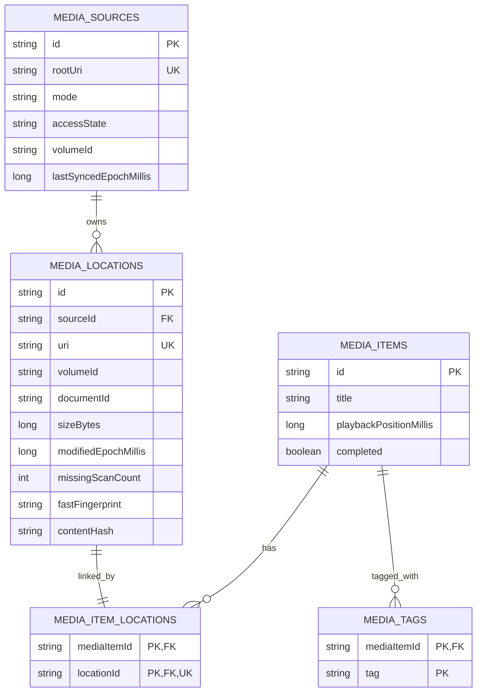

# Phase 3 媒体索引契约

## 范围与边界

Phase 3 负责本地媒体源授权、轻量发现、逻辑身份、物理位置、增量写库和缩略图调度。它不负责播放会话、深度编解码元数据、自动清理缺失记录或文件整理写操作。

- UI 只向 `MediaLibraryViewModel` 发送用户动作，不直接访问 `ContentResolver`、Room DAO 或文件系统。
- `MediaPermissionGateway` 只检查能力和持久化 SAF URI，不启动 Activity。
- Activity Result 启动器位于 Compose 壳；任何系统授权页都由用户点击触发。
- 发现适配器统一输出 `MediaDiscoveryEvent`，扫描器不依赖 Cursor、`DocumentFile` 或 `File`。

## Room v1 ER 图

`MediaItem` 是逻辑媒体，保存播放进度、完成状态和标签；`MediaLocation` 是可失效的物理位置。一个逻辑媒体可以关联多个位置。删除、离线或失权只增加位置的缺失计数或改变源状态，不级联删除逻辑媒体和用户数据。

## 身份证据顺序

| 优先级 | 证据 | 决策 |
|---:|---|---|
| 1 | URI 完全相等 | 复用原位置与逻辑媒体 |
| 2 | 同卷 `volumeId + documentId` | 复用稳定位置；多逻辑项冲突时要求复核 |
| 3 | 已有完整内容哈希 | 关联逻辑媒体，但创建新物理位置 |
| 4 | 大小、时长、分辨率、修改时间和卷的加权证据 | 分数至少 5 且只命中一个逻辑媒体时自动重关联 |
| 5 | 候选冲突 | 仅此时在 I/O 调度器计算 SHA-256，再重新决策 |
| 6 | 证据不足或哈希仍冲突 | 创建独立逻辑媒体，不猜测合并 |

文件名不参与得分，不能单独触发合并。正常扫描不计算全量哈希。移动或复制后的新 URI 关联原 `MediaItem`，但保留独立 `MediaLocation`，从而同时表达多路径和旧位置缺失。

## 权限降级表

| 用户动作或平台状态 | 能力 | 后续行为 |
|---|---|---|
| 用户选择“全部文件访问”并授权 | `MEDIA_STORE` + 文件管理能力 | 通过 MediaStore 建立系统视频轻量索引；全部文件权限只扩展播放与文件管理能力，不触发逐视频容器解析 |
| 全部文件访问被拒绝 | 无隐式能力 | 请求 API 33+ `READ_MEDIA_VIDEO`；API 31-32 使用 `READ_EXTERNAL_STORAGE` |
| MediaStore 完整或 Android 14+ 部分视频授权 | `MEDIA_STORE` | 请求并识别 `READ_MEDIA_VISUAL_USER_SELECTED`；只查询授权视频的必要列，不依赖真实路径 |
| 媒体读取拒绝 | `EMPTY` | 进入可用空首页，保留“选择一个目录”动作 |
| 用户选择 SAF Tree | `SAF_TREE` | 持久化只读 URI 授权并立即后台索引该树 |
| SAF 选择器取消 | 原能力或 `EMPTY` | 不重复弹窗，进入可恢复空首页 |
| 持久 SAF URI 失效 | 降级到剩余 SAF/MediaStore/空能力 | 标记需要重新授权，保留旧索引和用户关系 |
| 卷离线或扫描中失权 | `OFFLINE` / `PERMISSION_LOST` | 本轮 `markMissing=false`，避免把未知状态写成文件缺失 |

## 增量扫描算法

1. 按 `MediaSourceMode` 选择发现适配器，并在事务中读取该源的缓存快照。
2. 适配器在 I/O 调度器流式输出轻量候选；每个节点检查协程取消。
3. 身份解析依次使用 URI、卷与文档 ID、已有哈希和低成本证据。URI 使用哈希索引，模糊匹配按大小分桶，避免万级媒体增量扫描退化为 O(n^2)。单行或单节点失败转换为可恢复事件，不终止其余批次。
4. 扫描器在内存构建候选 Item、Location、关系和已见位置集合，不逐条写 Room。
5. 发现流正常结束后，Room 在单一事务中插入/更新实体、关系、标签、证据和源摘要。
6. 只有完整扫描才累计未见位置的 `missingScanCount`；取消、权限丢失、源离线和终端 I/O 失败不污染旧索引。
7. UI 始终先显示 Room 缓存，再以无百分比 Banner 表示后台扫描；首屏不等待全库缩略图。

扫描缺失记录当前不自动删除。连续 3 次或 7 天只作为后续清理策略的最低保护线，Phase 3 不引入未经用户确认的删除行为。

## 发现适配器约束

- MediaStore 只查询 `_ID`、`DISPLAY_NAME`、`MIME_TYPE`、`SIZE`、`DATE_MODIFIED`、`DURATION`、`WIDTH`、`HEIGHT`。
- MediaStore 空 Cursor 合法；缺列、损坏行和 `SecurityException` 转换为事件。
- SAF 使用迭代队列、URI 去重和最大深度 64；隐藏项默认过滤；单目录 Provider 异常不影响兄弟节点。
- 原始文件目录适配器使用迭代遍历和最大深度 64，只发现轻量文件事实，不调用 `MediaMetadataRetriever`；它不作为首次系统视频索引入口。

## 缩略图队列

优先级固定为：可见项、继续观看、最近添加、后台。队列限制并发，离屏任务立即取消；取消不转成失败或重试。提取失败最多重试一次，成功 Key 受 LRU 上限约束。Coil Video 只作为提取边界，首屏媒体列表不等待缩略图完成。

## 性能数据集

| 数据集 | 内容 | 门禁 |
|---|---|---|
| `synthetic-1k` | 1,000 个唯一 URI、文档 ID和轻量元数据 | JVM 小于 3 秒 |
| `synthetic-10k` | 10,000 个唯一 URI、文档 ID 和轻量元数据 | JVM 和指定真机目标小于 3 秒 |
| 缓存首屏 | Room 已有 Item Flow，后台扫描同时运行 | 目标小于 500ms，已有内容持续可见 |
| 冲突哈希 | 两个以上低成本候选逻辑项 | 只在冲突分支读取内容，不计入轻量扫描基线 |

性能值记录在 `phase-3-tdd-report.md`。JVM 合成结果用于防止算法回退；真机真实媒体结果受文件系统、Provider 和媒体数量影响，单独记录设备和能力模式。
