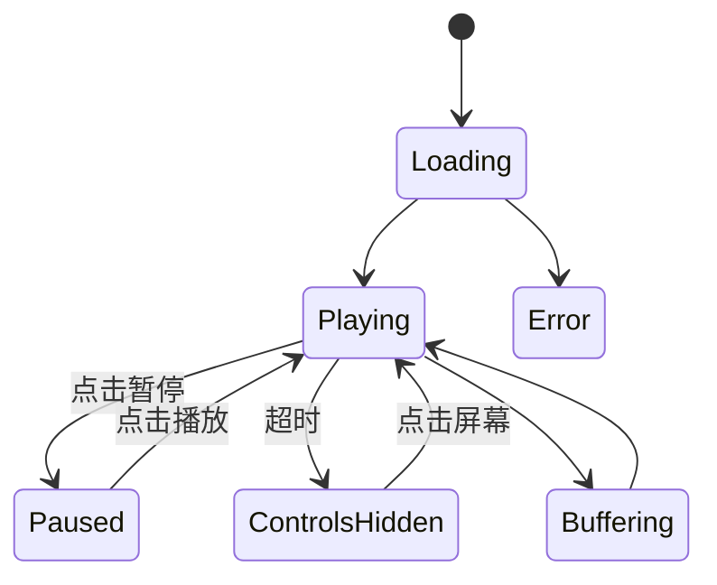

# 任务：深度分析安卓本地视频播放器播放界面 Demo，并编写完整 UI/UX 实现规范

你需要**深度研读当前提供的播放界面 Demo 文件**，不要只做表面的视觉描述。

该 Demo 是一个 **Android 本地视频播放器**的播放界面参考方案，最终项目使用 **Kotlin + Jetpack Compose** 开发。

你的任务是：

> **从 Demo 中完整提取视觉设计、布局结构、组件体系、交互逻辑和功能行为，并整理成一份可以直接交给 Android 开发人员实施的详细 UI/UX 设计规范文档。**

---

## 一、首先：完整理解 Demo

在开始编写文档之前，必须先完整分析 Demo。

不要仅根据局部代码或单个截图进行推断。

需要重点分析：

- 页面整体结构
- 播放区域
- 顶部控制区域
- 底部控制区域
- 播放控制按钮
- 进度条
- 音量控制
- 播放速度
- 清晰度/轨道选择
- 字幕相关操作
- 全屏/退出全屏
- 更多菜单
- 设置面板
- 弹窗
- Bottom Sheet
- 列表
- Toast / Snackbar
- Loading
- Error 状态
- 空状态
- 手势交互
- 横屏/竖屏状态
- 播放中/暂停状态
- 控件显示/隐藏动画

如果 Demo 中存在多个状态或页面，需要分别分析。

---

# 二、输出文档的总体目标

最终文档不能只是：

> “这里有一个按钮，颜色是白色，点击后可以播放。”

而应该达到**开发规格说明书**的程度。

每一个重要 UI 元素都需要回答：

1. 它是什么？
2. 为什么这样设计？
3. 使用什么图标？
4. 图标来自什么图标库？
5. 图标尺寸是多少？
6. 按钮尺寸是多少？
7. 按钮点击区域是多少？
8. 使用什么颜色？
9. 不同状态使用什么颜色？
10. 使用什么字体？
11. 字体大小是多少？
12. 字重是多少？
13. 布局方式是什么？
14. 与其他元素的间距是多少？
15. 点击后发生什么？
16. 长按后发生什么？
17. 滑动后发生什么？
18. 是否有动画？
19. 动画持续多久？
20. 是否存在禁用状态？
21. 是否存在 Loading 状态？
22. 是否存在错误状态？
23. 横屏和竖屏有什么区别？
24. 播放器处于不同状态时应该如何变化？

---

# 三、文档必须包含的内容

## 1. 产品与界面定位

首先说明：

- Demo 的整体设计风格
- 适合什么类型的视频播放器
- 设计理念
- 信息层级
- 操作密度
- 视觉重点
- 与普通在线视频播放器相比有什么特点
- 哪些设计适合本地视频播放器
- 哪些设计可能需要针对 Android 进行调整

同时给出对整个界面的总体评价。

---

# 四、页面整体布局分析

需要建立完整的页面结构树。

例如：

```text
PlayerScreen
├── VideoSurface
├── TopControls
│   ├── BackButton
│   ├── Title
│   └── MoreButton
├── CenterControls
│   ├── PreviousButton
│   ├── PlayPauseButton
│   └── NextButton
├── GestureLayer
└── BottomControls
    ├── CurrentTime
    ├── ProgressBar
    ├── Duration
    ├── SubtitleButton
    ├── PlaybackSpeedButton
    ├── AudioTrackButton
    ├── FullscreenButton
    └── MoreButton
```

如果实际 Demo 结构不同，以 Demo 为准。

需要说明：

- 每个区域的位置
- 宽高
- Padding
- Margin
- 对齐方式
- 层级关系
- 是否覆盖在视频之上
- 是否使用渐变遮罩
- 是否固定位置
- 是否随控制栏一起显示/隐藏

---

# 五、尺寸规范

建立统一的尺寸规范。

至少分析：

### 5.1 播放控制按钮

分别记录：

- Icon Size
- Button Size
- Touch Target
- Button 间距
- 内边距

重点区分：

> **视觉图标尺寸 ≠ 实际点击区域**

如果 Demo 中视觉按钮较小，需要判断 Android 中是否应该扩大触摸区域。

---

### 5.2 顶部区域

分析：

- Top Bar 高度
- 左右 Padding
- 返回按钮尺寸
- 标题最大宽度
- 标题与按钮间距
- 更多按钮尺寸

---

### 5.3 底部区域

分析：

- Bottom Control Bar 高度
- Progress Bar 高度
- 时间文字宽度
- 控制按钮尺寸
- 各元素之间的间距
- 横屏和竖屏是否不同

---

### 5.4 Popup / Dialog / Bottom Sheet

分别记录：

- 宽度
- 最大高度
- 圆角
- Padding
- 列表行高
- 图标尺寸
- 文本尺寸
- 行间距
- 内外边距

---

# 六、颜色系统

从 Demo 中提取完整颜色体系。

不要只写：

> “背景是黑色。”

需要建立类似：

| Token | 用途 | 推荐值 |
|---|---|---|
| Background | 播放器背景 | #000000 |
| Surface | 弹窗/面板 | ... |
| Primary | 主操作 | ... |
| OnBackground | 主文字 | ... |
| SecondaryText | 次级文字 | ... |
| Divider | 分割线 | ... |
| Progress | 进度条 | ... |
| Disabled | 禁用状态 | ... |

同时分析：

- 视频背景
- 控制栏背景
- 渐变遮罩
- 主文字
- 次级文字
- 图标
- 激活状态
- Hover（如果存在）
- Pressed
- Disabled
- Selected
- Progress
- Buffer
- Error

如果 Demo 使用透明度，需要明确记录。

例如：

```text
White 100%
White 80%
White 60%
White 40%
White 20%
```

---

# 七、字体系统

详细分析 Demo 中所有文字。

包括：

- Font Family
- Font Size
- Font Weight
- Line Height
- Letter Spacing
- Color
- 最大行数
- Ellipsis

至少区分：

- 视频标题
- 当前时间
- 视频总时长
- 菜单标题
- 菜单选项
- Secondary Text
- Toast
- Dialog 标题
- Dialog 内容
- Button Text

同时给出 Android Compose 对应建议，例如：

```kotlin
Text(
    fontSize = 14.sp,
    fontWeight = FontWeight.Medium,
    lineHeight = 20.sp
)
```

如果 Demo 使用的字体不确定，不要武断猜测，需要明确标记：

> “推测 / 待确认”

---

# 八、图标系统

这是本次分析的重点之一。

对 Demo 中的每一个图标进行识别。

建立表格：

| 功能 | Demo 图标 | 推荐图标 | Icon Library | Size |
|---|---|---|---|---|
| 返回 | ← | ArrowBack | Material Icons | 24dp |
| 播放 | ▶ | Play | Material Icons | 24dp |
| 暂停 | || | Pause | Material Icons | 24dp |
| 全屏 | ⛶ | Fullscreen | Material Icons | 24dp |

需要重点判断：

- Material Icons
- Material Symbols
- Tabler Icons
- Lucide
- Phosphor
- 自定义 SVG

哪个最适合项目。

如果使用 Android 原生 Compose，优先考虑：

> Material Symbols / Material Icons

但如果 Demo 的视觉风格明显更接近其他图标库，也需要指出。

不要为了“统一”而强行替换 Demo 图标。

---

# 九、按钮系统

按钮是本次分析的核心。

需要逐个分析所有按钮。

对于每个按钮，都按照以下模板：

## Button：播放/暂停

### 外观

- Icon
- Icon Size
- Button Size
- Shape
- Background
- Border
- Shadow
- Alpha

### 状态

- Normal
- Pressed
- Disabled
- Loading
- Selected

### 行为

点击：

```text
Playing → Paused
Paused → Playing
```

长按：

说明是否存在。

双击：

说明是否存在。

### 动画

说明：

- Icon 是否变化
- Scale
- Alpha
- Rotation
- Duration
- Easing

### Android 实现

给出适合 Compose 的实现建议。

---

# 十、进度条

重点分析播放器进度条。

需要说明：

- 当前播放位置
- 总时长
- Buffer Position
- Thumb
- Track
- Progress
- 点击 Seek
- 拖动 Seek
- 快速拖动
- 精确拖动
- 拖动时是否显示时间预览
- 拖动过程中是否暂停
- 松手后是否恢复播放

同时分析：

### 点击

例如：

```text
点击进度条 → SeekTo(position)
```

### 拖动

例如：

```text
Drag Start
↓
显示时间预览
↓
Drag Move
↓
更新预览位置
↓
Drag End
↓
执行 Seek
```

如果 Demo 使用的是类似 YouTube 的“预览式 Seek”，必须详细描述。

---

# 十一、列表与菜单

所有列表都必须详细分析。

例如：

- 播放速度列表
- 音轨列表
- 字幕列表
- 视频列表
- 播放列表
- 文件列表
- 设置列表

对于每个列表，需要说明：

- List Container
- Row Height
- Icon
- Title
- Subtitle
- Selected Indicator
- Check Icon
- Divider
- Click Area
- Scroll Behavior
- Animation

并明确：

> 点击列表项之后，播放器状态如何改变？

例如：

```text
Playback Speed
1.0x
1.25x
1.5x
2.0x

点击 1.5x
↓
Player.setPlaybackSpeed(1.5f)
↓
关闭 BottomSheet
↓
显示当前速度
```

---

# 十二、交互逻辑

建立完整的交互状态模型。

至少分析：

```text
PlayerState
├── Loading
├── Playing
├── Paused
├── Buffering
├── Completed
├── Error
└── Idle
```

以及：

```text
ControlsState
├── Visible
└── Hidden
```

建立状态转换：

```text
Paused
   ↓ Play
Playing
   ↓ Pause
Paused

Playing
   ↓ timeout
ControlsHidden

ControlsHidden
   ↓ tap
ControlsVisible
```

如果 Demo 中存在复杂交互，应继续细分。

---

# 十三、手势系统

重点分析：

- 单击视频区域
- 双击
- 长按
- 左右滑动
- 上下滑动
- 边缘滑动
- Seek 手势
- 音量手势
- 亮度手势
- 全屏手势

分别说明：

```text
Gesture
↓
识别
↓
动作
↓
UI Feedback
↓
最终状态
```

同时判断：

> 哪些手势值得在 Android 本地播放器中实现，哪些属于 Demo 展示效果但不建议实现。

---

# 十四、控制栏自动隐藏

详细分析：

- 控制栏什么时候显示
- 什么时候隐藏
- 自动隐藏延迟
- 播放状态是否影响隐藏
- 用户操作后是否重新计时
- 暂停时是否自动隐藏
- Loading 时是否隐藏
- Error 时是否隐藏

最终形成明确规则。

例如：

```text
用户点击视频
→ Controls Visible
→ 3 秒无操作
→ Controls Hidden
```

---

# 十五、动画系统

分析所有动画。

至少包括：

- Controls Fade In
- Controls Fade Out
- Dialog Enter
- Dialog Exit
- Bottom Sheet Enter
- Bottom Sheet Exit
- Icon Change
- Progress Animation
- Loading Animation
- Seek Feedback

记录：

- Duration
- Easing
- Delay
- Alpha
- Scale
- Translation
- 是否支持 Reduced Motion

并给出 Compose 实现建议。

---

# 十六、不同屏幕状态

分析：

### 竖屏

- 布局
- 控件数量
- 控件大小
- 信息密度

### 横屏

- 布局
- 控件数量
- 控件位置
- 是否增加功能

### 全屏

- System Bar
- Navigation Bar
- Status Bar
- Edge-to-edge
- Screen Orientation

同时说明 Android 实现建议。

---

# 十七、异常与边界状态

不能只分析正常播放状态。

需要设计：

### Loading

```text
正在加载视频
```

### Buffering

```text
缓冲中
```

### Error

```text
视频无法播放
```

### 字幕不存在

```text
暂无字幕
```

### 多音轨不存在

```text
只有一个音轨
```

### 视频已播放完成

```text
Replay
Next
```

### 文件不存在

```text
视频文件已被删除或无法访问
```

---

# 十八、功能优先级

将 Demo 中的功能分成：

### P0：必须实现

核心播放功能。

### P1：建议实现

重要增强功能。

### P2：可选实现

高级功能。

### P3：暂不实现

复杂、低收益或者与本地播放器定位不匹配的功能。

最终形成：

| 功能 | 优先级 | 原因 |
|---|---|---|
| 播放/暂停 | P0 | 核心功能 |
| Seek | P0 | 核心功能 |
| 全屏 | P0 | 核心功能 |
| 播放速度 | P1 | 常用功能 |
| 字幕 | P1 | 本地播放器重要功能 |
| 手势调音量 | P2 | 增强功能 |

---

# 十九、Android + Kotlin + Compose 实现建议

最终必须把 Demo 设计映射到 Android 技术实现。

建议分析：

```text
PlayerScreen
├── PlayerViewModel
├── PlayerState
├── PlayerControlsState
├── PlayerGestureHandler
├── PlayerController
└── Media3 Player
```

UI 层：

```text
PlayerScreen
├── VideoSurface
├── PlayerOverlay
├── TopBar
├── CenterControls
├── BottomControls
├── ProgressBar
├── PlayerMenus
├── PlayerDialogs
└── GestureLayer
```

说明哪些应该：

- State-driven
- Stateless Composable
- ViewModel 管理
- Media3 管理
- UI 本地状态管理

避免把所有逻辑堆进一个 `PlayerScreen.kt`。

---

# 二十、最终建立 Design Tokens

最终输出一套可以直接用于项目的 Token。

例如：

```text
PlayerColors
PlayerDimensions
PlayerTypography
PlayerShapes
PlayerSpacing
PlayerAnimations
PlayerIcons
```

例如：

```kotlin
object PlayerDimensions {
    val TopBarHeight = 56.dp
    val ControlButtonSize = 48.dp
    val IconSize = 24.dp
    val ProgressHeight = 4.dp
}
```

具体数值必须根据 Demo 分析结果制定，而不是随意填写。

---

# 二十一、最终输出完整组件清单

建立组件表：

| Component | 类型 | 功能 | 状态 | 交互 |
|---|---|---|---|---|
| PlayerSurface | Container | 视频播放 | Playing/Paused | Tap |
| PlayButton | Button | 播放/暂停 | Playing/Paused | Click |
| SeekBar | Slider | 视频进度 | Normal/Dragging | Drag |
| SubtitleButton | Button | 字幕 | On/Off | Click |
| SpeedButton | Button | 倍速 | Multiple | Click |
| FullscreenButton | Button | 全屏 | Normal/Fullscreen | Click |

确保 Demo 中所有重要组件都被覆盖。

---

# 二十二、最终输出交互流程图

使用 Mermaid 描述关键交互。

例如：



还需要针对：

- 播放
- 暂停
- Seek
- 全屏
- 字幕
- 播放速度
- 音轨
- 更多菜单

分别提供必要的流程图。

---

# 二十三、最终输出格式

最终文档建议按照以下结构：

```text
# 播放器 Demo UI/UX 设计规范

## 1. 设计概述
## 2. 页面结构
## 3. 布局系统
## 4. 尺寸规范
## 5. 颜色系统
## 6. 字体系统
## 7. 图标系统
## 8. 按钮系统
## 9. 播放进度条
## 10. 顶部控制栏
## 11. 中央控制区
## 12. 底部控制栏
## 13. 菜单
## 14. Bottom Sheet
## 15. Dialog
## 16. 列表
## 17. 手势
## 18. 动画
## 19. 状态管理
## 20. 播放状态
## 21. 横屏/竖屏
## 22. 异常状态
## 23. 功能优先级
## 24. Android Compose 实现建议
## 25. Design Tokens
## 26. Component 清单
## 27. Interaction Flow
## 28. 开发实施建议
```

---

# 二十四、重要要求

### 1. 不要主观臆测

如果 Demo 中无法确定某个参数，明确写：

> 待确认

或者：

> 根据视觉比例推测，建议值为 X dp。

不要把推测值伪装成 Demo 的实际值。

### 2. 不要遗漏隐藏状态

重点寻找：

- Hover
- Pressed
- Selected
- Disabled
- Loading
- Error
- Empty
- Buffering
- Fullscreen
- Controls Hidden

### 3. 不要只分析静态 UI

这是播放器 Demo。

**交互逻辑比静态视觉更重要。**

必须重点分析：

> 用户操作 → UI 反馈 → 播放器状态变化 → 控件状态变化

### 4. 不要直接开始写代码

当前任务首先是：

> **分析 Demo + 编写设计规范文档**

而不是直接实现播放器。

### 5. 所有关键尺寸都需要统一

不要出现：

```text
按钮 A = 44dp
按钮 B = 46dp
按钮 C = 52dp
```

但没有设计依据。

需要最终归纳成统一的尺寸体系。

### 6. 优先考虑 Android 实际体验

Demo 即使是 Web/HTML 实现，也不能机械照搬。

需要结合：

- Android Touch Target
- Edge-to-edge
- Gesture Navigation
- 横屏
- 状态栏
- Navigation Bar
- Compose
- Media3
- Material Design

判断哪些地方应该保持 Demo 原样，哪些地方应该 Android 化。

---

# 最终目标

最终得到的不是一份简单的“Demo 介绍”。

而是一份：

> **《Android 本地视频播放器播放界面 UI/UX + 交互 + 实现规范》**

开发人员仅阅读这份文档，就应该能够明确知道：

- 页面怎么布局
- 每个元素放在哪里
- 使用什么图标
- 图标多大
- 按钮多大
- 点击区域多大
- 使用什么颜色
- 使用什么字体
- 字体多大
- 列表怎么显示
- 菜单怎么打开
- Bottom Sheet 怎么交互
- 播放/暂停如何变化
- Seek 如何工作
- 手势如何工作
- 控件什么时候隐藏
- 动画怎么执行
- 横屏怎么变化
- 异常状态怎么处理
- Android Compose 应该如何组织代码
- 哪些功能 P0/P1/P2
- 最终应该实现哪些组件

**请以“专业 Android 播放器产品设计师 + UI/UX 设计师 + Kotlin/Jetpack Compose 架构师”的视角完成这份分析。**

不要为了凑篇幅重复描述。

重点放在**可量化的设计参数、完整的组件定义、明确的交互规则以及可落地的 Android 实现方案**上。